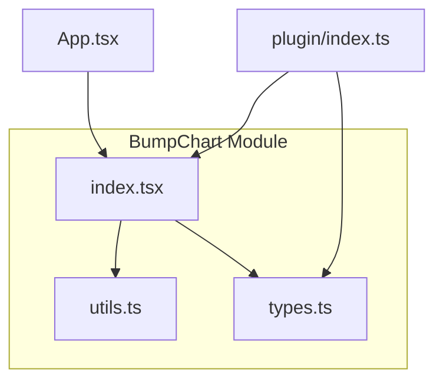
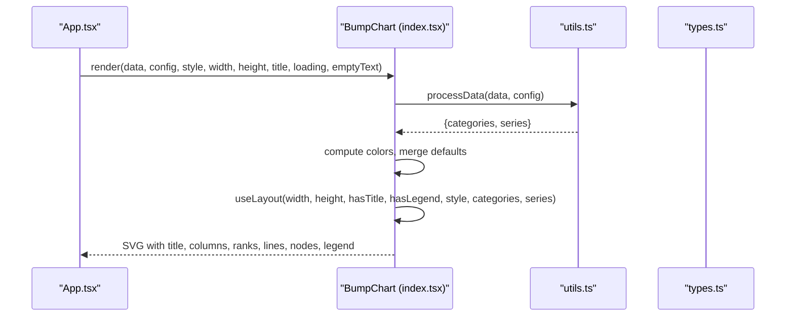
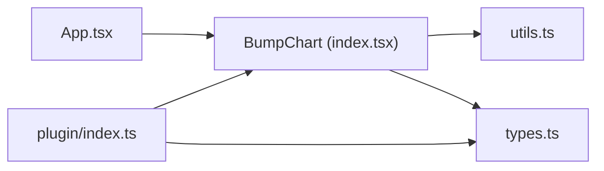

# Component Reference

<cite>
**Referenced Files in This Document**
- [index.tsx](file://src/BumpChart/index.tsx)
- [types.ts](file://src/BumpChart/types.ts)
- [utils.ts](file://src/BumpChart/utils.ts)
- [index.ts](file://src/plugin/index.ts)
- [App.tsx](file://src/App.tsx)
- [README.md](file://README.md)
</cite>

## Table of Contents
1. [Introduction](#introduction)
2. [Project Structure](#project-structure)
3. [Core Components](#core-components)
4. [Architecture Overview](#architecture-overview)
5. [Detailed Component Analysis](#detailed-component-analysis)
6. [Dependency Analysis](#dependency-analysis)
7. [Performance Considerations](#performance-considerations)
8. [Troubleshooting Guide](#troubleshooting-guide)
9. [Conclusion](#conclusion)
10. [Appendices](#appendices)

## Introduction
This document provides a comprehensive component reference for the BumpChart React component. It explains all props, TypeScript interfaces, rendering behavior, layout calculation, and SVG generation. It also includes usage examples, dynamic field mapping, custom styling, responsive considerations, performance guidance, and best practices for large datasets.

## Project Structure
The BumpChart is implemented as a small, focused module with clear separation of concerns:
- types.ts: TypeScript interfaces for data, configuration, style, and internal structures.
- utils.ts: Data processing utilities to transform raw records into series and categories, plus color management.
- index.tsx: The React component that computes layout, renders SVG elements, and composes the chart.
- plugin/index.ts: Exports the component and a dashboard plugin descriptor for integration with dashboard frameworks.
- App.tsx: Example application demonstrating dynamic axis/series field selection and styling.

**Diagram sources**
- [index.tsx:1-10](file://src/BumpChart/index.tsx#L1-L10)
- [utils.ts:1-4](file://src/BumpChart/utils.ts#L1-L4)
- [types.ts:1-12](file://src/BumpChart/types.ts#L1-L12)
- [index.ts:1-5](file://src/plugin/index.ts#L1-L5)
- [App.tsx:1-4](file://src/App.tsx#L1-L4)

**Section sources**
- [index.tsx:1-10](file://src/BumpChart/index.tsx#L1-L10)
- [utils.ts:1-4](file://src/BumpChart/utils.ts#L1-L4)
- [types.ts:1-12](file://src/BumpChart/types.ts#L1-L12)
- [index.ts:1-5](file://src/plugin/index.ts#L1-L5)
- [App.tsx:1-4](file://src/App.tsx#L1-L4)

## Core Components
- BumpChart (React.FC): Renders an SVG-based bump chart with configurable axes, series, and styles. It handles loading and empty states, computes layout, and draws lines, nodes, labels, and optional legend.
- processData (utility): Converts RawRecord[] and AxisConfig into categories and SeriesData[], computing ranks per category and aligning points across time/category steps.
- getColors (utility): Returns a color palette, falling back to defaults when none provided.

Key responsibilities:
- Props handling and default style merging.
- Data transformation via processData.
- Layout computation via useLayout hook.
- SVG rendering of title, category headers, rank labels, smooth connecting paths, node rectangles, series labels, and legend.

**Section sources**
- [index.tsx:104-337](file://src/BumpChart/index.tsx#L104-L337)
- [utils.ts:30-112](file://src/BumpChart/utils.ts#L30-L112)
- [utils.ts:16-18](file://src/BumpChart/utils.ts#L16-L18)

## Architecture Overview
The component follows a unidirectional data flow:
- Input: RawRecord[] + AxisConfig + Style + Dimensions
- Processing: processData transforms input into categories and series; colors are assigned; layout is computed based on dimensions and style.
- Rendering: SVG elements are drawn using computed coordinates.

**Diagram sources**
- [index.tsx:120-145](file://src/BumpChart/index.tsx#L120-L145)
- [utils.ts:30-112](file://src/BumpChart/utils.ts#L30-L112)
- [types.ts:1-68](file://src/BumpChart/types.ts#L1-L68)

## Detailed Component Analysis

### Props Interface: BumpChartProps
- data: Array of raw records used to build categories and series.
- config: AxisConfig defining xAxisField, yAxisField, seriesField.
- style: Optional BumpChartStyle to customize colors, spacing, padding, legend visibility, and rank label formatting.
- className: Optional CSS class for the root container.
- width: Number; default 800.
- height: Number; default 520.
- title: Optional string rendered at the top-left.
- loading: Boolean; shows a loading placeholder when true.
- emptyText: String; shown when there is no data or series.

Behavior:
- Merges provided style with defaults.
- Computes categories and series from data and config.
- Assigns colors to series and computes layout.
- Renders appropriate UI for loading, empty, or chart states.

**Section sources**
- [types.ts:37-49](file://src/BumpChart/types.ts#L37-L49)
- [index.tsx:104-118](file://src/BumpChart/index.tsx#L104-L118)

### AxisConfig
Defines how raw records map to chart axes and series:
- xAxisField: Field name for categories/time (e.g., year).
- yAxisField: Numeric field used to compute ranking within each category.
- seriesField: Identifier for the entity represented by each line (e.g., city).

Validation:
- If any required field is missing, processData returns empty categories and series.

**Section sources**
- [types.ts:5-12](file://src/BumpChart/types.ts#L5-L12)
- [utils.ts:30-38](file://src/BumpChart/utils.ts#L30-L38)

### BumpChartStyle
Optional style overrides:
- colors: Palette array; cycles if more series than colors.
- leftLabelWidth: Width reserved for rank labels on the left.
- rightLabelWidth: Right-side padding/label width.
- nodeWidth: Width of node rectangles.
- nodeHeight: Height of node rectangles.
- columnGap: Spacing between columns (used indirectly in layout calculations).
- padding: Object with top/right/bottom/left values.
- showLegend: Whether to display the legend row at the bottom.
- rankPrefix/rankSuffix: Strings around rank numbers (e.g., “第” and “名”).

Defaults are merged with user-provided style before layout and rendering.

**Section sources**
- [types.ts:14-35](file://src/BumpChart/types.ts#L14-L35)
- [index.tsx:5-27](file://src/BumpChart/index.tsx#L5-L27)

### Data Types: RawRecord, SeriesPoint, SeriesData, ColumnLayout
- RawRecord: Generic record with string keys and values of type string | number | undefined.
- SeriesPoint: Represents a point in a series with category, seriesName, rank, and value.
- SeriesData: Aggregated series with name, color, and ordered points.
- ColumnLayout: Column metadata with x coordinate and label.

These types ensure strong typing throughout data processing and rendering.

**Section sources**
- [types.ts:1-3](file://src/BumpChart/types.ts#L1-L3)
- [types.ts:51-67](file://src/BumpChart/types.ts#L51-L67)

### Data Processing: processData
Responsibilities:
- Group records by xAxisField values to form categories.
- For each category, sort by yAxisField descending to compute ranks.
- Build seriesMap keyed by seriesField values.
- Ensure each series has a point per category; fill missing categories with placeholder points having rank -1 and value 0.
- Return categories and series arrays aligned by category order.

Complexity:
- Grouping and sorting per category: O(N log N) where N is number of records.
- Aligning series points: O(S × C) where S is number of series and C is number of categories.

Edge cases:
- Missing or invalid numeric values default to 0.
- Missing series names are filtered out.
- Empty categories or series result in empty output.

**Section sources**
- [utils.ts:20-28](file://src/BumpChart/utils.ts#L20-L28)
- [utils.ts:30-112](file://src/BumpChart/utils.ts#L30-L112)

### Layout Calculation: useLayout Hook
Computes:
- Plot area boundaries based on width, height, padding, title, legend, and category header.
- Rank rows: evenly spaced vertically based on maximum rank observed across series.
- Column positions: evenly distributed across plot width; single column centered if only one category.
- Helper functions for rank-to-Y conversion and derived metrics like rowHeight and rankCount.

Dependencies:
- width, height, hasTitle, hasLegend, style, categories, series.

Memoization:
- useMemo ensures layout recomputation only when inputs change.

**Section sources**
- [index.tsx:29-90](file://src/BumpChart/index.tsx#L29-L90)

### SVG Rendering Flow
Rendering stages:
- Title: Rendered at top-left if provided.
- Category headers: One text element per column.
- Rank labels: Left-aligned labels for each rank row.
- Connecting paths: Smooth cubic bezier curves between consecutive ranked points per series.
- Nodes and labels: Rectangles and series name text at each valid rank position.
- Legend: Optional row of colored swatches and series names at the bottom.

Path generation:
- Uses a helper to create smooth curves between two points with configurable curvature.

Responsive behavior:
- All coordinates scale with width and height; categories and ranks adapt to available space.

**Section sources**
- [index.tsx:184-318](file://src/BumpChart/index.tsx#L184-L318)
- [index.tsx:92-102](file://src/BumpChart/index.tsx#L92-L102)

### Usage Examples
Basic usage with dynamic fields:
- Provide data as an array of objects with fields matching xAxisField, yAxisField, seriesField.
- Configure AxisConfig accordingly.
- Optionally set style colors, rankPrefix/rankSuffix, and enable legend.

Example references:
- Demonstrates selecting xAxisField, yAxisField, seriesField dynamically and toggling color schemes.

**Section sources**
- [App.tsx:5-39](file://src/App.tsx#L5-L39)
- [App.tsx:56-76](file://src/App.tsx#L56-L76)
- [App.tsx:176-183](file://src/App.tsx#L176-L183)
- [README.md:23-52](file://README.md#L23-L52)

### Dynamic Field Mapping
- xAxisField determines category ordering and column placement.
- yAxisField determines ranking within each category.
- seriesField groups records into distinct lines.

Changing these fields alters the chart’s grouping and ranking logic without modifying data structure.

**Section sources**
- [utils.ts:30-64](file://src/BumpChart/utils.ts#L30-L64)
- [App.tsx:56-76](file://src/App.tsx#L56-L76)

### Custom Styling
- Override colors to match brand palettes.
- Adjust nodeWidth/nodeHeight for visual emphasis.
- Modify padding and label widths to fit dense content.
- Enable legend to improve readability for many series.
- Customize rankPrefix/rankSuffix for localization.

**Section sources**
- [types.ts:14-35](file://src/BumpChart/types.ts#L14-L35)
- [index.tsx:5-27](file://src/BumpChart/index.tsx#L5-L27)

### Responsive Behavior
- Width and height control the SVG canvas size.
- Layout recalculates column positions and rank spacing based on available space.
- Legend wraps automatically based on width.

Best practice:
- Use responsive containers and pass dynamic width/height to keep charts legible across screen sizes.

**Section sources**
- [index.tsx:137-145](file://src/BumpChart/index.tsx#L137-L145)
- [index.tsx:285-317](file://src/BumpChart/index.tsx#L285-L317)

## Dependency Analysis
Internal dependencies:
- index.tsx depends on utils.ts for data processing and color management.
- Both rely on types.ts for shared interfaces.
- plugin/index.ts re-exports the component and types for dashboard integration.

External dependencies:
- React and ReactDOM as peer dependencies.

**Diagram sources**
- [App.tsx:1-4](file://src/App.tsx#L1-L4)
- [index.tsx:1-3](file://src/BumpChart/index.tsx#L1-L3)
- [utils.ts:1-4](file://src/BumpChart/utils.ts#L1-L4)
- [types.ts:1-12](file://src/BumpChart/types.ts#L1-L12)
- [index.ts:1-5](file://src/plugin/index.ts#L1-L5)

**Section sources**
- [package.json:18-21](file://package.json#L18-L21)
- [index.tsx:1-3](file://src/BumpChart/index.tsx#L1-L3)
- [utils.ts:1-4](file://src/BumpChart/utils.ts#L1-L4)
- [types.ts:1-12](file://src/BumpChart/types.ts#L1-L12)
- [index.ts:1-5](file://src/plugin/index.ts#L1-L5)

## Performance Considerations
- Memoization:
  - processData and layout computations are wrapped in useMemo to avoid unnecessary recalculations on stable inputs.
- Efficient grouping and sorting:
  - Grouping uses Map for O(1) lookups; sorting per category is O(N log N).
- Alignment optimization:
  - Series points are aligned to category length to simplify rendering loops.
- Large datasets:
  - Limit visible categories or series to maintain responsiveness.
  - Consider pagination or aggregation strategies upstream.
  - Reduce nodeWidth/nodeHeight and disable legend for denser layouts.
- Color assignment:
  - Colors cycle through a fixed palette; avoid excessively long color arrays unless necessary.

[No sources needed since this section provides general guidance]

## Troubleshooting Guide
Common issues and resolutions:
- No data displayed:
  - Ensure xAxisField, yAxisField, and seriesField exist in data records.
  - Verify yAxisField contains numeric values; non-numeric values default to 0.
- Unexpected rankings:
  - Check that yAxisField values reflect desired ranking direction (higher value = higher rank).
- Missing series points:
  - processData fills missing categories with placeholder points; ensure seriesField values are consistent across categories.
- Legend not showing:
  - Enable showLegend in style; ensure there are series present.
- Loading state:
  - Set loading=true to show placeholder; reset to false when data is ready.

**Section sources**
- [utils.ts:30-38](file://src/BumpChart/utils.ts#L30-L38)
- [utils.ts:20-28](file://src/BumpChart/utils.ts#L20-L28)
- [index.tsx:149-182](file://src/BumpChart/index.tsx#L149-L182)
- [index.tsx:285-317](file://src/BumpChart/index.tsx#L285-L317)

## Conclusion
The BumpChart component offers a flexible, lightweight solution for multi-series ranking visualization using pure SVG. Its clear separation of data processing, layout computation, and rendering makes it easy to integrate and extend. By leveraging dynamic field mapping, customizable styling, and responsive layout, it adapts well to diverse dashboards and datasets. Following the performance and troubleshooting guidance ensures robust usage even with large or complex data.

[No sources needed since this section summarizes without analyzing specific files]

## Appendices

### API Summary
- BumpChartProps: data, config, style, className, width, height, title, loading, emptyText.
- AxisConfig: xAxisField, yAxisField, seriesField.
- BumpChartStyle: colors, leftLabelWidth, rightLabelWidth, nodeWidth, nodeHeight, columnGap, padding, showLegend, rankPrefix, rankSuffix.

**Section sources**
- [types.ts:5-49](file://src/BumpChart/types.ts#L5-L49)
- [README.md:62-98](file://README.md#L62-L98)

### Dashboard Plugin Integration
- Export bumpChartPlugin with metadata and schema for dashboard registration.
- Supports passing data, config, style, title, width, height to the component.

**Section sources**
- [index.ts:7-82](file://src/plugin/index.ts#L7-L82)