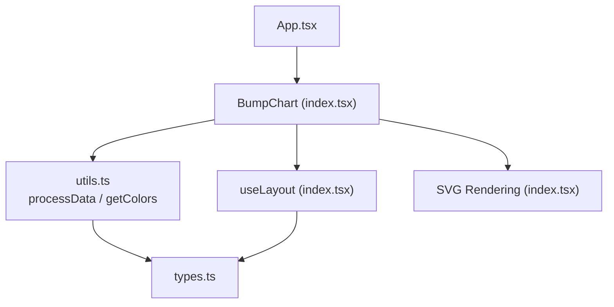
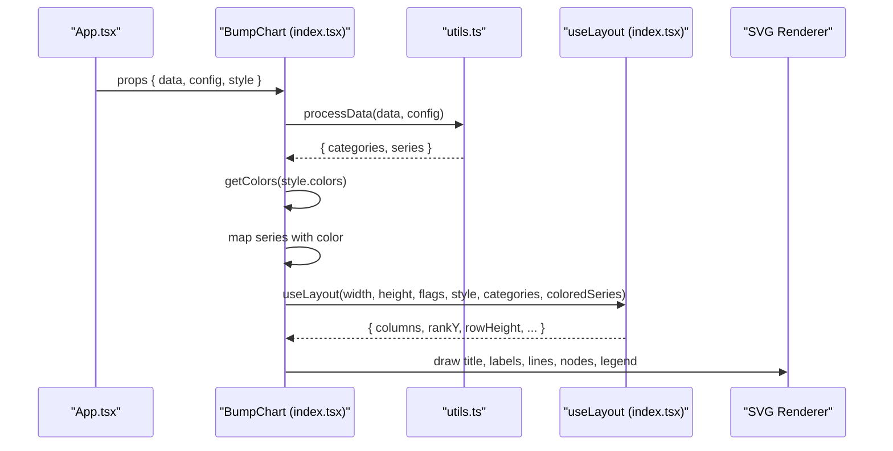
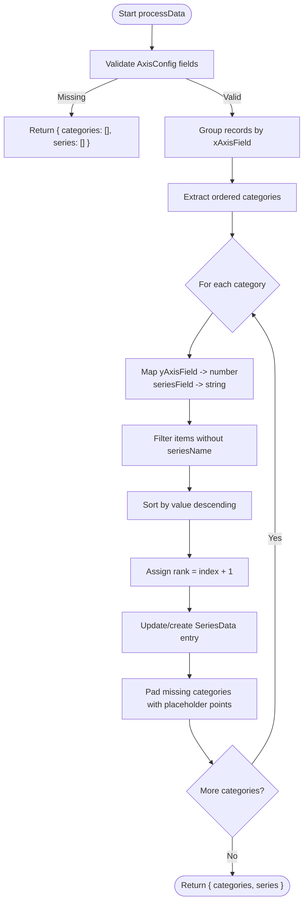
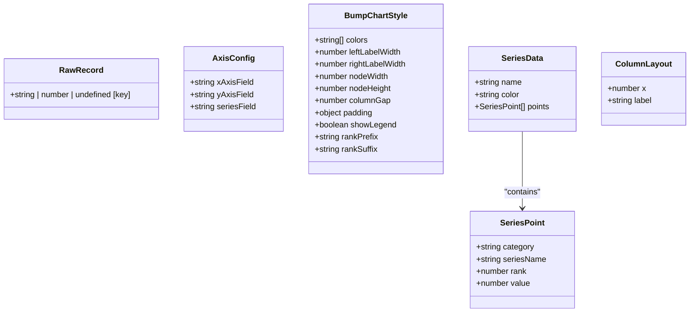
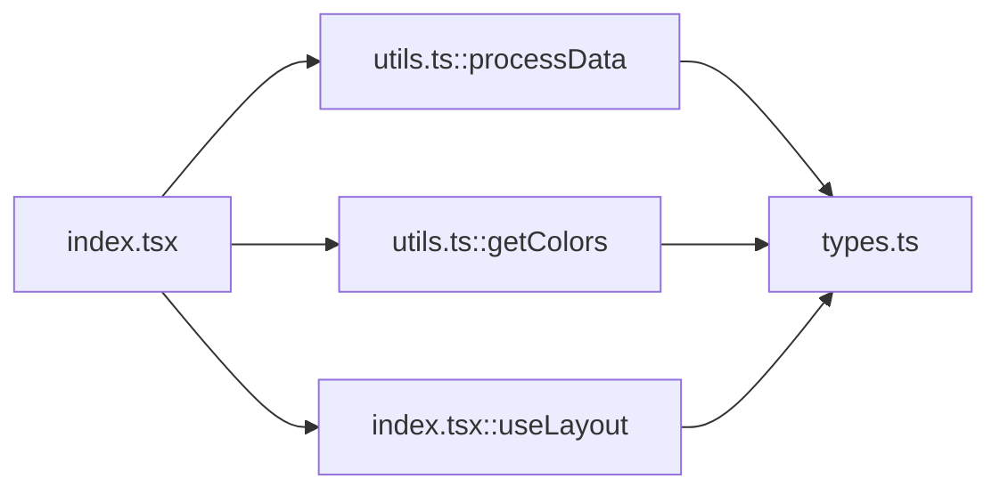

# Data Processing

<cite>
**Referenced Files in This Document**
- [index.tsx](file://src/BumpChart/index.tsx)
- [utils.ts](file://src/BumpChart/utils.ts)
- [types.ts](file://src/BumpChart/types.ts)
- [App.tsx](file://src/App.tsx)
</cite>

## Table of Contents
1. [Introduction](#introduction)
2. [Project Structure](#project-structure)
3. [Core Components](#core-components)
4. [Architecture Overview](#architecture-overview)
5. [Detailed Component Analysis](#detailed-component-analysis)
6. [Dependency Analysis](#dependency-analysis)
7. [Performance Considerations](#performance-considerations)
8. [Troubleshooting Guide](#troubleshooting-guide)
9. [Conclusion](#conclusion)

## Introduction
This document explains the data processing pipeline of the BumpChart component, focusing on how raw tabular data is transformed into structured series suitable for rendering a bump chart. It covers:
- The processData function that maps fields, computes ranks per category, and validates input.
- The getColors utility used to assign and cycle colors across series.
- The useLayout hook that calculates coordinates, spacing, and responsive layout behavior.
- Examples of data transformation from various input formats and error handling strategies.

## Project Structure
The BumpChart implementation is organized into three core files:
- types.ts: Type definitions for inputs, outputs, and styles.
- utils.ts: Data transformation (processData) and color assignment (getColors).
- index.tsx: React component that orchestrates data processing, layout calculation, and SVG rendering.

**Diagram sources**
- [index.tsx:104-145](file://src/BumpChart/index.tsx#L104-L145)
- [utils.ts:30-112](file://src/BumpChart/utils.ts#L30-L112)
- [types.ts:1-68](file://src/BumpChart/types.ts#L1-L68)

**Section sources**
- [index.tsx:1-340](file://src/BumpChart/index.tsx#L1-L340)
- [utils.ts:1-113](file://src/BumpChart/utils.ts#L1-L113)
- [types.ts:1-68](file://src/BumpChart/types.ts#L1-L68)
- [App.tsx:19-50](file://src/App.tsx#L19-L50)

## Core Components
- processData(data, config): Transforms RawRecord[] into categories and SeriesData[], computing ranks per category and aligning points across categories.
- getColors(colors?): Returns a color palette, cycling through provided or default colors.
- useLayout(width, height, hasTitle, hasLegend, style, categories, series): Computes plot area, column positions, rank Y positions, row heights, and other layout metrics.

Key responsibilities:
- Field mapping via AxisConfig (xAxisField, yAxisField, seriesField).
- Ranking by descending numeric values within each category.
- Padding, label widths, node sizes, and responsive distribution of columns.
- Smooth curve generation between adjacent ranked points.

**Section sources**
- [utils.ts:30-112](file://src/BumpChart/utils.ts#L30-L112)
- [index.tsx:29-90](file://src/BumpChart/index.tsx#L29-L90)
- [types.ts:5-12](file://src/BumpChart/types.ts#L5-L12)

## Architecture Overview
The data flow proceeds from props to structured series and then to layout-driven rendering:

**Diagram sources**
- [index.tsx:120-145](file://src/BumpChart/index.tsx#L120-L145)
- [utils.ts:30-112](file://src/BumpChart/utils.ts#L30-L112)
- [index.tsx:29-90](file://src/BumpChart/index.tsx#L29-L90)

## Detailed Component Analysis

### processData: Field Mapping, Ranking, Validation
Responsibilities:
- Validate AxisConfig; if any required field is missing, return empty results.
- Group records by xAxisField (category), preserving insertion order.
- For each category:
  - Map yAxisField to numbers safely (non-numeric becomes 0).
  - Map seriesField to strings; filter out entries without a series name.
  - Sort by value descending to compute ranks (rank = index + 1).
- Build SeriesData:
  - Each unique seriesName gets a SeriesData entry with an assigned color.
  - Points are appended in category order; missing categories are padded with placeholder points (rank -1, value 0) to keep alignment.
- Return categories array and series list.

Complexity:
- Grouping: O(N) where N is number of records.
- Sorting per category: O(K log K) per category (K = records per category).
- Building series and padding: O(S * C) where S = number of series, C = number of categories.

Error handling:
- Missing axis fields result in empty output.
- Non-numeric values are coerced to 0.
- Entries without series names are filtered out.

Examples of input formats:
- Standard format: Array of objects with keys matching xAxisField, yAxisField, seriesField.
- Mixed types: Numeric or string values for yAxisField are supported; non-numeric become 0.
- Sparse data: Missing series in some categories are padded automatically.

**Section sources**
- [utils.ts:20-28](file://src/BumpChart/utils.ts#L20-L28)
- [utils.ts:30-112](file://src/BumpChart/utils.ts#L30-L112)
- [types.ts:1-12](file://src/BumpChart/types.ts#L1-L12)

#### Flowchart: processData logic

**Diagram sources**
- [utils.ts:30-112](file://src/BumpChart/utils.ts#L30-L112)

### getColors: Color Assignment and Cycling
Behavior:
- If a custom colors array is provided and non-empty, use it.
- Otherwise, fall back to a built-in default palette.
- Colors are cycled when assigning to series (modulo length).

Usage:
- Called once per render to derive the active palette.
- Applied to series during mapping to ensure consistent coloring.

Edge cases:
- Empty or undefined colors fallback to defaults.
- When fewer colors than series exist, cycling ensures coverage.

**Section sources**
- [utils.ts:3-18](file://src/BumpChart/utils.ts#L3-L18)
- [index.tsx:125-133](file://src/BumpChart/index.tsx#L125-L133)

### useLayout: Coordinate Calculation, Spacing, Responsive Behavior
Inputs:
- width, height: Container dimensions.
- hasTitle, hasLegend: Flags affecting available plot area.
- style: Visual configuration including padding, label widths, node size, and gaps.
- categories: Ordered list of x-axis categories.
- series: Processed series with points and ranks.

Calculations:
- Title and legend reduce vertical space; category header adds fixed height.
- Plot top/bottom computed from padding and reserved areas.
- Rank count derived from maximum rank across all series points; rowHeight computed to evenly space ranks.
- Column positions distributed across horizontal space:
  - Single category centers the column.
  - Multiple categories distribute columns evenly between first and last node boundaries.
- rankY(rank) returns y-coordinate for a given rank using rowHeight.

Responsive behavior:
- Adjusts to width/height changes.
- Adapts to presence of title and legend.
- Maintains consistent spacing regardless of category count.

Output:
- columns: Array of { x, label }.
- rankY: Function to compute y for a rank.
- rowHeight, rankCount, and other layout constants.

**Section sources**
- [index.tsx:29-90](file://src/BumpChart/index.tsx#L29-L90)

#### Class Diagram: Types and Relationships

**Diagram sources**
- [types.ts:1-68](file://src/BumpChart/types.ts#L1-L68)

### Rendering Pipeline and Data Transformation Examples
- Input formats:
  - Standard: Objects with keys matching AxisConfig fields.
  - Mixed types: Numeric or string values for yAxisField are accepted; invalid numbers become 0.
  - Sparse series: Missing categories are padded with placeholders (rank -1, value 0).
- Output structure:
  - categories: Ordered list of unique xAxisField values.
  - series: Array of SeriesData with aligned points across categories.

Example transformations (conceptual):
- From time-series ranking data to series with ranks per year.
- From categorical rankings to series with ranks per category.
- Handling missing entries by padding to maintain alignment.

**Section sources**
- [App.tsx:19-50](file://src/App.tsx#L19-L50)
- [utils.ts:30-112](file://src/BumpChart/utils.ts#L30-L112)

## Dependency Analysis
- BumpChart depends on:
  - utils.processData for data transformation.
  - utils.getColors for palette selection.
  - internal useLayout for coordinate calculations.
- Types are shared across modules to ensure consistency.

**Diagram sources**
- [index.tsx:1-4](file://src/BumpChart/index.tsx#L1-L4)
- [utils.ts:1-18](file://src/BumpChart/utils.ts#L1-L18)
- [types.ts:1-68](file://src/BumpChart/types.ts#L1-L68)

**Section sources**
- [index.tsx:1-340](file://src/BumpChart/index.tsx#L1-L340)
- [utils.ts:1-113](file://src/BumpChart/utils.ts#L1-L113)
- [types.ts:1-68](file://src/BumpChart/types.ts#L1-L68)

## Performance Considerations
- useMemo usage:
  - processData result memoized based on data and config.
  - colors memoized based on style.colors.
  - useLayout memoized based on dimensions, flags, style, categories, and series.
- Complexity:
  - processData is O(N log K) due to sorting per category; efficient for typical dashboard datasets.
  - Padding and alignment are linear in series and categories.
- Rendering:
  - SVG paths generated per series and category pair; consider limiting series count for very large datasets.
- Recommendations:
  - Keep dataset size reasonable; paginate or aggregate if necessary.
  - Avoid frequent prop changes to minimize recomputation.

[No sources needed since this section provides general guidance]

## Troubleshooting Guide
Common issues and resolutions:
- Empty chart:
  - Cause: Missing or invalid AxisConfig fields.
  - Resolution: Ensure xAxisField, yAxisField, and seriesField are set correctly.
- No lines or nodes:
  - Cause: All series have no valid ranks (e.g., missing series names or zero values).
  - Resolution: Verify series names are present and yAxisField contains valid numbers.
- Misaligned points:
  - Cause: Inconsistent category ordering or missing categories.
  - Resolution: processData pads missing categories; ensure xAxisField values are consistent.
- Incorrect colors:
  - Cause: Custom colors array empty or undefined.
  - Resolution: Provide a non-empty colors array or rely on defaults.
- Layout issues:
  - Cause: Very small width/height or extreme padding.
  - Resolution: Adjust width/height and padding to fit content.

**Section sources**
- [utils.ts:30-38](file://src/BumpChart/utils.ts#L30-L38)
- [index.tsx:167-182](file://src/BumpChart/index.tsx#L167-L182)

## Conclusion
The BumpChart’s data processing pipeline transforms raw tabular data into structured series with computed ranks, assigns colors consistently, and calculates responsive layouts for accurate rendering. The design emphasizes robustness through validation, safe type coercion, and automatic padding, while leveraging memoization for performance. Users can adapt the component to various data formats by configuring AxisConfig and styling options, ensuring flexible and scalable visualization of ranking changes over time or categories.