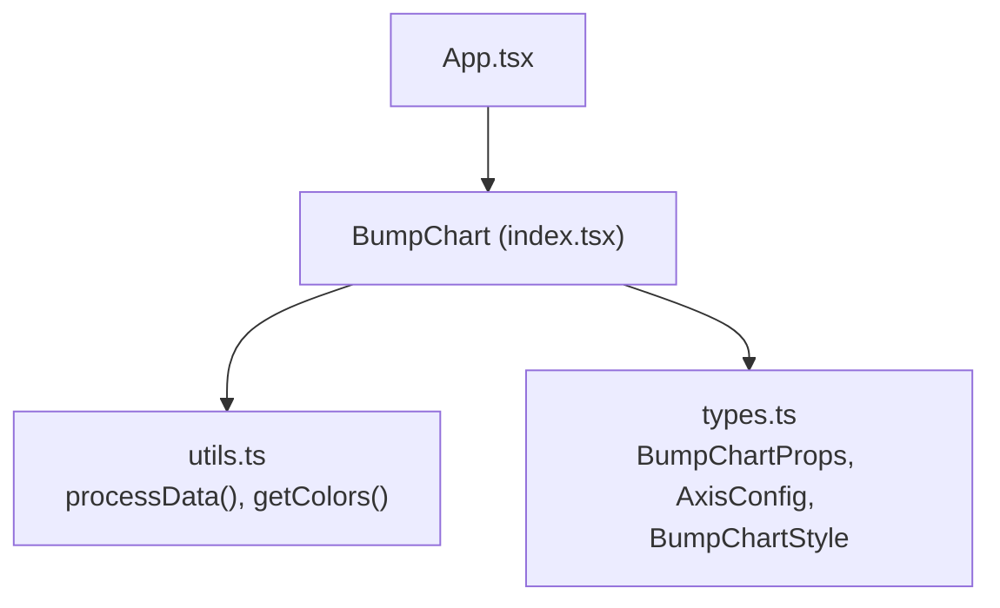
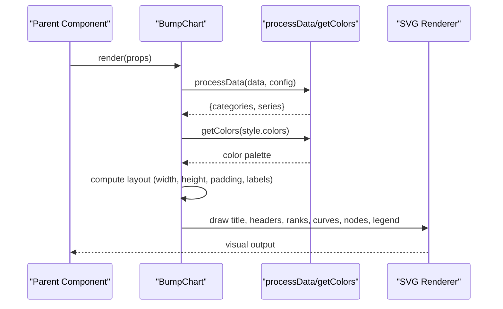
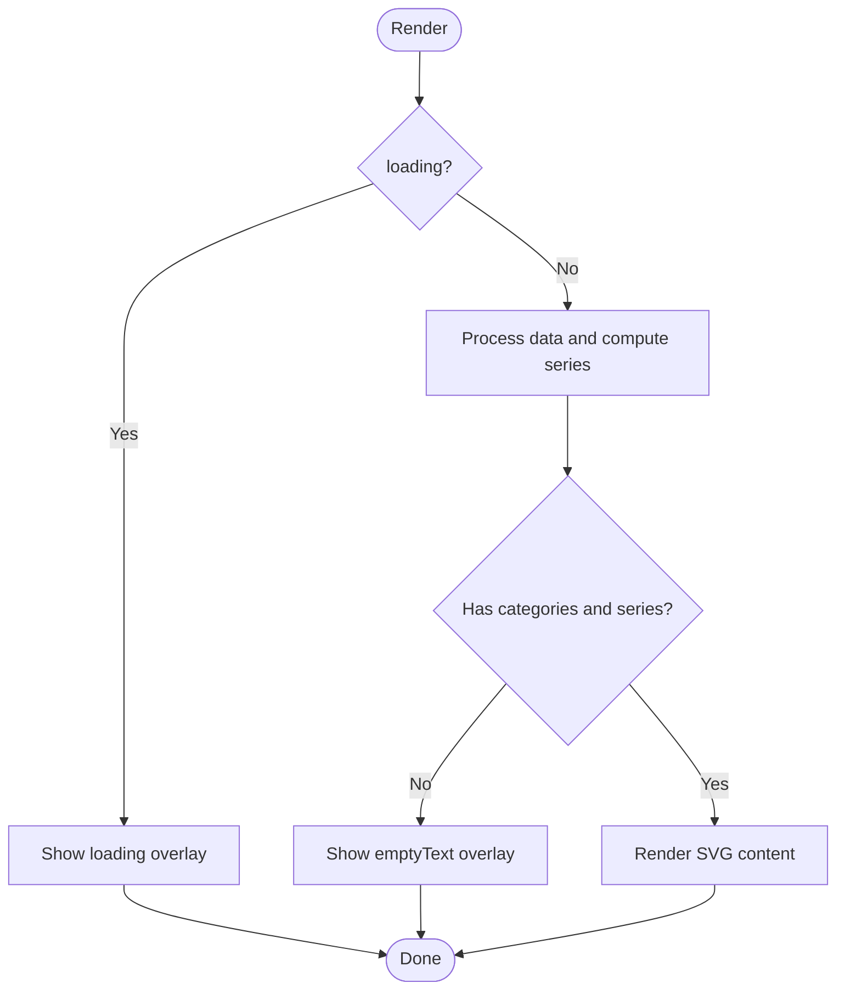
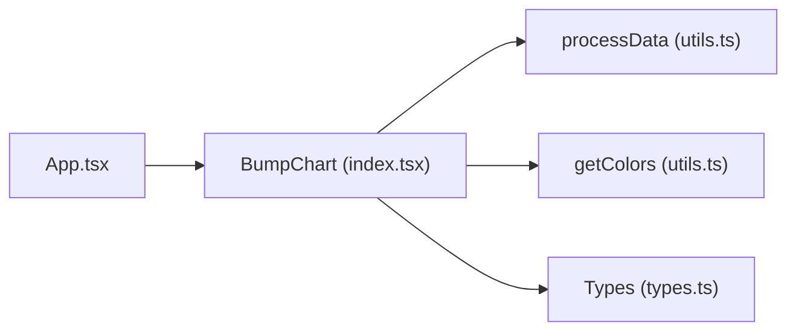

# Props API

<cite>
**Referenced Files in This Document**
- [index.tsx](file://src/BumpChart/index.tsx)
- [types.ts](file://src/BumpChart/types.ts)
- [utils.ts](file://src/BumpChart/utils.ts)
- [App.tsx](file://src/App.tsx)
- [README.md](file://README.md)
</cite>

## Table of Contents
1. [Introduction](#introduction)
2. [Project Structure](#project-structure)
3. [Core Components](#core-components)
4. [Architecture Overview](#architecture-overview)
5. [Detailed Component Analysis](#detailed-component-analysis)
6. [Dependency Analysis](#dependency-analysis)
7. [Performance Considerations](#performance-considerations)
8. [Troubleshooting Guide](#troubleshooting-guide)
9. [Conclusion](#conclusion)
10. [Appendices](#appendices)

## Introduction
This document provides a comprehensive guide to the BumpChart component’s props interface, including TypeScript types, default values, validation rules, and usage patterns. It explains how data is mapped via config (xAxisField, yAxisField, seriesField), how style affects rendering, and how optional props like title, loading, and emptyText control behavior and UI states.

## Project Structure
The BumpChart component is implemented as a React functional component with:
- Types and interfaces defined in a dedicated types file
- Data processing utilities for transforming raw records into series and categories
- A main component that composes layout, styling, and SVG rendering

**Diagram sources**
- [index.tsx:1-3](file://src/BumpChart/index.tsx#L1-L3)
- [utils.ts:1-2](file://src/BumpChart/utils.ts#L1-L2)
- [types.ts:1-68](file://src/BumpChart/types.ts#L1-L68)

**Section sources**
- [index.tsx:1-340](file://src/BumpChart/index.tsx#L1-L340)
- [types.ts:1-68](file://src/BumpChart/types.ts#L1-L68)
- [utils.ts:1-113](file://src/BumpChart/utils.ts#L1-L113)
- [App.tsx:1-193](file://src/App.tsx#L1-L193)

## Core Components
- BumpChart component: Renders an SVG-based bump chart with configurable axes, styles, and states.
- processData utility: Transforms raw records into categories and series with ranks based on axis configuration.
- getColors utility: Provides theme colors, falling back to defaults when none are provided.

Key responsibilities:
- Accept props and merge with defaults
- Compute layout and assign colors
- Render title, category headers, rank labels, curves, nodes, and legend
- Handle loading and empty states

**Section sources**
- [index.tsx:104-337](file://src/BumpChart/index.tsx#L104-L337)
- [utils.ts:16-113](file://src/BumpChart/utils.ts#L16-L113)

## Architecture Overview
The component follows a clear separation of concerns:
- Props layer: Receives data, config, style, and UI flags
- Processing layer: Converts raw data into structured series and categories
- Rendering layer: Computes layout and draws SVG elements

**Diagram sources**
- [index.tsx:104-337](file://src/BumpChart/index.tsx#L104-L337)
- [utils.ts:16-113](file://src/BumpChart/utils.ts#L16-L113)

## Detailed Component Analysis

### BumpChartProps Interface
All props are defined in the types file and used in the component implementation.

- data: RawRecord[] — Required. Array of records where each record contains fields mapped by config.
- config: AxisConfig — Required. Defines xAxisField, yAxisField, seriesField.
- style?: BumpChartStyle — Optional. Styling options including colors, spacing, labels, and legend visibility.
- className?: string — Optional. CSS class applied to the root container.
- width?: number — Optional. Defaults to 800. Controls SVG width.
- height?: number — Optional. Defaults to 520. Controls SVG height.
- title?: string — Optional. Displays a title at the top-left if provided.
- loading?: boolean — Optional. Defaults to false. When true, shows a loading indicator.
- emptyText?: string — Optional. Defaults to a Chinese phrase meaning “No data”. Shown when there is no data to render.

Default values:
- width: 800
- height: 520
- loading: false
- emptyText: a localized placeholder text

Validation rules:
- If any of xAxisField, yAxisField, or seriesField is missing or falsy, processData returns empty categories and series, resulting in the empty state being displayed.
- Numeric values for yAxisField are coerced; invalid numbers become 0.
- Series names must be non-empty strings; entries without a series name are filtered out during processing.

Usage examples (by reference):
- Basic usage with data, config, style, dimensions, and title: see [App.tsx:176-183](file://src/App.tsx#L176-L183)
- Loading state: set loading={true} to show a centered loading message within the chart area
- Empty state: provide emptyText to customize the message shown when data is absent or invalid

**Section sources**
- [types.ts:37-49](file://src/BumpChart/types.ts#L37-L49)
- [index.tsx:104-118](file://src/BumpChart/index.tsx#L104-L118)
- [utils.ts:30-38](file://src/BumpChart/utils.ts#L30-L38)
- [App.tsx:176-183](file://src/App.tsx#L176-L183)

### AxisConfig Options
- xAxisField: string — The field representing time or category (e.g., year). Used to group data points along the horizontal axis.
- yAxisField: string — The numeric field used to compute ranking within each category. Higher values rank better.
- seriesField: string — The identifier for each series (e.g., city). Each unique value becomes a line/series in the chart.

Behavior:
- Categories are derived from unique values of xAxisField.
- Within each category, records are sorted by yAxisField descending to determine ranks.
- Series are built by grouping records by seriesField and aligning points across categories.

Common patterns:
- Time-series ranking: xAxisField = 'year', yAxisField = 'value', seriesField = 'city'
- Category-wise ranking: xAxisField = 'category', yAxisField = 'score', seriesField = 'product'

**Section sources**
- [types.ts:5-12](file://src/BumpChart/types.ts#L5-L12)
- [utils.ts:30-113](file://src/BumpChart/utils.ts#L30-L113)
- [App.tsx:57-61](file://src/App.tsx#L57-L61)

### BumpChartStyle Options
- colors?: string[] — Theme colors; cycles through the array for multiple series.
- leftLabelWidth?: number — Width reserved for left-side rank labels.
- rightLabelWidth?: number — Right padding/label width.
- nodeWidth?: number — Width of each node rectangle.
- nodeHeight?: number — Height of each node rectangle.
- columnGap?: number — Spacing between columns (used in layout calculations).
- padding?: { top, right, bottom, left } — Internal padding around the plot area.
- showLegend?: boolean — Whether to display a legend at the bottom.
- rankPrefix?: string — Prefix for rank labels (e.g., “第”).
- rankSuffix?: string — Suffix for rank labels (e.g., “名”).

Defaults:
- A predefined set of colors and label widths are merged with user-provided style.

Visual outcomes:
- Increasing nodeWidth/nodeHeight enlarges markers.
- Adjusting padding shifts the plot area and labels.
- Enabling showLegend adds a legend row(s) at the bottom, affecting available plot height.

**Section sources**
- [types.ts:14-35](file://src/BumpChart/types.ts#L14-L35)
- [index.tsx:5-27](file://src/BumpChart/index.tsx#L5-L27)
- [index.tsx:115-118](file://src/BumpChart/index.tsx#L115-L118)

### Rendering States and UI Flow
- Loading state: When loading is true, a full-size overlay displays a loading message.
- Empty state: When categories or series are empty, a full-size overlay displays emptyText.
- Normal state: Renders SVG with title, category headers, rank labels, smooth curves connecting ranked points, nodes, and optionally a legend.

**Diagram sources**
- [index.tsx:149-182](file://src/BumpChart/index.tsx#L149-L182)
- [index.tsx:184-319](file://src/BumpChart/index.tsx#L184-L319)

**Section sources**
- [index.tsx:149-182](file://src/BumpChart/index.tsx#L149-L182)
- [index.tsx:184-319](file://src/BumpChart/index.tsx#L184-L319)

## Dependency Analysis
- BumpChart depends on:
  - utils.processData for data transformation
  - utils.getColors for color assignment
  - types for prop and internal data structures
- App demonstrates typical usage and dynamic configuration changes.

**Diagram sources**
- [index.tsx:1-3](file://src/BumpChart/index.tsx#L1-L3)
- [utils.ts:1-2](file://src/BumpChart/utils.ts#L1-L2)
- [types.ts:1-68](file://src/BumpChart/types.ts#L1-L68)
- [App.tsx:1-3](file://src/App.tsx#L1-L3)

**Section sources**
- [index.tsx:1-3](file://src/BumpChart/index.tsx#L1-L3)
- [utils.ts:1-2](file://src/BumpChart/utils.ts#L1-L2)
- [types.ts:1-68](file://src/BumpChart/types.ts#L1-L68)
- [App.tsx:1-3](file://src/App.tsx#L1-L3)

## Performance Considerations
- useMemo is used to memoize layout computation and processed data, reducing re-renders when inputs change.
- Color assignment is memoized to avoid unnecessary recalculations.
- For large datasets, ensure efficient sorting and mapping in upstream code; the component sorts per category to compute ranks.

[No sources needed since this section provides general guidance]

## Troubleshooting Guide
Common issues and resolutions:
- No data displayed:
  - Ensure xAxisField, yAxisField, and seriesField are correctly set and present in data.
  - Verify yAxisField values are numeric or convertible to numbers.
  - Confirm seriesField values are non-empty strings.
- Unexpected rankings:
  - Check that yAxisField reflects the intended metric; higher values rank better.
- Legend not visible:
  - Enable showLegend in style and ensure there are series to display.
- Layout misalignment:
  - Adjust padding, leftLabelWidth, rightLabelWidth, nodeWidth, nodeHeight to fit your content.

References:
- Validation and fallbacks in processing: [utils.ts:20-28](file://src/BumpChart/utils.ts#L20-L28), [utils.ts:30-38](file://src/BumpChart/utils.ts#L30-L38)
- Empty and loading states: [index.tsx:149-182](file://src/BumpChart/index.tsx#L149-L182)

**Section sources**
- [utils.ts:20-28](file://src/BumpChart/utils.ts#L20-L28)
- [utils.ts:30-38](file://src/BumpChart/utils.ts#L30-L38)
- [index.tsx:149-182](file://src/BumpChart/index.tsx#L149-L182)

## Conclusion
The BumpChart component offers a flexible, type-safe interface for rendering multi-series ranking charts. By configuring xAxisField, yAxisField, and seriesField, you can map diverse datasets to meaningful rankings. Style options allow fine-tuning of visuals, while loading and empty states improve UX. Use the provided patterns and references to integrate the component effectively in your applications.

[No sources needed since this section summarizes without analyzing specific files]

## Appendices

### Prop Reference Summary
- data: RawRecord[] — Required
- config: AxisConfig — Required
- style?: BumpChartStyle — Optional
- className?: string — Optional
- width?: number — Default 800
- height?: number — Default 520
- title?: string — Optional
- loading?: boolean — Default false
- emptyText?: string — Default localized placeholder

**Section sources**
- [types.ts:37-49](file://src/BumpChart/types.ts#L37-L49)
- [index.tsx:104-118](file://src/BumpChart/index.tsx#L104-L118)

### Example Usage References
- Basic example with data, config, style, dimensions, and title: [App.tsx:176-183](file://src/App.tsx#L176-L183)
- Dynamic config selection (xAxisField, yAxisField, seriesField): [App.tsx:57-61](file://src/App.tsx#L57-L61)

**Section sources**
- [App.tsx:57-61](file://src/App.tsx#L57-L61)
- [App.tsx:176-183](file://src/App.tsx#L176-L183)