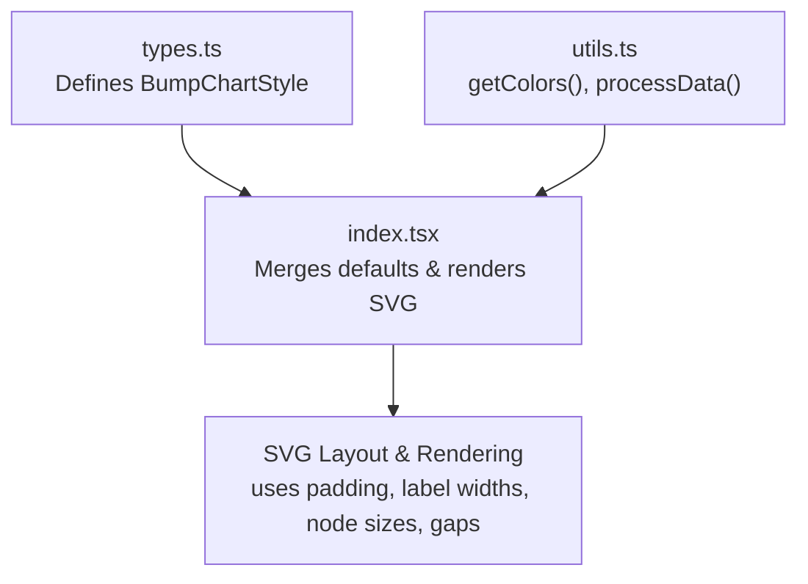
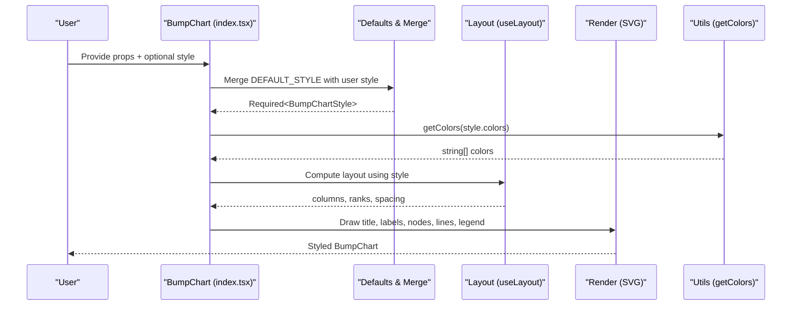
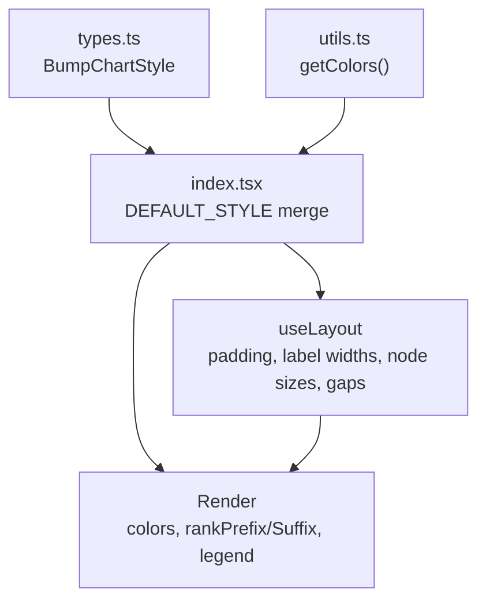

# Styling Configuration

<cite>
**Referenced Files in This Document**
- [types.ts](file://src/BumpChart/types.ts)
- [index.tsx](file://src/BumpChart/index.tsx)
- [utils.ts](file://src/BumpChart/utils.ts)
- [README.md](file://README.md)
</cite>

## Table of Contents
1. [Introduction](#introduction)
2. [Project Structure](#project-structure)
3. [Core Components](#core-components)
4. [Architecture Overview](#architecture-overview)
5. [Detailed Component Analysis](#detailed-component-analysis)
6. [Dependency Analysis](#dependency-analysis)
7. [Performance Considerations](#performance-considerations)
8. [Troubleshooting Guide](#troubleshooting-guide)
9. [Conclusion](#conclusion)
10. [Appendices](#appendices)

## Introduction
This document explains the BumpChart styling system, focusing on how to configure and customize visual appearance and layout through style properties. It covers default values, customization options, responsive considerations, and performance implications for each property. The goal is to help you create clear, accessible bump charts with consistent themes and efficient rendering.

## Project Structure
The styling system is defined by a small set of TypeScript types and implemented within the React component:
- Types define the shape of style configuration and chart data.
- The component merges user-provided styles with defaults and applies them during layout and rendering.
- Utilities provide color management and data processing that interact with style (e.g., colors).

**Diagram sources**
- [types.ts:14-35](file://src/BumpChart/types.ts#L14-L35)
- [index.tsx:5-27](file://src/BumpChart/index.tsx#L5-L27)
- [utils.ts:3-18](file://src/BumpChart/utils.ts#L3-L18)

**Section sources**
- [types.ts:14-35](file://src/BumpChart/types.ts#L14-L35)
- [index.tsx:5-27](file://src/BumpChart/index.tsx#L5-L27)
- [utils.ts:3-18](file://src/BumpChart/utils.ts#L3-L18)

## Core Components
- BumpChartStyle defines all customizable style properties for the chart.
- Default style values are applied when no overrides are provided.
- Colors are managed via a utility function that returns either user-provided colors or a built-in palette.

Key responsibilities:
- Define the interface for styling configuration.
- Provide sensible defaults for layout and visuals.
- Apply styles consistently across layout calculations and SVG rendering.

**Section sources**
- [types.ts:14-35](file://src/BumpChart/types.ts#L14-L35)
- [index.tsx:5-27](file://src/BumpChart/index.tsx#L5-L27)
- [utils.ts:3-18](file://src/BumpChart/utils.ts#L3-L18)

## Architecture Overview
The styling system integrates into the chart’s layout and rendering pipeline:
- User props include an optional style object.
- Defaults are merged with user styles to produce a required style object.
- Layout calculations use padding, label widths, node dimensions, and column gap to compute positions.
- Rendering uses colors from the utility and applies rank prefixes/suffixes to labels.

**Diagram sources**
- [index.tsx:104-145](file://src/BumpChart/index.tsx#L104-L145)
- [index.tsx:29-90](file://src/BumpChart/index.tsx#L29-L90)
- [utils.ts:16-18](file://src/BumpChart/utils.ts#L16-L18)

## Detailed Component Analysis

### Style Properties Reference
Below is a comprehensive guide to each style property, its purpose, default value, and customization guidance.

- colors
  - Purpose: Theme color palette used for series lines and nodes; cycles if there are more series than colors.
  - Default: A curated palette of ten colors.
  - Customization: Provide any array of valid CSS color strings. Use fewer colors to cycle; use more to differentiate many series.
  - Notes: If omitted, the built-in palette is used automatically.

- leftLabelWidth
  - Purpose: Width reserved for the left-side ranking labels (e.g., “第1名”).
  - Default: 60 pixels.
  - Customization: Increase if your rank labels are longer or use larger fonts; decrease to save space.

- rightLabelWidth
  - Purpose: Right-side padding/label width area; currently used to constrain plot width on the right side.
  - Default: 60 pixels.
  - Customization: Adjust to balance whitespace or accommodate right-aligned annotations.

- nodeWidth
  - Purpose: Width of each rectangular node representing a ranked item at a category.
  - Default: 10 pixels.
  - Customization: Larger values emphasize nodes but may overlap lines; smaller values reduce visual weight.

- nodeHeight
  - Purpose: Height of each rectangular node.
  - Default: 22 pixels.
  - Customization: Match font size and rank label height for balanced alignment.

- columnGap
  - Purpose: Spacing between categories along the horizontal axis.
  - Default: 80 pixels.
  - Customization: Increase for clarity with many categories; decrease to fit more categories in narrow widths.

- padding
  - Purpose: Chart internal margins: top, right, bottom, left.
  - Default: { top: 20, right: 20, bottom: 20, left: 20 }.
  - Customization: Adjust to accommodate titles, legends, and long labels. Top padding affects title/category header space; bottom affects legend placement.

- showLegend
  - Purpose: Toggle visibility of the legend showing series names and colors.
  - Default: false.
  - Customization: Enable when you need to identify multiple series visually.

- rankPrefix
  - Purpose: Text prefix before rank numbers on the left labels (e.g., “第”).
  - Default: “第”.
  - Customization: Set to empty string or another language-specific prefix as needed.

- rankSuffix
  - Purpose: Text suffix after rank numbers on the left labels (e.g., “名”).
  - Default: empty string.
  - Customization: Add localized suffixes like “th”, “nd”, “rd”, or “st” equivalents.

How defaults are applied:
- The component merges user-provided style with a built-in default style object to ensure all properties exist.
- Colors are resolved via a utility that returns either user colors or the default palette.

Responsive behavior:
- The chart respects width and height props.
- Layout calculations adjust column positions based on available width and padding.
- Legend items wrap horizontally based on container width.

**Section sources**
- [types.ts:14-35](file://src/BumpChart/types.ts#L14-L35)
- [index.tsx:5-27](file://src/BumpChart/index.tsx#L5-L27)
- [index.tsx:29-90](file://src/BumpChart/index.tsx#L29-L90)
- [index.tsx:184-318](file://src/BumpChart/index.tsx#L184-L318)
- [utils.ts:3-18](file://src/BumpChart/utils.ts#L3-L18)

### Visual Themes and Layout Configurations
Examples of common configurations (described conceptually):
- Minimal theme: Reduce nodeWidth and nodeHeight, hide legend, use neutral colors, and minimize padding for compact dashboards.
- High contrast theme: Use bold colors, increase nodeHeight for readability, enable legend, and add larger padding for accessibility.
- Dense timeline: Decrease columnGap to fit many categories; increase leftLabelWidth if rank labels are long; consider enabling legend only if necessary.
- Localized labels: Set rankPrefix and rankSuffix to match target language conventions; adjust leftLabelWidth accordingly.

[No sources needed since this section provides conceptual examples]

### Responsive Design Considerations
- Width and height: Ensure sufficient width for category spacing and label readability.
- Padding: Increase left padding when rank labels are long; increase bottom padding when legend is enabled.
- Node sizing: Smaller nodes and heights improve density; larger sizes improve legibility on small screens.
- Legend wrapping: Legend items wrap based on container width; keep series count reasonable for small screens.
- ColumnGap: Tune to balance readability vs. space constraints.

[No sources needed since this section provides general guidance]

### Performance Implications
- Colors array length: Shorter arrays cycle faster; very large arrays have negligible impact but can increase memory slightly.
- Node dimensions: Large nodeWidth/nodeHeight increases SVG element count and drawing cost; prefer moderate sizes for performance.
- ColumnGap: Excessively small gaps can cause overlapping elements and reflows; choose values that avoid collisions.
- Legend: Enabling showLegend adds extra SVG elements; disable when not needed for better performance on large datasets.
- Data size: While not a style property, large datasets amplify the cost of rendering nodes and paths; consider simplifying visuals for performance.

[No sources needed since this section provides general guidance]

## Dependency Analysis
Styling flows through these dependencies:
- BumpChartStyle type defines the contract for style configuration.
- Default style is merged with user style to guarantee all properties exist.
- getColors resolves the final color palette used for series.
- Layout calculations depend on padding, label widths, node dimensions, and columnGap to compute positions.
- Rendering applies colors, rankPrefix/rankSuffix, and conditional legend display.

**Diagram sources**
- [types.ts:14-35](file://src/BumpChart/types.ts#L14-L35)
- [index.tsx:5-27](file://src/BumpChart/index.tsx#L5-L27)
- [index.tsx:29-90](file://src/BumpChart/index.tsx#L29-L90)
- [utils.ts:3-18](file://src/BumpChart/utils.ts#L3-L18)

**Section sources**
- [types.ts:14-35](file://src/BumpChart/types.ts#L14-L35)
- [index.tsx:5-27](file://src/BumpChart/index.tsx#L5-L27)
- [index.tsx:29-90](file://src/BumpChart/index.tsx#L29-L90)
- [utils.ts:3-18](file://src/BumpChart/utils.ts#L3-L18)

## Performance Considerations
- Prefer minimal node sizes for dense timelines; increase only when legibility suffers.
- Avoid excessive padding that reduces usable area; tune per screen size.
- Disable legend when not needed to reduce DOM/SVG overhead.
- Keep colors array concise; cycling is efficient and avoids unnecessary allocations.
- For very large datasets, consider reducing nodeHeight and nodeWidth to lower rendering cost.

[No sources needed since this section provides general guidance]

## Troubleshooting Guide
Common issues and resolutions:
- Rank labels clipped on the left: Increase leftLabelWidth or left padding to accommodate longer text.
- Nodes overlapping lines: Reduce nodeWidth or increase columnGap; adjust nodeHeight to align with row spacing.
- Legend overlaps content: Increase bottom padding or reduce number of series; consider disabling legend on small screens.
- Colors not applying: Ensure colors array contains valid CSS color strings; verify it is passed correctly in style prop.
- Empty chart: Verify data fields map correctly via AxisConfig; check that seriesField values are present and numeric yAxisField values exist.

[No sources needed since this section provides general guidance]

## Conclusion
The BumpChart styling system offers flexible control over colors, layout spacing, node dimensions, and labeling. By understanding defaults and how each property influences layout and rendering, you can craft accessible, performant, and visually coherent bump charts tailored to your dashboard needs.

[No sources needed since this section summarizes without analyzing specific files]

## Appendices

### API Reference Summary
- BumpChartStyle properties:
  - colors: string[]
  - leftLabelWidth: number
  - rightLabelWidth: number
  - nodeWidth: number
  - nodeHeight: number
  - columnGap: number
  - padding: { top: number; right: number; bottom: number; left: number }
  - showLegend: boolean
  - rankPrefix: string
  - rankSuffix: string

- Default values:
  - colors: Built-in palette of ten colors
  - leftLabelWidth: 60
  - rightLabelWidth: 60
  - nodeWidth: 10
  - nodeHeight: 22
  - columnGap: 80
  - padding: { top: 20, right: 20, bottom: 20, left: 20 }
  - showLegend: false
  - rankPrefix: “第”
  - rankSuffix: “”

**Section sources**
- [types.ts:14-35](file://src/BumpChart/types.ts#L14-L35)
- [index.tsx:5-27](file://src/BumpChart/index.tsx#L5-L27)
- [README.md:85-99](file://README.md#L85-L99)