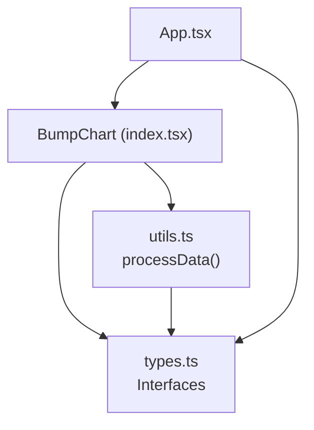
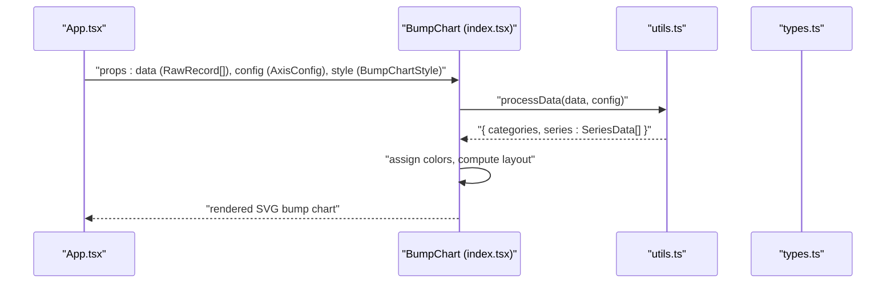
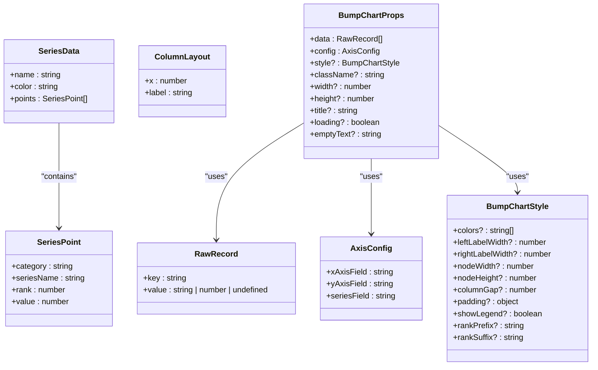
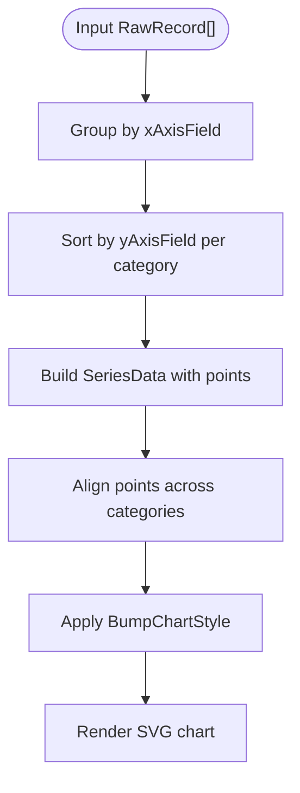

# Type Definitions

<cite>
**Referenced Files in This Document**
- [types.ts](file://src/BumpChart/types.ts)
- [utils.ts](file://src/BumpChart/utils.ts)
- [index.tsx](file://src/BumpChart/index.tsx)
- [App.tsx](file://src/App.tsx)
- [README.md](file://README.md)
</cite>

## Table of Contents
1. [Introduction](#introduction)
2. [Project Structure](#project-structure)
3. [Core Components](#core-components)
4. [Architecture Overview](#architecture-overview)
5. [Detailed Component Analysis](#detailed-component-analysis)
6. [Dependency Analysis](#dependency-analysis)
7. [Performance Considerations](#performance-considerations)
8. [Troubleshooting Guide](#troubleshooting-guide)
9. [Conclusion](#conclusion)
10. [Appendices](#appendices)

## Introduction
This document provides a comprehensive guide to the TypeScript interfaces and types used by the BumpChart component. It focuses on:
- RawRecord for input data structure
- AxisConfig for field mapping
- SeriesData for processed series output
- BumpChartStyle for styling options
It also explains type constraints, validation rules, relationships between types, and how they flow through the component pipeline from raw data to rendered chart.

## Project Structure
The BumpChart module is organized into three core files:
- types.ts: Defines all public and internal TypeScript interfaces
- utils.ts: Contains data processing logic that transforms RawRecord[] into SeriesData[]
- index.tsx: The React component that consumes these types and renders the chart

**Diagram sources**
- [index.tsx:1-4](file://src/BumpChart/index.tsx#L1-L4)
- [utils.ts:1-2](file://src/BumpChart/utils.ts#L1-L2)
- [types.ts:1-68](file://src/BumpChart/types.ts#L1-L68)

**Section sources**
- [index.tsx:1-4](file://src/BumpChart/index.tsx#L1-L4)
- [utils.ts:1-2](file://src/BumpChart/utils.ts#L1-L2)
- [types.ts:1-68](file://src/BumpChart/types.ts#L1-L68)

## Core Components
This section documents the key TypeScript interfaces and their roles in the BumpChart pipeline.

- RawRecord: Represents a single row of input data with flexible key-value pairs. Keys are strings; values can be string, number, or undefined.
- AxisConfig: Maps data fields to chart axes: xAxisField (time/category), yAxisField (numeric value for ranking), seriesField (entity identifier).
- SeriesPoint: A point within a series with category, seriesName, rank, and value.
- SeriesData: A named series with an assigned color and an ordered list of points across categories.
- ColumnLayout: Layout metadata for each category column (x position and label).
- BumpChartStyle: Styling options including colors, dimensions, padding, legend visibility, and rank label formatting.
- BumpChartProps: Props accepted by the BumpChart component, combining data, config, style, and rendering options.

Key relationships:
- BumpChartProps.data is RawRecord[].
- BumpChartProps.config is AxisConfig.
- processData(data, config) returns { categories: string[], series: SeriesData[] }.
- SeriesData contains SeriesPoint[] representing ranked positions per category.
- BumpChartStyle controls visual presentation and layout metrics.

**Section sources**
- [types.ts:1-68](file://src/BumpChart/types.ts#L1-L68)
- [utils.ts:30-112](file://src/BumpChart/utils.ts#L30-L112)
- [index.tsx:104-145](file://src/BumpChart/index.tsx#L104-L145)

## Architecture Overview
The data flows from props into processing and then into rendering:

**Diagram sources**
- [index.tsx:104-145](file://src/BumpChart/index.tsx#L104-L145)
- [utils.ts:30-112](file://src/BumpChart/utils.ts#L30-L112)
- [types.ts:1-68](file://src/BumpChart/types.ts#L1-L68)

## Detailed Component Analysis

### RawRecord
- Purpose: Input record shape for chart data.
- Constraints:
  - Keys: any string.
  - Values: string | number | undefined.
- Validation behavior in processing:
  - Numeric conversion coerces undefined/null/empty to 0.
  - String conversion coerces undefined/null to empty string.
- Example usage context:
  - See demo data in App.tsx where records contain year, city, and value fields.

Valid data structure examples (conceptual):
- Records with numeric values and string identifiers:
  - { year: "2021年", city: "广州", value: 1000 }
  - { year: "2022年", city: "北京", value: 950 }
- Records with missing or invalid values are tolerated via coercion:
  - { year: "2023年", city: "上海", value: undefined } becomes value 0
  - { year: "2023年", city: null, value: 700 } becomes seriesName ""

Notes:
- Missing series names cause filtering out during processing.
- Non-numeric values are treated as 0 after parsing.

**Section sources**
- [types.ts:1-3](file://src/BumpChart/types.ts#L1-L3)
- [utils.ts:20-28](file://src/BumpChart/utils.ts#L20-L28)
- [App.tsx:5-39](file://src/App.tsx#L5-L39)

### AxisConfig
- Purpose: Field mapping configuration for the chart axes and series.
- Fields:
  - xAxisField: string — time or category dimension.
  - yAxisField: string — numeric field used to compute ranks.
  - seriesField: string — entity identifier (e.g., city name).
- Validation rules:
  - All three fields must be provided; otherwise, processData returns empty categories and series.
- Example usage context:
  - Configured in App.tsx state and passed to BumpChart.

Valid configuration example (conceptual):
- { xAxisField: "year", yAxisField: "value", seriesField: "city" }

Behavioral notes:
- If any field is missing, no chart is rendered due to empty results.
- Field names must match keys present in RawRecord entries.

**Section sources**
- [types.ts:5-12](file://src/BumpChart/types.ts#L5-L12)
- [utils.ts:30-38](file://src/BumpChart/utils.ts#L30-L38)
- [App.tsx:57-61](file://src/App.tsx#L57-L61)

### SeriesPoint
- Purpose: Represents a single ranked point within a series at a specific category.
- Fields:
  - category: string — the x-axis category label.
  - seriesName: string — the series identifier.
  - rank: number — rank order within the category (positive integers for valid ranks; -1 indicates placeholder).
  - value: number — numeric value used for ranking.
- Constraints:
  - rank >= 1 denotes a real ranked point; rank == -1 is a placeholder for missing data alignment.
- Usage:
  - Points are generated per category and aligned across series to ensure consistent plotting.

Alignment behavior:
- Missing points are padded with rank -1 and value 0 to maintain sequence length across categories.

**Section sources**
- [types.ts:51-56](file://src/BumpChart/types.ts#L51-L56)
- [utils.ts:55-96](file://src/BumpChart/utils.ts#L55-L96)
- [utils.ts:99-109](file://src/BumpChart/utils.ts#L99-L109)

### SeriesData
- Purpose: Aggregated series representation with color and ordered points.
- Fields:
  - name: string — series identifier.
  - color: string — assigned color from theme palette.
  - points: SeriesPoint[] — ordered points across categories.
- Behavior:
  - Colors are assigned cyclically from the theme palette.
  - Points are sorted by value descending within each category to determine ranks.

Example usage context:
- ColoredSeries in BumpChart merges SeriesData with assigned colors for rendering.

**Section sources**
- [types.ts:58-62](file://src/BumpChart/types.ts#L58-L62)
- [utils.ts:52-77](file://src/BumpChart/utils.ts#L52-L77)
- [index.tsx:125-133](file://src/BumpChart/index.tsx#L125-L133)

### ColumnLayout
- Purpose: Layout metadata for each category column.
- Fields:
  - x: number — horizontal coordinate for the category.
  - label: string — category label displayed above the column.
- Usage:
  - Computed in useLayout hook based on width, padding, nodeWidth, and category count.

**Section sources**
- [types.ts:64-67](file://src/BumpChart/types.ts#L64-L67)
- [index.tsx:29-89](file://src/BumpChart/index.tsx#L29-L89)

### BumpChartStyle
- Purpose: Styling and layout options for the chart.
- Fields:
  - colors?: string[] — theme colors (cycled if fewer than series).
  - leftLabelWidth?: number — width for left rank labels.
  - rightLabelWidth?: number — width for right-side spacing.
  - nodeWidth?: number — width of node rectangles.
  - nodeHeight?: number — height of node rectangles.
  - columnGap?: number — spacing between columns.
  - padding?: { top, right, bottom, left }: number — chart inner padding.
  - showLegend?: boolean — whether to render legend.
  - rankPrefix?: string — prefix for rank labels (e.g., “第”).
  - rankSuffix?: string — suffix for rank labels (e.g., “名”).
- Defaults:
  - Provided defaults include a default color palette and reasonable layout metrics.
- Usage:
  - Merged with defaults in BumpChart to produce a required style object.

Validation and fallbacks:
- If colors is not provided or empty, a default palette is used.
- Padding ensures proper margins around the plot area.

**Section sources**
- [types.ts:14-35](file://src/BumpChart/types.ts#L14-L35)
- [index.tsx:5-27](file://src/BumpChart/index.tsx#L5-L27)
- [index.tsx:115-118](file://src/BumpChart/index.tsx#L115-L118)
- [utils.ts:3-18](file://src/BumpChart/utils.ts#L3-L18)

### BumpChartProps
- Purpose: Component props combining data, configuration, styling, and rendering options.
- Fields:
  - data: RawRecord[] — input dataset.
  - config: AxisConfig — field mapping.
  - style?: BumpChartStyle — optional styling overrides.
  - className?: string — CSS class for container.
  - width?: number — chart width (default 800).
  - height?: number — chart height (default 520).
  - title?: string — optional chart title.
  - loading?: boolean — loading state indicator.
  - emptyText?: string — text shown when no data is available.
- Behavior:
  - When loading is true, a loading message is shown.
  - When categories or series are empty, emptyText is shown.

**Section sources**
- [types.ts:37-49](file://src/BumpChart/types.ts#L37-L49)
- [index.tsx:104-118](file://src/BumpChart/index.tsx#L104-L118)
- [index.tsx:149-182](file://src/BumpChart/index.tsx#L149-L182)

## Dependency Analysis
Type-level dependencies and relationships:

**Diagram sources**
- [types.ts:1-68](file://src/BumpChart/types.ts#L1-L68)

**Section sources**
- [types.ts:1-68](file://src/BumpChart/types.ts#L1-L68)

## Performance Considerations
- Data processing uses Map structures for grouping and deduplication, which provide efficient lookups and insertions.
- Sorting per category determines ranks; complexity is O(n log n) per category group.
- Point alignment pads missing categories to maintain consistent series lengths, avoiding misalignment during rendering.
- Color assignment cycles through a fixed palette, minimizing allocations.

[No sources needed since this section provides general guidance]

## Troubleshooting Guide
Common issues and resolutions:
- Empty chart:
  - Cause: Missing or invalid AxisConfig fields.
  - Resolution: Ensure xAxisField, yAxisField, and seriesField are defined and correspond to keys in RawRecord.
- No series rendered:
  - Cause: All seriesNames are empty or filtered out.
  - Resolution: Provide non-empty seriesField values in data.
- Incorrect rankings:
  - Cause: Non-numeric yAxisField values.
  - Resolution: Ensure yAxisField contains numbers or convertible strings; invalid values coerce to 0.
- Misaligned lines:
  - Cause: Inconsistent category ordering or missing points.
  - Resolution: processData aligns points across categories; verify xAxisField values are consistent across records.

**Section sources**
- [utils.ts:30-38](file://src/BumpChart/utils.ts#L30-L38)
- [utils.ts:55-96](file://src/BumpChart/utils.ts#L55-L96)
- [utils.ts:99-109](file://src/BumpChart/utils.ts#L99-L109)
- [index.tsx:149-182](file://src/BumpChart/index.tsx#L149-L182)

## Conclusion
The BumpChart’s type system cleanly separates concerns:
- RawRecord captures flexible input data.
- AxisConfig maps fields to chart semantics.
- SeriesData and SeriesPoint represent processed, ranked series ready for rendering.
- BumpChartStyle encapsulates visual customization.
- BumpChartProps unify inputs for the component.
Together, these types enable robust data transformation, predictable layout computation, and customizable visualization.

[No sources needed since this section summarizes without analyzing specific files]

## Appendices

### Data Flow Diagram

[No sources needed since this diagram shows conceptual workflow, not actual code structure]

### API Reference Summary
- BumpChartProps: See README for property descriptions and defaults.
- AxisConfig: See README for field mapping details.
- BumpChartStyle: See README for styling options.

**Section sources**
- [README.md:62-99](file://README.md#L62-L99)