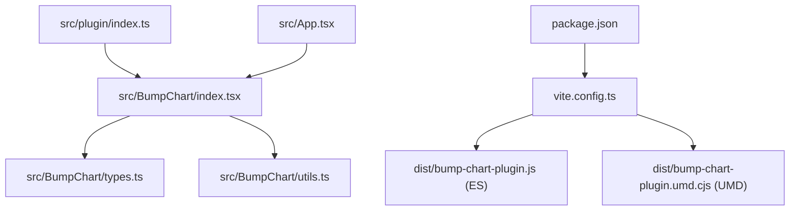
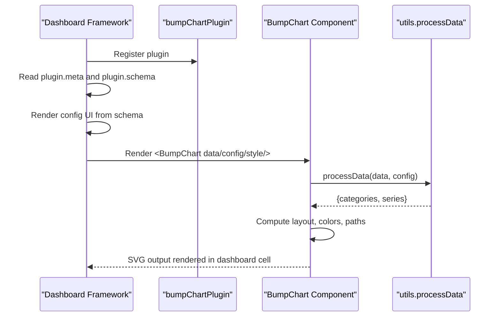
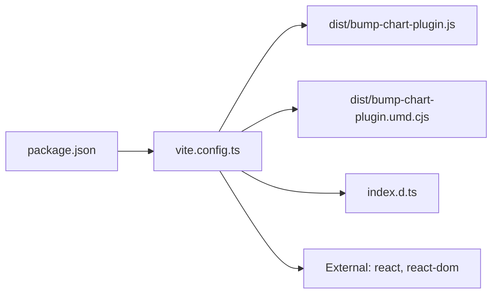

# Dashboard Integration

<cite>
**Referenced Files in This Document**
- [src/plugin/index.ts](file://src/plugin/index.ts)
- [src/BumpChart/index.tsx](file://src/BumpChart/index.tsx)
- [src/BumpChart/types.ts](file://src/BumpChart/types.ts)
- [src/BumpChart/utils.ts](file://src/BumpChart/utils.ts)
- [vite.config.ts](file://vite.config.ts)
- [package.json](file://package.json)
- [README.md](file://README.md)
- [src/App.tsx](file://src/App.tsx)
</cite>

## Table of Contents
1. [Introduction](#introduction)
2. [Project Structure](#project-structure)
3. [Core Components](#core-components)
4. [Architecture Overview](#architecture-overview)
5. [Detailed Component Analysis](#detailed-component-analysis)
6. [Dependency Analysis](#dependency-analysis)
7. [Performance Considerations](#performance-considerations)
8. [Troubleshooting Guide](#troubleshooting-guide)
9. [Conclusion](#conclusion)
10. [Appendices](#appendices)

## Introduction
This document explains how to integrate the BumpChart plugin into dashboard frameworks that support React components and a plugin registration model. It covers the standardized plugin interface, schema definition, configuration patterns, event handling strategies, state management within dashboards, dual build outputs (UMD and ES modules), distribution formats, deployment via CDN, versioning, lifecycle considerations, error handling, debugging techniques, and migration guidance across dashboard framework versions.

## Project Structure
The project is organized around a reusable React chart component and a thin plugin wrapper that exposes a standard dashboard plugin object. The build system produces both ES module and UMD bundles for broad compatibility.

**Diagram sources**
- [src/plugin/index.ts:1-85](file://src/plugin/index.ts#L1-L85)
- [src/BumpChart/index.tsx:1-340](file://src/BumpChart/index.tsx#L1-L340)
- [src/BumpChart/types.ts:1-68](file://src/BumpChart/types.ts#L1-L68)
- [src/BumpChart/utils.ts:1-113](file://src/BumpChart/utils.ts#L1-L113)
- [vite.config.ts:1-46](file://vite.config.ts#L1-L46)
- [package.json:1-44](file://package.json#L1-L44)

**Section sources**
- [src/plugin/index.ts:1-85](file://src/plugin/index.ts#L1-L85)
- [vite.config.ts:1-46](file://vite.config.ts#L1-L46)
- [package.json:1-44](file://package.json#L1-L44)

## Core Components
- BumpChart React component renders an SVG-based bump chart with configurable axes, series, and styling. It handles loading and empty states and computes layout and paths internally.
- Plugin wrapper exports a standardized DashboardPlugin object including metadata, schema, and the React component reference for dashboard registration.
- Types define data shapes, axis mapping, styles, and internal series structures.
- Utilities process raw records into categories and ranked series, assign colors, and compute smooth paths.

Key responsibilities:
- Data processing and ranking per category
- Layout computation for columns, ranks, labels, legend
- SVG rendering of nodes, lines, labels, and optional legend
- Plugin metadata and schema for dynamic form generation in dashboards

**Section sources**
- [src/BumpChart/index.tsx:1-340](file://src/BumpChart/index.tsx#L1-L340)
- [src/BumpChart/types.ts:1-68](file://src/BumpChart/types.ts#L1-L68)
- [src/BumpChart/utils.ts:1-113](file://src/BumpChart/utils.ts#L1-L113)
- [src/plugin/index.ts:1-85](file://src/plugin/index.ts#L1-L85)

## Architecture Overview
The plugin architecture separates concerns between the chart implementation and the dashboard integration contract. The plugin object conforms to a generic DashboardPlugin interface, enabling dashboard frameworks to register, render, and configure the chart using a consistent schema.

**Diagram sources**
- [src/plugin/index.ts:7-82](file://src/plugin/index.ts#L7-L82)
- [src/BumpChart/index.tsx:104-337](file://src/BumpChart/index.tsx#L104-L337)
- [src/BumpChart/utils.ts:30-112](file://src/BumpChart/utils.ts#L30-L112)

## Detailed Component Analysis

### Standardized Plugin Interface and Schema
The plugin exposes a typed DashboardPlugin object with:
- name, version, type
- component reference to the React chart
- meta describing title, description, icon, category
- schema defining expected data and config shapes for dynamic forms

This enables dashboard frameworks to:
- Discover available plugins
- Generate configuration forms automatically
- Validate inputs at runtime based on schema
- Persist and reload configurations consistently

**Section sources**
- [src/plugin/index.ts:7-82](file://src/plugin/index.ts#L7-L82)

### BumpChart Component
Responsibilities:
- Accepts data, axis mapping config, style, dimensions, title, loading, and empty text
- Computes categories and ranked series via utility functions
- Calculates layout for columns, rank rows, label widths, and spacing
- Renders SVG elements: title, category headers, rank labels, smooth connecting paths, nodes, series names, and optional legend
- Handles loading and empty states gracefully

Props overview:
- data: array of records with arbitrary fields
- config: xAxisField, yAxisField, seriesField
- style: colors, label widths, node sizes, padding, legend toggle, rank prefix/suffix
- width, height, title, loading, emptyText

Rendering flow:
- If loading, show placeholder
- If no categories or series, show empty message
- Otherwise, render SVG with computed layout and styled elements

**Section sources**
- [src/BumpChart/index.tsx:104-337](file://src/BumpChart/index.tsx#L104-L337)

### Data Processing and Ranking
Processing pipeline:
- Group raw records by xAxisField values to form categories
- For each category, map records to numeric values and series names
- Sort by value descending to determine rank per category
- Build series objects with points aligned to categories; fill missing points with placeholder entries
- Assign stable colors per series

Complexity:
- Grouping and sorting are O(N log N) per category due to sorting
- Series alignment ensures consistent point arrays across categories

Edge cases handled:
- Missing or invalid numeric values default to zero
- Missing series names filtered out
- Incomplete series padded to match category count

**Section sources**
- [src/BumpChart/utils.ts:30-112](file://src/BumpChart/utils.ts#L30-L112)

### Styles and Defaults
- Default color palette cycles across series
- Label widths and node dimensions are configurable
- Padding controls margins inside the SVG
- Legend visibility controlled by style flag

**Section sources**
- [src/BumpChart/index.tsx:5-27](file://src/BumpChart/index.tsx#L5-L27)
- [src/BumpChart/types.ts:14-35](file://src/BumpChart/types.ts#L14-L35)

### Plugin Registration and Usage
Registration example pattern:
- Import the plugin object
- Call dashboard.register(plugin)
- Dashboard reads metadata and schema to generate UI and validate configuration

Usage as React component:
- Import BumpChart directly
- Provide data, config, style, and dimensions
- Optionally set title, loading, and empty text

**Section sources**
- [src/plugin/index.ts:43-82](file://src/plugin/index.ts#L43-L82)
- [README.md:23-60](file://README.md#L23-L60)

### Configuration Examples
- Axis mapping: specify xAxisField, yAxisField, seriesField to bind data fields
- Styling: customize colors, rank labels, node sizes, padding, legend visibility
- Dimensions: set width and height to fit dashboard cells
- Title: provide descriptive header for charts

State management in dashboards:
- Store config and style in dashboard state or persistence layer
- Update props reactively when user changes field mappings or style options
- Use loading and emptyText to reflect data fetching states

**Section sources**
- [src/BumpChart/types.ts:5-49](file://src/BumpChart/types.ts#L5-L49)
- [src/App.tsx:56-183](file://src/App.tsx#L56-L183)

### Event Handling and Interactions
- The component does not expose explicit event callbacks; interactions are typically driven by dashboard-level state updates
- To add interactivity (e.g., click-to-filter), wrap the component in a higher-order component or use dashboard events to mutate props
- For accessibility and tooltips, extend the component or overlay interactive layers in your dashboard context

[No sources needed since this section provides general guidance]

### Lifecycle and State Management
- Mount: component initializes layout and processes data once props change
- Update: useMemo hooks recompute derived values when dependencies change
- Unmount: no special cleanup required beyond React’s default behavior

Best practices:
- Keep data immutable to trigger efficient re-renders
- Memoize large datasets or derived computations outside the component if necessary
- Use loading and emptyText to manage asynchronous data flows

**Section sources**
- [src/BumpChart/index.tsx:29-145](file://src/BumpChart/index.tsx#L29-L145)

## Dependency Analysis
External dependencies relevant to the plugin:
- React and ReactDOM are externalized in library builds to avoid bundling duplicates
- Optional UI framework dependencies exist in dev dependencies but are not required for the core plugin functionality

Build outputs:
- ES module: bump-chart-plugin.js
- UMD module: bump-chart-plugin.umd.cjs
- TypeScript declarations: index.d.ts

**Diagram sources**
- [package.json:1-44](file://package.json#L1-L44)
- [vite.config.ts:16-35](file://vite.config.ts#L16-L35)

**Section sources**
- [vite.config.ts:16-35](file://vite.config.ts#L16-L35)
- [package.json:14-33](file://package.json#L14-L33)

## Performance Considerations
- Data processing uses grouping and sorting; consider pre-processing large datasets before passing to the component
- useMemo in the component minimizes recomputation for layout and derived series
- Avoid excessive re-renders by stabilizing props and memoizing configs
- For very large numbers of series or categories, consider virtualization at the dashboard level or pagination of data

[No sources needed since this section provides general guidance]

## Troubleshooting Guide
Common issues and resolutions:
- Empty chart: ensure xAxisField, yAxisField, seriesField are correctly mapped and present in data
- No lines or nodes: verify that yAxisField contains numeric values and seriesField has non-empty strings
- Incorrect ranking: confirm sorting logic aligns with desired direction (higher values rank first)
- Missing legend: enable showLegend in style and ensure there are series
- Loading state: set loading to false after data fetch completes
- Empty state: customize emptyText to guide users when data is unavailable

Debugging techniques:
- Log intermediate categories and series to validate processing
- Inspect computed layout values (columns, rankY, rowHeight) during development
- Use browser DevTools to inspect SVG structure and styles
- Wrap component usage with error boundaries to catch rendering errors

**Section sources**
- [src/BumpChart/utils.ts:30-112](file://src/BumpChart/utils.ts#L30-L112)
- [src/BumpChart/index.tsx:149-182](file://src/BumpChart/index.tsx#L149-L182)

## Conclusion
The BumpChart plugin provides a robust, schema-driven integration point for React-based dashboards. Its standardized plugin interface and clear schema enable dynamic configuration, while the component offers flexible styling and responsive layout. With dual build outputs and externalized React dependencies, it integrates smoothly into diverse environments. Follow the guidance here to register, configure, and manage state effectively, and use the troubleshooting tips to resolve common issues.

[No sources needed since this section summarizes without analyzing specific files]

## Appendices

### Dual Build System Output and Distribution Formats
- ES module: bump-chart-plugin.js
- UMD module: bump-chart-plugin.umd.cjs
- Type declarations: index.d.ts

These outputs are generated by the build configuration and can be consumed via npm packages or loaded directly from CDNs.

**Section sources**
- [vite.config.ts:16-35](file://vite.config.ts#L16-L35)
- [README.md:100-110](file://README.md#L100-L110)

### Deployment Strategies and CDN Integration
- Package manager: publish to npm and install via package managers
- CDN: host UMD bundle on a CDN and include via script tag; ensure React and ReactDOM are provided globally
- Module bundlers: import ES module in modern applications; tree-shaking may reduce bundle size
- Versioning: pin versions in lockfiles and update incrementally with semantic versioning

[No sources needed since this section provides general guidance]

### Version Management
- Maintain semantic versioning for plugin releases
- Document breaking changes in schema or props
- Provide migration notes for major version updates
- Test against multiple React versions if supporting legacy environments

[No sources needed since this section provides general guidance]

### Migration Guides and Compatibility
- Dashboard frameworks: ensure they support React components and a plugin registration API similar to the documented interface
- React versions: the plugin targets React 18; verify compatibility with your environment
- Schema evolution: add new fields with defaults to maintain backward compatibility
- Deprecation strategy: mark deprecated props with warnings and plan removal timelines

[No sources needed since this section provides general guidance]