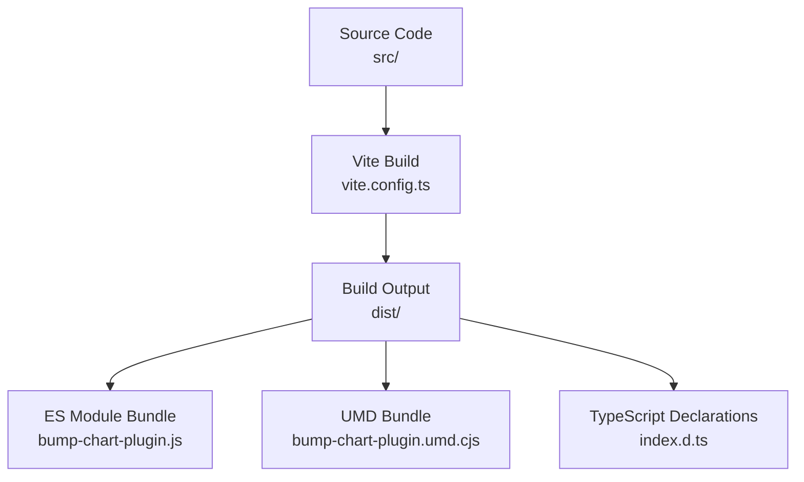
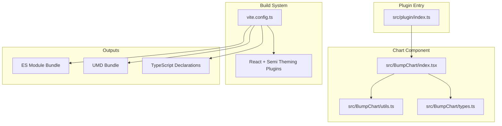
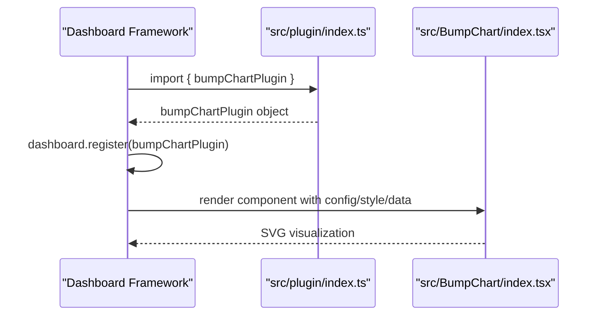
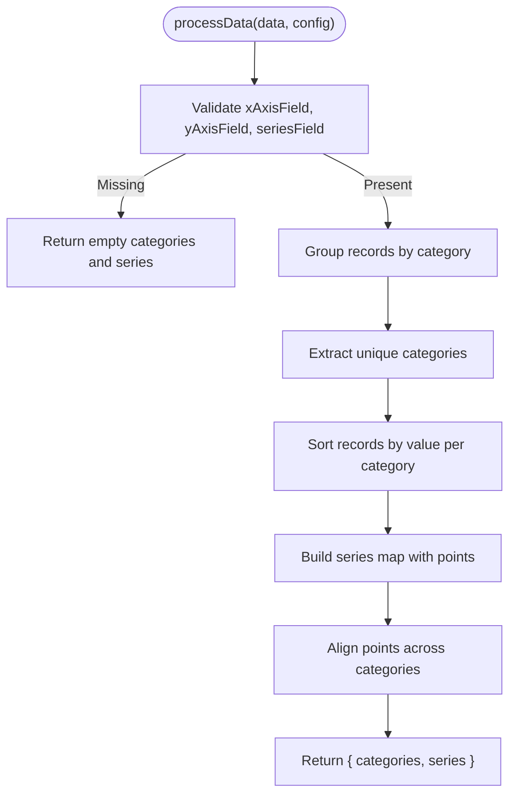
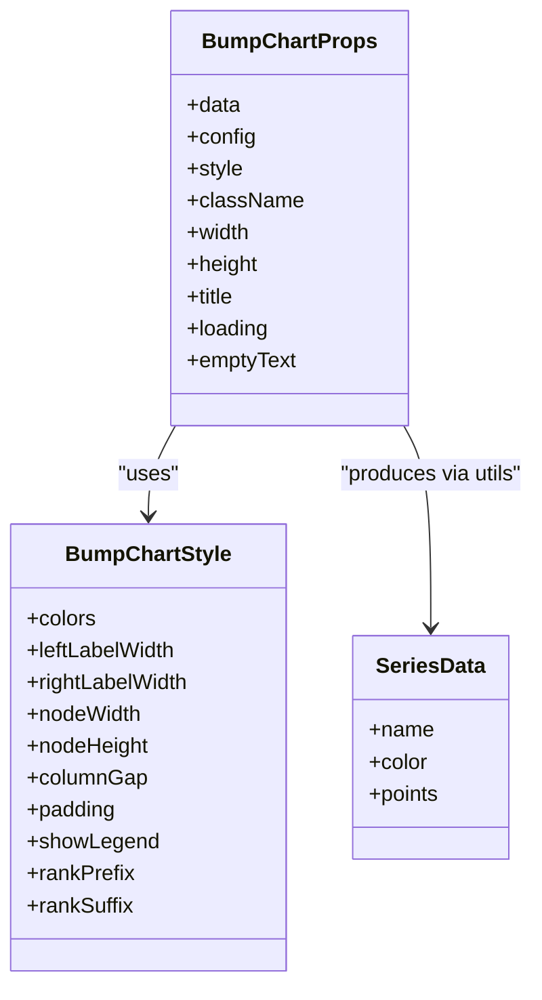
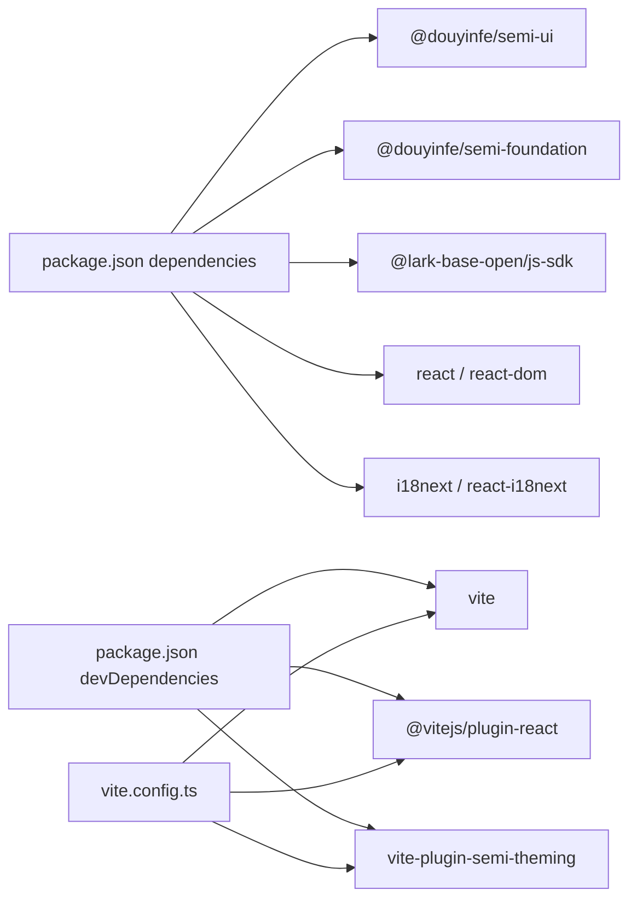

# Deployment and Distribution

<cite>
**Referenced Files in This Document**
- [package.json](file://package.json)
- [vite.config.ts](file://vite.config.ts)
- [README.md](file://README.md)
- [src/plugin/index.ts](file://src/plugin/index.ts)
- [src/BumpChart/index.tsx](file://src/BumpChart/index.tsx)
- [src/BumpChart/utils.ts](file://src/BumpChart/utils.ts)
- [src/BumpChart/types.ts](file://src/BumpChart/types.ts)
- [tsconfig.json](file://tsconfig.json)
- [index.html](file://index.html)
</cite>

## Table of Contents
1. [Introduction](#introduction)
2. [Project Structure](#project-structure)
3. [Core Components](#core-components)
4. [Architecture Overview](#architecture-overview)
5. [Detailed Component Analysis](#detailed-component-analysis)
6. [Dependency Analysis](#dependency-analysis)
7. [Performance Considerations](#performance-considerations)
8. [Troubleshooting Guide](#troubleshooting-guide)
9. [Conclusion](#conclusion)
10. [Appendices](#appendices)

## Introduction
This document provides comprehensive deployment and distribution guidance for the BumpChart plugin. It explains how Vite builds dual outputs (UMD and ES module), how to configure npm distribution via package.json, and how to integrate the plugin via CDN using both UMD bundles and ES modules. It also covers version management with semantic versioning, backward compatibility considerations, production deployment best practices, bundle optimization techniques, performance monitoring approaches, and troubleshooting steps for common distribution issues.

## Project Structure
The project is a React-based dashboard plugin that renders multi-series ranking change bump charts using pure SVG. The build system uses Vite with a React plugin and Semi theme integration. The README documents the expected build artifacts: an ES module file, a UMD CommonJS file, and TypeScript declaration files.

**Diagram sources**
- [README.md:100-111](file://README.md#L100-L111)
- [vite.config.ts:1-17](file://vite.config.ts#L1-L17)

**Section sources**
- [README.md:100-111](file://README.md#L100-L111)
- [vite.config.ts:1-17](file://vite.config.ts#L1-L17)

## Core Components
- Plugin entry point exposes the chart component and a dashboard plugin object for registration.
- Chart component implements layout, data processing, and SVG rendering.
- Utilities handle color assignment and data transformation into series and categories.
- Types define props, styles, axis configuration, and internal data structures.

Key responsibilities:
- src/plugin/index.ts: Exports the BumpChart component and a DashboardPlugin object with metadata and schema.
- src/BumpChart/index.tsx: Implements the React component, layout computation, and SVG drawing.
- src/BumpChart/utils.ts: Processes raw records into categories and series; assigns colors.
- src/BumpChart/types.ts: Declares interfaces for props, styles, and data shapes.

**Section sources**
- [src/plugin/index.ts:1-85](file://src/plugin/index.ts#L1-L85)
- [src/BumpChart/index.tsx:1-340](file://src/BumpChart/index.tsx#L1-L340)
- [src/BumpChart/utils.ts:1-113](file://src/BumpChart/utils.ts#L1-L113)
- [src/BumpChart/types.ts:1-68](file://src/BumpChart/types.ts#L1-L68)

## Architecture Overview
The plugin architecture centers on a React component that consumes typed props and produces SVG output. The plugin entry point packages the component and metadata for dashboard frameworks. Vite compiles the source into distributable formats for consumption via npm or CDN.

**Diagram sources**
- [src/plugin/index.ts:1-85](file://src/plugin/index.ts#L1-L85)
- [src/BumpChart/index.tsx:1-340](file://src/BumpChart/index.tsx#L1-L340)
- [src/BumpChart/utils.ts:1-113](file://src/BumpChart/utils.ts#L1-L113)
- [src/BumpChart/types.ts:1-68](file://src/BumpChart/types.ts#L1-L68)
- [vite.config.ts:1-17](file://vite.config.ts#L1-L17)

## Detailed Component Analysis

### Plugin Registration and Exports
The plugin entry exports the chart component and a dashboard plugin object containing name, version, type, component reference, metadata, and schema. Consumers can register this plugin with a dashboard framework.

**Diagram sources**
- [src/plugin/index.ts:1-85](file://src/plugin/index.ts#L1-L85)
- [src/BumpChart/index.tsx:1-340](file://src/BumpChart/index.tsx#L1-L340)

**Section sources**
- [src/plugin/index.ts:1-85](file://src/plugin/index.ts#L1-L85)

### Data Processing Flow
Data processing transforms raw records into categories and series, computes ranks, and ensures alignment across time/category columns.

**Diagram sources**
- [src/BumpChart/utils.ts:30-113](file://src/BumpChart/utils.ts#L30-L113)

**Section sources**
- [src/BumpChart/utils.ts:30-113](file://src/BumpChart/utils.ts#L30-L113)

### Rendering and Layout
The chart component merges default and user-provided styles, computes layout based on dimensions and content, and renders SVG elements including title, category headers, rank labels, smooth paths, nodes, and legend.

**Diagram sources**
- [src/BumpChart/types.ts:1-68](file://src/BumpChart/types.ts#L1-L68)
- [src/BumpChart/index.tsx:1-340](file://src/BumpChart/index.tsx#L1-L340)

**Section sources**
- [src/BumpChart/index.tsx:1-340](file://src/BumpChart/index.tsx#L1-L340)
- [src/BumpChart/types.ts:1-68](file://src/BumpChart/types.ts#L1-L68)

## Dependency Analysis
The project declares runtime dependencies for UI components, internationalization, and Lark Base SDK, along with development dependencies for building and styling. The build process integrates React and Semi theming plugins.

**Diagram sources**
- [package.json:14-34](file://package.json#L14-L34)
- [vite.config.ts:1-17](file://vite.config.ts#L1-L17)

**Section sources**
- [package.json:14-34](file://package.json#L14-L34)
- [vite.config.ts:1-17](file://vite.config.ts#L1-L17)

## Performance Considerations
- Use memoization for expensive computations: the chart component already uses useMemo for layout, processed data, and color assignments to avoid re-computation on re-renders.
- Minimize DOM operations: SVG rendering is efficient; ensure large datasets are preprocessed and passed as compact arrays.
- Avoid unnecessary re-renders: keep props stable and use shallow comparisons where possible.
- Optimize assets: leverage Vite’s built-in optimizations; consider code splitting if additional features are added.
- Monitor bundle size: analyze output bundles to identify heavy dependencies and tree-shake unused code.

[No sources needed since this section provides general guidance]

## Troubleshooting Guide
Common distribution and integration issues:
- Missing types: Ensure TypeScript declarations are included in the dist output; verify build script runs type checking before bundling.
- Incorrect base path: If serving from a subpath, adjust base configuration accordingly to resolve assets correctly.
- Module format mismatch: Confirm consumers load the correct format (UMD vs ES module) based on environment.
- Peer dependency conflicts: Ensure React versions align with the plugin’s expectations to avoid runtime errors.
- Internationalization resources: Verify locale files are accessible and loaded at runtime.

**Section sources**
- [README.md:100-111](file://README.md#L100-L111)
- [vite.config.ts:5-12](file://vite.config.ts#L5-L12)
- [package.json:14-34](file://package.json#L14-L34)

## Conclusion
The BumpChart plugin leverages Vite to produce both ES module and UMD bundles, enabling flexible consumption via npm and CDN. The plugin entry provides a standardized dashboard registration interface, while the chart component delivers performant SVG rendering with robust data processing. Adhering to semantic versioning and maintaining clear export mappings will ensure backward compatibility and smooth upgrades. Following the outlined production best practices and monitoring strategies will help maintain reliability and performance in diverse deployment environments.

[No sources needed since this section summarizes without analyzing specific files]

## Appendices

### Dual Build Outputs and Formats
- ES module bundle: Suitable for modern bundlers and native ES module support.
- UMD bundle: Suitable for direct script inclusion in browsers without a bundler.
- TypeScript declarations: Provide type safety for consumers using TypeScript.

**Section sources**
- [README.md:100-111](file://README.md#L100-L111)

### Package Configuration for npm Distribution
- Name and version: Define package identity and release tracking.
- Scripts: Include build commands that run type checking and bundling.
- Dependencies: Declare runtime dependencies required by the plugin.
- DevDependencies: List tools used during development and build.

**Section sources**
- [package.json:1-44](file://package.json#L1-L44)

### CDN Integration Examples
- UMD usage: Load the UMD bundle via a script tag and access the global variable exposed by the bundle.
- ES module usage: Import the ES module directly in a browser supporting ES modules or via a bundler.

Note: Replace placeholders with actual URLs pointing to your published UMD and ES module files.

[No sources needed since this section provides conceptual guidance]

### Version Management and Semantic Versioning
- Follow semantic versioning (MAJOR.MINOR.PATCH):
  - MAJOR: Incompatible API changes.
  - MINOR: Backward-compatible functionality additions.
  - PATCH: Backward-compatible bug fixes.
- Update version consistently in package.json and plugin metadata.
- Maintain changelog entries to communicate changes to consumers.

**Section sources**
- [package.json:1-10](file://package.json#L1-L10)
- [src/plugin/index.ts:43-52](file://src/plugin/index.ts#L43-L52)

### Backward Compatibility Considerations
- Preserve existing prop names and types.
- Avoid removing or renaming exported members without deprecation notices.
- Keep default behaviors consistent unless breaking changes are explicitly documented.

**Section sources**
- [src/BumpChart/types.ts:1-68](file://src/BumpChart/types.ts#L1-L68)

### Production Deployment Best Practices
- Run full build pipeline: type check followed by bundling.
- Serve static assets over HTTPS with appropriate caching headers.
- Configure base path correctly for subpath deployments.
- Validate bundle integrity and sizes before release.

**Section sources**
- [package.json:8-12](file://package.json#L8-L12)
- [vite.config.ts:5-12](file://vite.config.ts#L5-L12)

### Bundle Optimization Techniques
- Enable tree shaking by ensuring side-effect-free modules.
- Remove unused dependencies and localize imports.
- Analyze bundle composition to identify heavy libraries.
- Consider lazy loading for non-critical features.

[No sources needed since this section provides general guidance]

### Performance Monitoring Approaches
- Instrument runtime metrics: measure render times and memory usage.
- Track user interactions: log events related to data updates and chart interactions.
- Use browser developer tools: profile rendering and identify bottlenecks.
- Set up error boundaries and logging to capture runtime issues.

[No sources needed since this section provides general guidance]