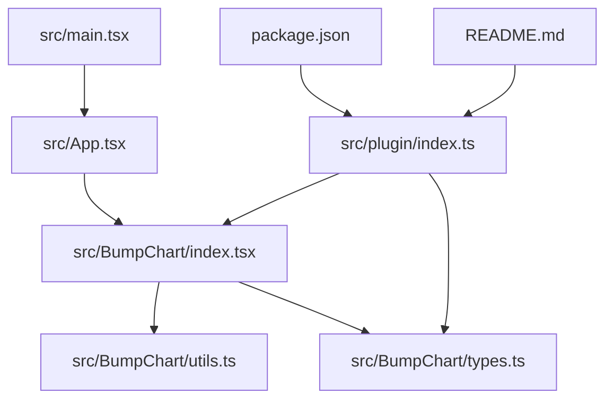
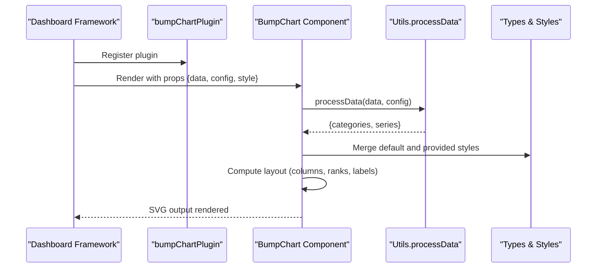
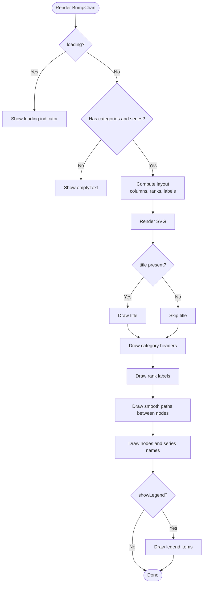
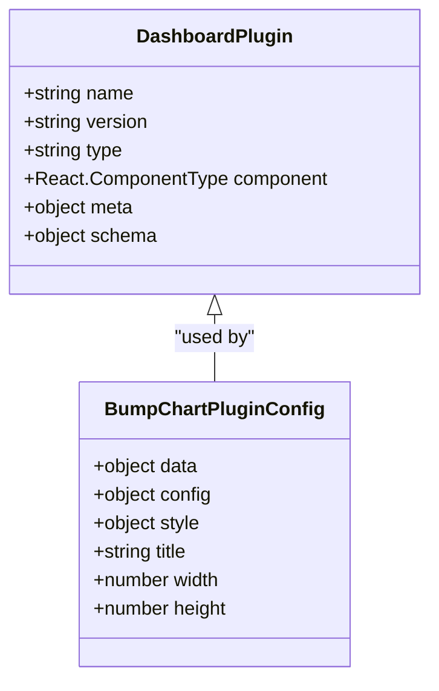
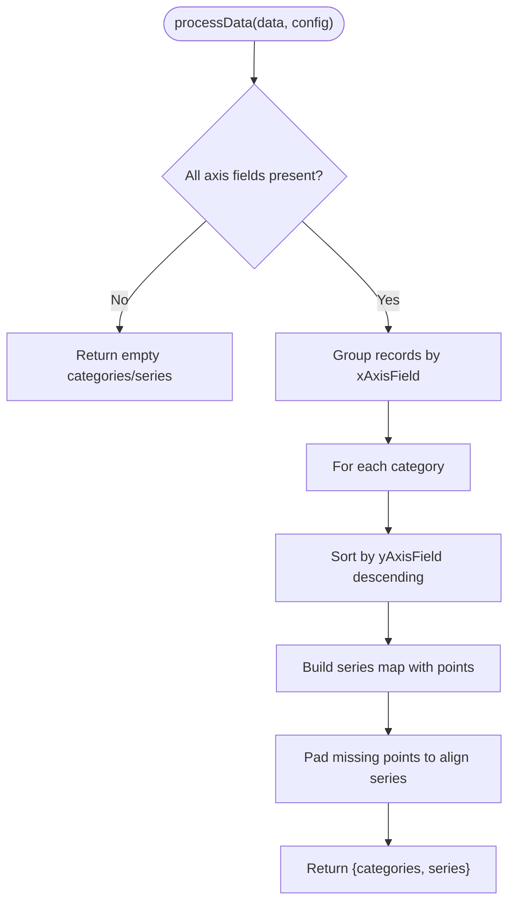
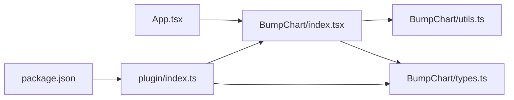

# Framework Integration Examples

<cite>
**Referenced Files in This Document**
- [index.ts](file://src/plugin/index.ts)
- [index.tsx](file://src/BumpChart/index.tsx)
- [types.ts](file://src/BumpChart/types.ts)
- [utils.ts](file://src/BumpChart/utils.ts)
- [App.tsx](file://src/App.tsx)
- [main.tsx](file://src/main.tsx)
- [package.json](file://package.json)
- [README.md](file://README.md)
</cite>

## Table of Contents
1. [Introduction](#introduction)
2. [Project Structure](#project-structure)
3. [Core Components](#core-components)
4. [Architecture Overview](#architecture-overview)
5. [Detailed Component Analysis](#detailed-component-analysis)
6. [Dependency Analysis](#dependency-analysis)
7. [Performance Considerations](#performance-considerations)
8. [Troubleshooting Guide](#troubleshooting-guide)
9. [Conclusion](#conclusion)
10. [Appendices](#appendices)

## Introduction
This document provides comprehensive framework integration examples for the BumpChart plugin, focusing on React-based dashboard frameworks. It explains how to import, register, and configure the bumpChartPlugin, describes the configuration object structure, and outlines event handling patterns. It also addresses framework-specific considerations such as state management, prop binding, and dynamic configuration updates, along with troubleshooting tips and debugging techniques tailored to common dashboard environments.

## Project Structure
The project is a React-based dashboard plugin that exports both a reusable chart component and a standardized plugin descriptor for registration into dashboard frameworks.

**Diagram sources**
- [main.tsx:1-10](file://src/main.tsx#L1-L10)
- [App.tsx:1-193](file://src/App.tsx#L1-L193)
- [index.tsx:1-340](file://src/BumpChart/index.tsx#L1-L340)
- [utils.ts:1-113](file://src/BumpChart/utils.ts#L1-L113)
- [types.ts:1-68](file://src/BumpChart/types.ts#L1-L68)
- [index.ts:1-85](file://src/plugin/index.ts#L1-L85)
- [package.json:1-44](file://package.json#L1-L44)
- [README.md:1-115](file://README.md#L1-L115)

**Section sources**
- [main.tsx:1-10](file://src/main.tsx#L1-L10)
- [App.tsx:1-193](file://src/App.tsx#L1-L193)
- [index.tsx:1-340](file://src/BumpChart/index.tsx#L1-L340)
- [utils.ts:1-113](file://src/BumpChart/utils.ts#L1-L113)
- [types.ts:1-68](file://src/BumpChart/types.ts#L1-L68)
- [index.ts:1-85](file://src/plugin/index.ts#L1-L85)
- [package.json:1-44](file://package.json#L1-L44)
- [README.md:1-115](file://README.md#L1-L115)

## Core Components
- BumpChart component: Renders a pure SVG bump chart with configurable axes, series, and styling. It processes raw data into ranked series and computes layout for columns, ranks, nodes, and labels.
- Plugin descriptor: Exposes a standardized DashboardPlugin object (name, version, type, component, meta, schema) suitable for registration in dashboard frameworks that support React components.
- Types and utilities: Define props, styles, axis configuration, and data processing logic for ranking and series assembly.

Key responsibilities:
- Data transformation: Group by category, rank by value per category, assemble series with aligned points.
- Layout computation: Determine column positions, rank spacing, label widths, and legend placement.
- Rendering: Draw title, category headers, rank labels, smooth curves between nodes, node rectangles, and optional legend.

**Section sources**
- [index.tsx:1-340](file://src/BumpChart/index.tsx#L1-L340)
- [utils.ts:1-113](file://src/BumpChart/utils.ts#L1-L113)
- [types.ts:1-68](file://src/BumpChart/types.ts#L1-L68)
- [index.ts:1-85](file://src/plugin/index.ts#L1-L85)

## Architecture Overview
The plugin architecture separates concerns into three layers:
- Presentation layer: BumpChart component renders SVG elements based on computed layout and styled series.
- Processing layer: Utilities transform raw records into categories and series with ranks and colors.
- Integration layer: The plugin descriptor exposes a standard interface for dashboard frameworks to register and render the component with metadata and schema validation.

**Diagram sources**
- [index.ts:1-85](file://src/plugin/index.ts#L1-L85)
- [index.tsx:1-340](file://src/BumpChart/index.tsx#L1-L340)
- [utils.ts:1-113](file://src/BumpChart/utils.ts#L1-L113)
- [types.ts:1-68](file://src/BumpChart/types.ts#L1-L68)

## Detailed Component Analysis

### BumpChart Component
- Props: Accepts data array, axis configuration, optional style overrides, dimensions, title, loading state, and empty text.
- State and memoization: Uses memoized computations for layout and color assignment to optimize re-renders when props change.
- Rendering flow:
  - If loading or no data, shows placeholder content.
  - Otherwise, renders SVG with title, category headers, rank labels, smooth paths connecting nodes, node rectangles, and an optional legend.
- Styling: Merges default style with user-provided style; supports colors, label widths, node sizes, padding, legend visibility, and rank prefix/suffix.

**Diagram sources**
- [index.tsx:104-337](file://src/BumpChart/index.tsx#L104-L337)

**Section sources**
- [index.tsx:1-340](file://src/BumpChart/index.tsx#L1-L340)

### Plugin Descriptor
- Exports a standardized DashboardPlugin object with name, version, type, component reference, metadata, and schema describing data, config, and style fields.
- Schema defines required axis fields and descriptions for framework-driven configuration UIs.
- Provides a consistent registration API for dashboard frameworks that accept React components.

**Diagram sources**
- [index.ts:7-32](file://src/plugin/index.ts#L7-L32)
- [index.ts:43-82](file://src/plugin/index.ts#L43-L82)

**Section sources**
- [index.ts:1-85](file://src/plugin/index.ts#L1-L85)

### Data Processing and Ranking
- Groups raw records by category field, sorts by value within each category, assigns ranks, and builds series arrays aligned to categories.
- Handles missing values and ensures series point arrays are padded to match category length.
- Assigns colors from a default palette or user-provided colors.

**Diagram sources**
- [utils.ts:30-112](file://src/BumpChart/utils.ts#L30-L112)

**Section sources**
- [utils.ts:1-113](file://src/BumpChart/utils.ts#L1-L113)

### Types and Configuration
- AxisConfig specifies xAxisField, yAxisField, seriesField for mapping raw data to chart axes and series.
- BumpChartStyle allows customization of colors, label widths, node dimensions, padding, legend visibility, and rank labeling prefixes/suffixes.
- BumpChartProps define the full set of inputs for rendering the chart.

**Section sources**
- [types.ts:1-68](file://src/BumpChart/types.ts#L1-L68)

## Dependency Analysis
- The plugin descriptor depends on the BumpChart component and types to provide a standardized registration object.
- The BumpChart component depends on utility functions for data processing and color assignment.
- The demo app demonstrates usage patterns including dynamic configuration via state and prop binding.

**Diagram sources**
- [App.tsx:1-193](file://src/App.tsx#L1-L193)
- [index.tsx:1-340](file://src/BumpChart/index.tsx#L1-L340)
- [utils.ts:1-113](file://src/BumpChart/utils.ts#L1-L113)
- [types.ts:1-68](file://src/BumpChart/types.ts#L1-L68)
- [index.ts:1-85](file://src/plugin/index.ts#L1-L85)
- [package.json:1-44](file://package.json#L1-L44)

**Section sources**
- [App.tsx:1-193](file://src/App.tsx#L1-L193)
- [index.tsx:1-340](file://src/BumpChart/index.tsx#L1-L340)
- [utils.ts:1-113](file://src/BumpChart/utils.ts#L1-L113)
- [types.ts:1-68](file://src/BumpChart/types.ts#L1-L68)
- [index.ts:1-85](file://src/plugin/index.ts#L1-L85)
- [package.json:1-44](file://package.json#L1-L44)

## Performance Considerations
- Memoization: The component uses memoized computations for layout and color assignment to minimize recalculations when props remain unchanged.
- Efficient data processing: Grouping and ranking are performed once per data/config change, ensuring stable series alignment across categories.
- SVG rendering: Pure SVG avoids heavy dependencies and leverages native browser rendering for performance.

[No sources needed since this section provides general guidance]

## Troubleshooting Guide
Common issues and resolutions:
- Missing axis fields: Ensure xAxisField, yAxisField, and seriesField are defined; otherwise, the chart returns empty categories and series.
- Invalid numeric values: Non-numeric yAxisField values are coerced to zero; verify data integrity to avoid misleading rankings.
- Empty or incomplete data: When no valid categories or series exist, the chart displays a customizable empty message.
- Loading state: Set loading to true while fetching data to show a loading indicator; reset to false when data is ready.
- Style conflicts: Overriding default styles may affect layout; adjust padding, label widths, and node sizes to maintain readability.
- Dynamic configuration: When updating config at runtime, ensure new axis fields exist in the dataset to prevent silent failures.

Framework-specific tips:
- State management: Keep config and style in local state or global store; pass them as props to BumpChart to trigger re-renders.
- Prop binding: Bind data, config, and style directly; use controlled inputs to update config fields reactively.
- Event handling: While the component does not expose explicit events, you can wrap it with your framework’s event system to capture interactions like hover or click if needed.

**Section sources**
- [utils.ts:30-112](file://src/BumpChart/utils.ts#L30-L112)
- [index.tsx:149-182](file://src/BumpChart/index.tsx#L149-L182)
- [App.tsx:56-76](file://src/App.tsx#L56-L76)

## Conclusion
The BumpChart plugin offers a flexible, framework-agnostic way to integrate multi-series ranking charts into React-based dashboards. By exporting both a component and a standardized plugin descriptor, it supports direct usage and framework registration. With clear configuration schemas, robust data processing, and customizable styling, it adapts well to various dashboard environments. Follow the integration steps outlined here to import, register, and configure the plugin effectively, leveraging state management and prop binding for dynamic updates.

[No sources needed since this section summarizes without analyzing specific files]

## Appendices

### Step-by-step Integration Guides

#### As a React Component
- Import the BumpChart component.
- Provide data as an array of records with fields mapped by AxisConfig.
- Configure axis fields (xAxisField, yAxisField, seriesField).
- Optionally customize style (colors, padding, legend, rank labels).
- Set width, height, title, loading, and emptyText as needed.

Reference example usage in the demo app for dynamic configuration and prop binding.

**Section sources**
- [App.tsx:56-183](file://src/App.tsx#L56-L183)
- [README.md:23-52](file://README.md#L23-L52)

#### As a Dashboard Plugin
- Import the bumpChartPlugin descriptor.
- Register it with your dashboard framework using the framework’s registration API.
- The plugin includes metadata and schema for framework-driven configuration UIs.

Registration pattern:
- Use dashboard.register(bumpChartPlugin) where dashboard is your framework’s registry.

**Section sources**
- [index.ts:43-82](file://src/plugin/index.ts#L43-L82)
- [README.md:54-60](file://README.md#L54-L60)

### Configuration Object Structure
- data: Array of raw records with arbitrary key-value pairs.
- config: AxisConfig specifying xAxisField, yAxisField, seriesField.
- style: BumpChartStyle for visual customization.
- Additional props: width, height, title, loading, emptyText.

**Section sources**
- [types.ts:1-68](file://src/BumpChart/types.ts#L1-L68)
- [index.ts:25-32](file://src/plugin/index.ts#L25-L32)

### Event Handling Patterns
- The component does not emit explicit events; integrate framework-level event handlers around the component if interaction is required.
- Use controlled props to reflect state changes and trigger re-renders.

[No sources needed since this section provides general guidance]

### Framework-Specific Considerations
- State Management: Manage config and style in local or global state; update via setters to reflect changes in the chart.
- Prop Binding: Bind data, config, and style directly; ensure reactive updates when these props change.
- Dynamic Configuration Updates: Change axis fields or style at runtime; validate that new fields exist in the dataset.

**Section sources**
- [App.tsx:56-76](file://src/App.tsx#L56-L76)