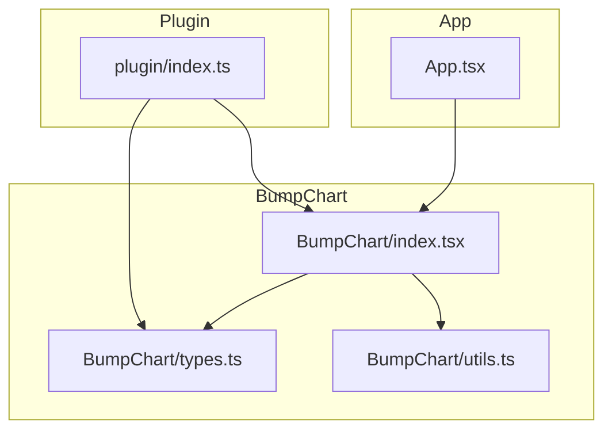
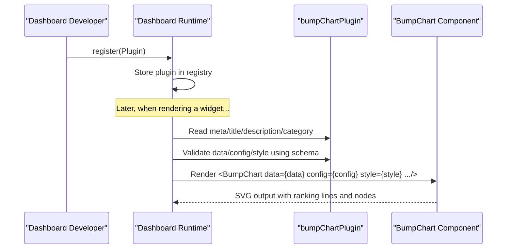
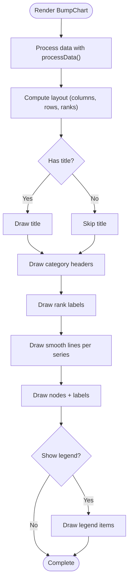
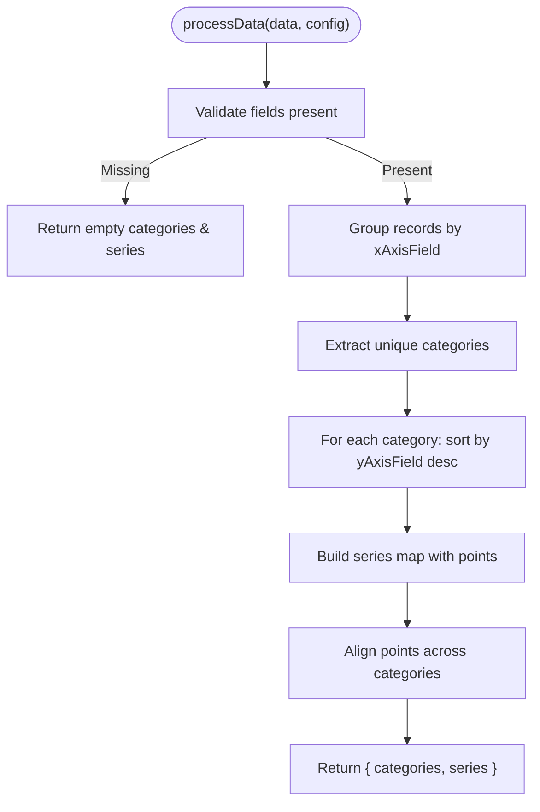
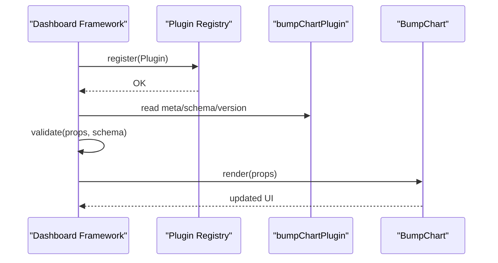
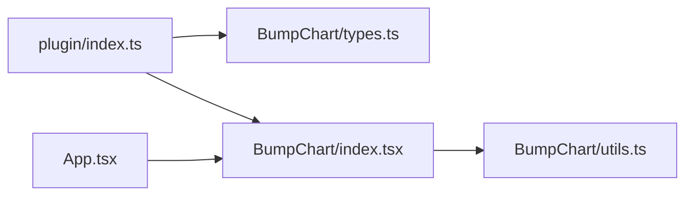

# Plugin Architecture

<cite>
**Referenced Files in This Document**
- [src/plugin/index.ts](file://src/plugin/index.ts)
- [src/BumpChart/types.ts](file://src/BumpChart/types.ts)
- [src/BumpChart/index.tsx](file://src/BumpChart/index.tsx)
- [src/BumpChart/utils.ts](file://src/BumpChart/utils.ts)
- [src/App.tsx](file://src/App.tsx)
- [package.json](file://package.json)
</cite>

## Table of Contents
1. Introduction
2. Project Structure
3. Core Components
4. Architecture Overview
5. Detailed Component Analysis
6. Dependency Analysis
7. Performance Considerations
8. Troubleshooting Guide
9. Conclusion

## Introduction
This document explains the BumpChart plugin architecture designed for React-based dashboard frameworks. It details the DashboardPlugin interface, the BumpChartPluginConfig mapping to BumpChartProps, and how the bump chart is packaged as a reusable plugin with metadata and schema for data validation. It also covers lifecycle considerations when registering plugins into dashboards, versioning strategies, and compatibility across framework versions.

## Project Structure
The project is organized around a clear separation between the chart component, its types and utilities, and the plugin descriptor that exposes the chart to a dashboard runtime.

**Diagram sources**
- [src/plugin/index.ts:1-85](file://src/plugin/index.ts#L1-L85)
- [src/BumpChart/index.tsx:1-340](file://src/BumpChart/index.tsx#L1-L340)
- [src/BumpChart/types.ts:1-68](file://src/BumpChart/types.ts#L1-L68)
- [src/BumpChart/utils.ts:1-113](file://src/BumpChart/utils.ts#L1-L113)
- [src/App.tsx:1-193](file://src/App.tsx#L1-L193)

**Section sources**
- [src/plugin/index.ts:1-85](file://src/plugin/index.ts#L1-L85)
- [src/BumpChart/types.ts:1-68](file://src/BumpChart/types.ts#L1-L68)
- [src/BumpChart/index.tsx:1-340](file://src/BumpChart/index.tsx#L1-L340)
- [src/BumpChart/utils.ts:1-113](file://src/BumpChart/utils.ts#L1-L113)
- [src/App.tsx:1-193](file://src/App.tsx#L1-L193)
- [package.json:1-44](file://package.json#L1-L44)

## Core Components
- DashboardPlugin<TProps>: A generic interface describing a dashboard plugin contract including name, version, type, component reference, metadata, and schema for data/config/style validation.
- BumpChartPluginConfig: The configuration shape passed by the dashboard to the BumpChart component via the plugin’s component prop. It maps directly to BumpChartProps fields (data, config, style, plus optional title/width/height).
- BumpChart: The React component implementing the bump chart visualization, consuming props from BumpChartProps and rendering an SVG-based chart with layout computation and series processing.
- Utilities: Data transformation functions that compute categories, ranks, and series points from raw records and axis configuration.

Key responsibilities:
- Plugin descriptor exports a typed object conforming to DashboardPlugin, enabling registration in dashboard frameworks.
- Types define strict contracts for data, axis configuration, styling, and internal series structures.
- Component handles loading states, empty states, layout calculations, and SVG rendering.
- Utilities provide deterministic color assignment and robust data processing with missing value handling.

**Section sources**
- [src/plugin/index.ts:7-32](file://src/plugin/index.ts#L7-L32)
- [src/BumpChart/types.ts:1-68](file://src/BumpChart/types.ts#L1-L68)
- [src/BumpChart/index.tsx:104-337](file://src/BumpChart/index.tsx#L104-L337)
- [src/BumpChart/utils.ts:30-112](file://src/BumpChart/utils.ts#L30-L112)

## Architecture Overview
The plugin architecture centers on a single exported plugin object that encapsulates the chart component and its configuration contract. Dashboard frameworks typically call a registration function with this object, store it in a registry, and later instantiate the component with user-provided data/config/style validated against the plugin’s schema.

**Diagram sources**
- [src/plugin/index.ts:43-82](file://src/plugin/index.ts#L43-L82)
- [src/BumpChart/index.tsx:104-337](file://src/BumpChart/index.tsx#L104-L337)

## Detailed Component Analysis

### DashboardPlugin Interface
- name: string — Unique identifier for the plugin.
- version: string — Semantic version for compatibility checks.
- type: 'chart' | 'widget' | 'card' — Declares the plugin category.
- component: React.ComponentType<TProps> — The React component to render.
- meta: { title, description, icon?, category? } — Human-readable information for UI.
- schema: { data, config, style? } — JSON Schema-like descriptors used by dashboards to validate incoming payloads.

In this implementation, the plugin object provides all required fields and sets sensible defaults for the bump chart.

**Section sources**
- [src/plugin/index.ts:7-23](file://src/plugin/index.ts#L7-L23)
- [src/plugin/index.ts:43-82](file://src/plugin/index.ts#L43-L82)

### BumpChartPluginConfig and Mapping to BumpChartProps
- BumpChartPluginConfig mirrors BumpChartProps for data, config, and style, and adds optional title, width, height for container sizing.
- The plugin casts the BumpChart component to accept BumpChartPluginConfig, ensuring type safety when the dashboard renders it.

Mapping highlights:
- data: RawRecord[] — Array of records with arbitrary keys; processed by utils to extract categories and series.
- config: AxisConfig — Defines xAxisField, yAxisField, seriesField for ranking logic.
- style?: BumpChartStyle — Optional overrides for colors, label widths, node dimensions, gaps, padding, legend visibility, rank prefix/suffix.
- Additional props like className, width, height, title, loading, emptyText are supported by the component but not part of the plugin config schema.

**Section sources**
- [src/plugin/index.ts:25-32](file://src/plugin/index.ts#L25-L32)
- [src/BumpChart/types.ts:37-49](file://src/BumpChart/types.ts#L37-L49)
- [src/BumpChart/index.tsx:104-118](file://src/BumpChart/index.tsx#L104-L118)

### BumpChart Component Behavior
- Props: data, config, style, className, width, height, title, loading, emptyText.
- Layout computation: Uses a custom hook to calculate plot area, column positions, row spacing based on rank count, and label sizes.
- Rendering: Produces an SVG with title, category headers, rank labels, smooth curved lines connecting ranked points, nodes with labels, and an optional legend.
- State handling: Shows loading indicator or empty text when appropriate.

**Diagram sources**
- [src/BumpChart/index.tsx:29-90](file://src/BumpChart/index.tsx#L29-L90)
- [src/BumpChart/index.tsx:149-319](file://src/BumpChart/index.tsx#L149-L319)

**Section sources**
- [src/BumpChart/index.tsx:104-337](file://src/BumpChart/index.tsx#L104-L337)

### Data Processing Logic
- Input: RawRecord[] and AxisConfig.
- Grouping: Groups records by xAxisField values to form categories.
- Ranking: Within each category, sorts by yAxisField descending to assign ranks.
- Series assembly: Builds series arrays aligned to categories, filling missing points with placeholder entries to maintain alignment.
- Colors: Assigns colors cyclically from provided or default palette.

**Diagram sources**
- [src/BumpChart/utils.ts:30-112](file://src/BumpChart/utils.ts#L30-L112)

**Section sources**
- [src/BumpChart/utils.ts:30-112](file://src/BumpChart/utils.ts#L30-L112)

### Plugin Registration and Lifecycle Management
- Registration: Exported bumpChartPlugin object conforms to DashboardPlugin and can be registered via a dashboard’s API (e.g., dashboard.register).
- Lifecycle:
  - Initialization: Dashboard reads plugin metadata and schema.
  - Validation: Incoming data/config/style are validated against schema before rendering.
  - Rendering: Dashboard instantiates the component with validated props.
  - Updates: When props change, the component re-renders with new layouts and visuals.
- Compatibility: Version field enables dashboards to enforce minimum required versions and handle breaking changes gracefully.

**Diagram sources**
- [src/plugin/index.ts:43-82](file://src/plugin/index.ts#L43-L82)

**Section sources**
- [src/plugin/index.ts:43-82](file://src/plugin/index.ts#L43-L82)

### Examples of Metadata and Schema Configuration
- Metadata includes title, description, and category to guide dashboard UI presentation.
- Schema defines:
  - data: array of objects representing raw records.
  - config: object with required fields xAxisField, yAxisField, seriesField.
  - style: optional object for visual customization.

These definitions enable dynamic forms and validation within dashboards without hardcoding field names.

**Section sources**
- [src/plugin/index.ts:48-81](file://src/plugin/index.ts#L48-L81)

### Component Wrapping Patterns
- The plugin wraps the BumpChart component and exposes it through a standardized interface.
- Optional wrapper patterns include:
  - Adding a container with title, width, height.
  - Injecting theme or i18n context if needed.
  - Providing default styles or behaviors consistent with the dashboard’s design system.

In this codebase, the plugin directly references the BumpChart component and relies on its built-in support for title, width, height, and style.

**Section sources**
- [src/plugin/index.ts:43-47](file://src/plugin/index.ts#L43-L47)
- [src/BumpChart/index.tsx:104-118](file://src/BumpChart/index.tsx#L104-L118)

## Dependency Analysis
The plugin depends on the BumpChart component and its types/utilities. The App demonstrates usage by passing demo data and configuration.

**Diagram sources**
- [src/plugin/index.ts:1-6](file://src/plugin/index.ts#L1-L6)
- [src/BumpChart/index.tsx:1-3](file://src/BumpChart/index.tsx#L1-L3)
- [src/BumpChart/utils.ts:1-2](file://src/BumpChart/utils.ts#L1-L2)
- [src/App.tsx:1-3](file://src/App.tsx#L1-L3)

**Section sources**
- [src/plugin/index.ts:1-6](file://src/plugin/index.ts#L1-L6)
- [src/BumpChart/index.tsx:1-3](file://src/BumpChart/index.tsx#L1-L3)
- [src/BumpChart/utils.ts:1-2](file://src/BumpChart/utils.ts#L1-L2)
- [src/App.tsx:1-3](file://src/App.tsx#L1-L3)

## Performance Considerations
- Memoization: The component uses memoized computations for layout and derived series to avoid unnecessary recalculations on re-renders.
- Efficient grouping: Data processing groups records once per category and builds series with minimal allocations.
- SVG rendering: Renders only visible elements; conditional rendering reduces DOM overhead for titles and legends.
- Color cycling: Simple modulo operation ensures constant-time color assignment.

Recommendations:
- Keep data size reasonable; consider pagination or aggregation for very large datasets.
- Use stable keys for lists to improve reconciliation performance.
- Avoid frequent prop changes that trigger full recomputation; batch updates where possible.

[No sources needed since this section provides general guidance]

## Troubleshooting Guide
Common issues and resolutions:
- Missing axis fields: If xAxisField, yAxisField, or seriesField are undefined, the chart returns empty categories and series. Ensure these fields exist in the config.
- Invalid numeric values: Non-numeric yAxisField values are coerced to zero; verify data types to avoid incorrect rankings.
- Empty dataset: When no valid categories or series exist, the component displays an empty state message; check input data and field mappings.
- Loading state: Set loading to true while fetching data; ensure it switches to false after data is ready to prevent persistent loading indicators.

Validation tips:
- Use the plugin’s schema in your dashboard to enforce required fields and types before rendering.
- Log warnings when fields are missing or malformed to aid debugging.

**Section sources**
- [src/BumpChart/utils.ts:30-38](file://src/BumpChart/utils.ts#L30-L38)
- [src/BumpChart/index.tsx:149-182](file://src/BumpChart/index.tsx#L149-L182)

## Conclusion
The BumpChart plugin provides a clean, typed abstraction for integrating a ranking-change visualization into React-based dashboards. The DashboardPlugin interface standardizes metadata, schema, and component exposure, while BumpChartPluginConfig ensures seamless mapping to BumpChartProps. With robust data processing, flexible styling, and clear lifecycle hooks for registration and validation, this plugin supports scalable dashboard ecosystems and maintains compatibility through explicit versioning.

[No sources needed since this section summarizes without analyzing specific files]