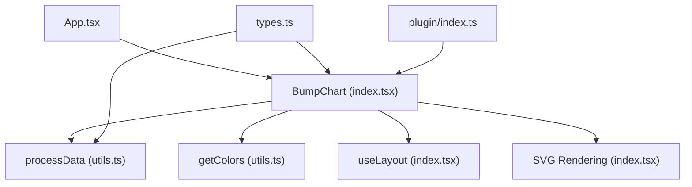
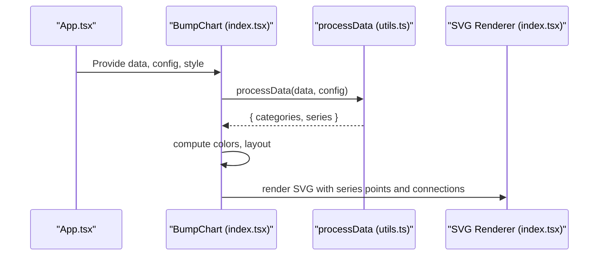
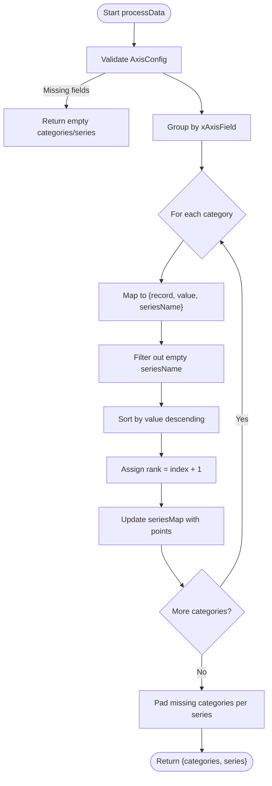
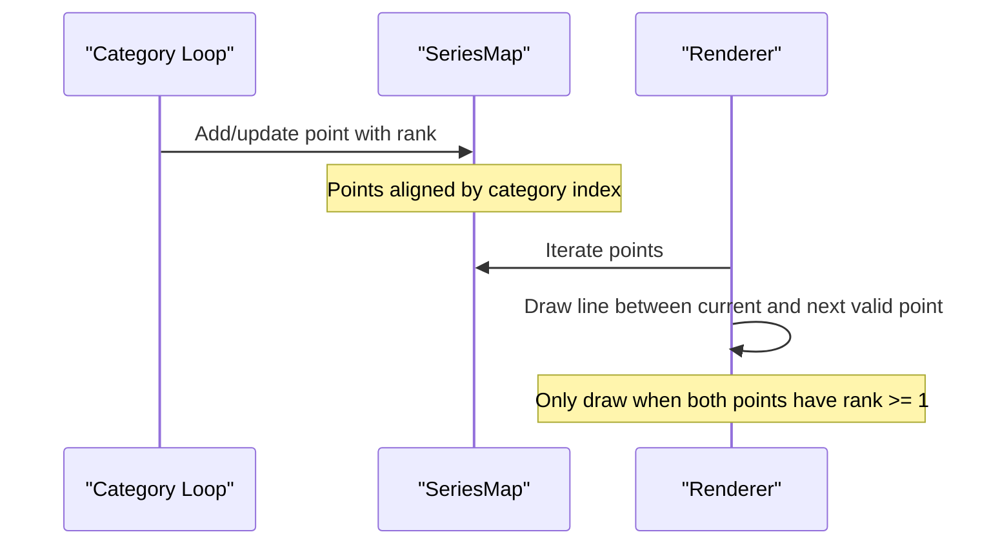
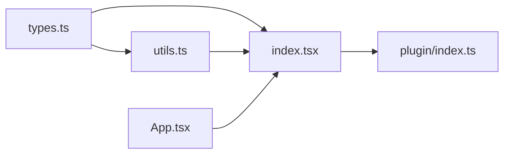
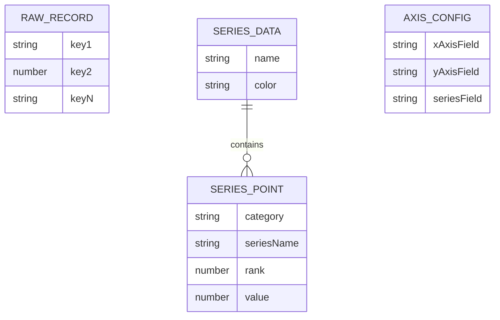

# Data Structures

<cite>
**Referenced Files in This Document**
- [types.ts](file://src/BumpChart/types.ts)
- [utils.ts](file://src/BumpChart/utils.ts)
- [index.tsx](file://src/BumpChart/index.tsx)
- [plugin/index.ts](file://src/plugin/index.ts)
- [App.tsx](file://src/App.tsx)
- [README.md](file://README.md)
</cite>

## Table of Contents
1. [Introduction](#introduction)
2. [Project Structure](#project-structure)
3. [Core Components](#core-components)
4. [Architecture Overview](#architecture-overview)
5. [Detailed Component Analysis](#detailed-component-analysis)
6. [Dependency Analysis](#dependency-analysis)
7. [Performance Considerations](#performance-considerations)
8. [Troubleshooting Guide](#troubleshooting-guide)
9. [Conclusion](#conclusion)
10. [Appendices](#appendices)

## Introduction
This document explains the data structures and processing pipeline for the BumpChart component. It focuses on:
- Input data format using RawRecord with flexible key-value pairs
- Axis field mapping via AxisConfig (xAxisField, yAxisField, seriesField)
- The transformation from raw records to processed SeriesData through processData
- Automatic ranking calculation, sorting, and connection logic
- Examples, edge cases, validation, error handling, performance guidance, and lifecycle/memory considerations

## Project Structure
The BumpChart implementation is organized into three core files plus supporting plugin and demo code:
- types.ts: Defines all data structures and configuration interfaces
- utils.ts: Implements data processing and color utilities
- index.tsx: React component that orchestrates layout and rendering
- plugin/index.ts: Exposes a dashboard plugin wrapper
- App.tsx: Demo application with sample dataset
- README.md: Usage and API overview

**Diagram sources**
- [index.tsx:1-340](file://src/BumpChart/index.tsx#L1-L340)
- [utils.ts:1-113](file://src/BumpChart/utils.ts#L1-L113)
- [types.ts:1-68](file://src/BumpChart/types.ts#L1-L68)
- [plugin/index.ts:1-85](file://src/plugin/index.ts#L1-L85)

**Section sources**
- [index.tsx:1-340](file://src/BumpChart/index.tsx#L1-L340)
- [utils.ts:1-113](file://src/BumpChart/utils.ts#L1-L113)
- [types.ts:1-68](file://src/BumpChart/types.ts#L1-L68)
- [plugin/index.ts:1-85](file://src/plugin/index.ts#L1-L85)
- [App.tsx:1-193](file://src/App.tsx#L1-L193)
- [README.md:1-115](file://README.md#L1-L115)

## Core Components
- RawRecord: Flexible key-value record where values can be string, number, or undefined. Used as input rows.
- AxisConfig: Maps chart axes to fields in RawRecord:
  - xAxisField: category/time dimension
  - yAxisField: numeric value used for ranking
  - seriesField: entity identifier (e.g., city, product)
- SeriesPoint: A single ranked point with category, seriesName, rank, and value
- SeriesData: A named series with a color and an ordered array of points
- ColumnLayout: Layout metadata for each category column (x position and label)

These types define the contract between input data, processing, and rendering.

**Section sources**
- [types.ts:1-68](file://src/BumpChart/types.ts#L1-L68)

## Architecture Overview
The data flow transforms flexible raw records into structured series with computed ranks and aligned time/category columns.

**Diagram sources**
- [index.tsx:104-145](file://src/BumpChart/index.tsx#L104-L145)
- [utils.ts:30-112](file://src/BumpChart/utils.ts#L30-L112)

## Detailed Component Analysis

### Input Data Format: RawRecord and AxisConfig
- RawRecord allows arbitrary keys; only xAxisField, yAxisField, and seriesField are used by the processor.
- AxisConfig must specify all three fields; otherwise, processData returns empty results.

Valid examples (from demo):
- xAxisField: 'year'
- yAxisField: 'value'
- seriesField: 'city'

Edge cases handled by the processor:
- Missing or non-string xAxisField values are skipped
- Non-numeric or missing yAxisField values become 0
- Missing or empty seriesField entries are filtered out

**Section sources**
- [types.ts:1-12](file://src/BumpChart/types.ts#L1-L12)
- [utils.ts:20-28](file://src/BumpChart/utils.ts#L20-L28)
- [utils.ts:30-48](file://src/BumpChart/utils.ts#L30-L48)
- [App.tsx:5-39](file://src/App.tsx#L5-L39)
- [README.md:27-52](file://README.md#L27-L52)

### Data Transformation Pipeline: processData
The processData function performs these steps:
1. Validate AxisConfig; return empty if any required field is missing
2. Group records by xAxisField (category), preserving insertion order
3. For each category:
   - Convert yAxisField to number (invalid becomes 0)
   - Extract seriesName from seriesField (non-empty only)
   - Sort descending by value to compute ranks
4. Assign rank = index + 1 per category
5. Build SeriesData per unique seriesName:
   - Maintain consistent ordering across categories
   - Pad missing categories with placeholder points (rank -1, value 0) to align series arrays
6. Return categories list and series array

Complexity:
- Grouping: O(N)
- Sorting per category: sum over categories of O(k log k) where k is records per category
- Building series and padding: O(S * C) where S is number of series and C is number of categories

**Diagram sources**
- [utils.ts:30-112](file://src/BumpChart/utils.ts#L30-L112)

**Section sources**
- [utils.ts:30-112](file://src/BumpChart/utils.ts#L30-L112)

### Axis Field Mapping and Processing Rules
- x-axis (category/time): Determined by xAxisField; categories preserve first-seen order
- y-axis (ranking value): Numeric conversion via parseFloat; invalid or missing becomes 0
- series (entities): Identified by seriesField; only entries with non-empty seriesName are included

Behavioral notes:
- If multiple records share the same seriesName within a category, they will be sorted by value and assigned distinct ranks based on their position in the sorted list
- Missing seriesName entries are excluded from ranking and rendering

**Section sources**
- [utils.ts:20-28](file://src/BumpChart/utils.ts#L20-L28)
- [utils.ts:55-64](file://src/BumpChart/utils.ts#L55-L64)
- [utils.ts:66-96](file://src/BumpChart/utils.ts#L66-L96)

### Ranking Calculation and Connection Logic
- Ranking: Within each category, records are sorted by value descending; rank starts at 1
- Connections: Between adjacent categories, smooth cubic bezier curves connect consecutive valid points (rank >= 1) for each series
- Alignment: Each series’ points array is padded so that indices correspond to category positions; missing points have rank -1 and value 0

**Diagram sources**
- [utils.ts:66-109](file://src/BumpChart/utils.ts#L66-L109)
- [index.tsx:224-251](file://src/BumpChart/index.tsx#L224-L251)

**Section sources**
- [utils.ts:66-109](file://src/BumpChart/utils.ts#L66-L109)
- [index.tsx:224-251](file://src/BumpChart/index.tsx#L224-L251)

### Examples of Valid Data Structures
- Time-series ranking: year -> value per city
- Category-based ranking: region -> score per product
- Mixed numeric/string keys: As long as xAxisField, yAxisField, seriesField exist in each record

Demo dataset demonstrates multi-year rankings across cities.

**Section sources**
- [App.tsx:5-39](file://src/App.tsx#L5-L39)
- [README.md:27-52](file://README.md#L27-L52)

### Edge Cases and Validation
- Missing axis fields in config: Returns empty result
- Empty or null seriesName: Skipped
- Non-numeric yAxisField: Treated as 0
- Duplicate seriesName within a category: Sorted by value; ranks reflect order
- Missing categories for a series: Padded with placeholder points (rank -1, value 0)

Validation strategy:
- Defensive parsing for numbers and strings
- Early exit for invalid config
- Filtering and padding to ensure stable rendering

**Section sources**
- [utils.ts:20-28](file://src/BumpChart/utils.ts#L20-L28)
- [utils.ts:30-48](file://src/BumpChart/utils.ts#L30-L48)
- [utils.ts:55-96](file://src/BumpChart/utils.ts#L55-L96)
- [utils.ts:99-109](file://src/BumpChart/utils.ts#L99-L109)

### Performance Considerations
- Complexity: O(N + Σ(k log k) + S*C). For large datasets:
  - Prefer pre-sorted data per category to reduce sort cost
  - Minimize duplicate series names per category
  - Keep category count reasonable; excessive categories increase padding overhead
- Memory:
  - Uses Map for grouping and series accumulation; efficient for sparse series
  - Padding creates placeholder points; consider limiting series count or categories for very large inputs
- Rendering:
  - Smooth paths are generated per series per category pair; avoid extremely high series counts to keep DOM size manageable

Optimization tips:
- Batch updates to data/config to trigger fewer recomputations
- Use memoization (already applied in component) to avoid redundant processing
- For very large datasets, consider server-side aggregation or sampling

[No sources needed since this section provides general guidance]

### Data Lifecycle Management and Memory Considerations
- Lifecycle:
  - processData runs inside useMemo keyed by data and config changes
  - Colors and layout are also memoized to minimize re-renders
- Memory:
  - Intermediate grouped maps are transient per call
  - SeriesData persists in component state via useMemo; ensure props change appropriately to release references
- Best practices:
  - Avoid mutating input data in place; pass new arrays when updating
  - Clear or replace data references when unmounting to allow GC

**Section sources**
- [index.tsx:120-145](file://src/BumpChart/index.tsx#L120-L145)

## Dependency Analysis
The component depends on types and utilities, and exposes a plugin interface.

**Diagram sources**
- [types.ts:1-68](file://src/BumpChart/types.ts#L1-L68)
- [utils.ts:1-113](file://src/BumpChart/utils.ts#L1-L113)
- [index.tsx:1-340](file://src/BumpChart/index.tsx#L1-L340)
- [plugin/index.ts:1-85](file://src/plugin/index.ts#L1-L85)
- [App.tsx:1-193](file://src/App.tsx#L1-L193)

**Section sources**
- [types.ts:1-68](file://src/BumpChart/types.ts#L1-L68)
- [utils.ts:1-113](file://src/BumpChart/utils.ts#L1-L113)
- [index.tsx:1-340](file://src/BumpChart/index.tsx#L1-L340)
- [plugin/index.ts:1-85](file://src/plugin/index.ts#L1-L85)
- [App.tsx:1-193](file://src/App.tsx#L1-L193)

## Performance Considerations
- Sorting dominates per-category processing; pre-sorting can help
- Large numbers of series or categories increase memory and rendering costs
- Memoization reduces recomputation; ensure prop stability
- For very large datasets, consider pagination or aggregation strategies

[No sources needed since this section provides general guidance]

## Troubleshooting Guide
Common issues and resolutions:
- No data displayed:
  - Ensure xAxisField, yAxisField, seriesField are set and present in data
  - Verify seriesName values are non-empty strings
- Unexpected ranks:
  - Confirm yAxisField contains numeric values; invalid values become 0
  - Check for ties; equal values will be ordered by original sequence after sort
- Missing lines between categories:
  - Ensure series has valid points in adjacent categories; placeholders have rank -1 and won’t connect
- Performance lag:
  - Reduce number of series/categories or pre-aggregate data
  - Avoid frequent prop churn; batch updates

**Section sources**
- [utils.ts:20-28](file://src/BumpChart/utils.ts#L20-L28)
- [utils.ts:55-96](file://src/BumpChart/utils.ts#L55-L96)
- [index.tsx:167-182](file://src/BumpChart/index.tsx#L167-L182)

## Conclusion
The BumpChart component transforms flexible raw records into structured series with computed ranks and aligned timelines. By configuring AxisConfig, you control how categories, values, and entities map to the visualization. The processData utility ensures robust handling of missing or invalid data, while the component’s memoization and layout logic provide efficient rendering. For large datasets, apply pre-processing and batching strategies to maintain performance.

[No sources needed since this section summarizes without analyzing specific files]

## Appendices

### Data Model Diagram

**Diagram sources**
- [types.ts:1-68](file://src/BumpChart/types.ts#L1-L68)