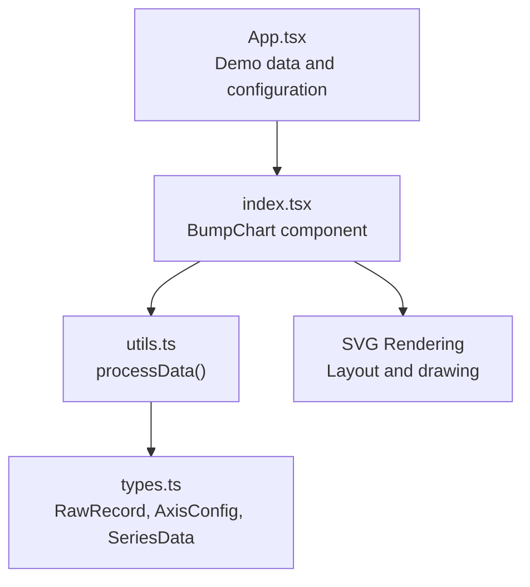
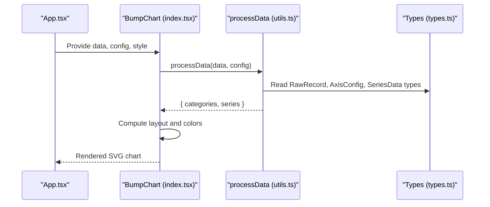
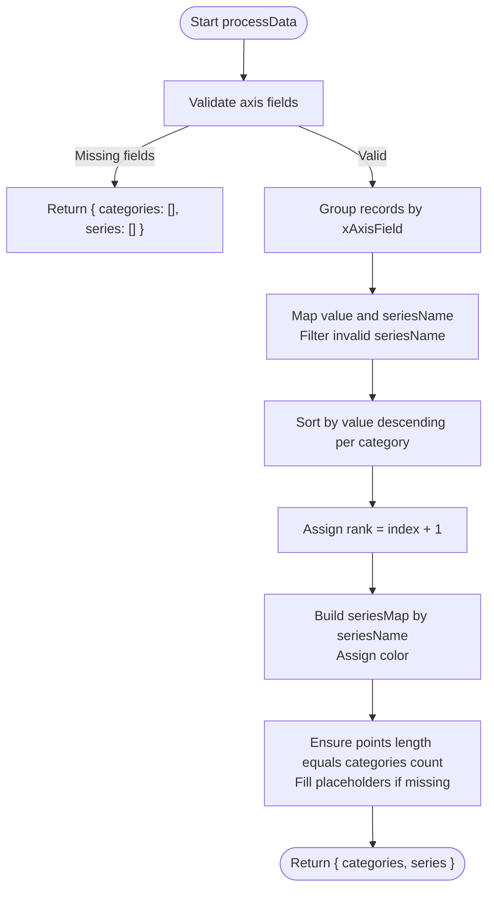
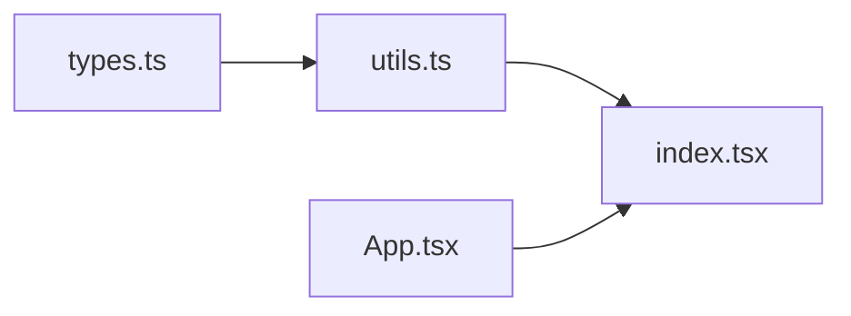

# Data Transformation Pipeline

<cite>
**Referenced Files in This Document**
- [utils.ts](file://src/BumpChart/utils.ts)
- [types.ts](file://src/BumpChart/types.ts)
- [index.tsx](file://src/BumpChart/index.tsx)
- [App.tsx](file://src/App.tsx)
- [README.md](file://README.md)
</cite>

## Table of Contents
1. [Introduction](#introduction)
2. [Project Structure](#project-structure)
3. [Core Components](#core-components)
4. [Architecture Overview](#architecture-overview)
5. [Detailed Component Analysis](#detailed-component-analysis)
6. [Dependency Analysis](#dependency-analysis)
7. [Performance Considerations](#performance-considerations)
8. [Troubleshooting Guide](#troubleshooting-guide)
9. [Conclusion](#conclusion)
10. [Appendices](#appendices)

## Introduction
This document explains the data transformation pipeline that converts raw input arrays into visualization-ready series for a Bump Chart. The core utility processes RawRecord[] arrays according to an AxisConfig and outputs categories and SeriesData structures suitable for rendering. It covers validation, field mapping, grouping by category, sorting within each category, automatic ranking computation, series grouping, and alignment of points across categories. It also includes examples of before-and-after transformations, error handling behavior, performance considerations for large datasets, and memory management strategies.

## Project Structure
The project is organized around a React-based chart component with a dedicated transformation utility:
- Types define the input and output contracts used by the pipeline.
- The utility implements the transformation logic.
- The React component consumes the transformed data and renders the chart.
- An application example demonstrates usage with sample data.

**Diagram sources**
- [index.tsx:104-145](file://src/BumpChart/index.tsx#L104-L145)
- [utils.ts:30-112](file://src/BumpChart/utils.ts#L30-L112)
- [types.ts:1-68](file://src/BumpChart/types.ts#L1-L68)

**Section sources**
- [index.tsx:104-145](file://src/BumpChart/index.tsx#L104-L145)
- [utils.ts:30-112](file://src/BumpChart/utils.ts#L30-L112)
- [types.ts:1-68](file://src/BumpChart/types.ts#L1-L68)
- [App.tsx:5-39](file://src/App.tsx#L5-L39)

## Core Components
- processData(data, config): Transforms RawRecord[] into { categories: string[], series: SeriesData[] }.
- getColors(colors?): Provides default or custom color palette for series.
- Type definitions: RawRecord, AxisConfig, SeriesPoint, SeriesData, etc.

Key responsibilities:
- Validate axis configuration fields.
- Group records by category (xAxisField).
- Map values and series names using yAxisField and seriesField.
- Sort records within each category by value descending to compute ranks.
- Build series grouped by seriesField, ensuring consistent point ordering across categories.
- Fill missing points per series with placeholder entries to maintain alignment.

**Section sources**
- [utils.ts:30-112](file://src/BumpChart/utils.ts#L30-L112)
- [types.ts:1-68](file://src/BumpChart/types.ts#L1-L68)

## Architecture Overview
The pipeline integrates with the React component as follows:
- The component receives data and config, then calls processData to transform inputs.
- The transformed categories and series are used to compute layout and render SVG elements.
- Colors are applied to series for visual distinction.

**Diagram sources**
- [index.tsx:104-145](file://src/BumpChart/index.tsx#L104-L145)
- [utils.ts:30-112](file://src/BumpChart/utils.ts#L30-L112)
- [types.ts:1-68](file://src/BumpChart/types.ts#L1-L68)

## Detailed Component Analysis

### processData Utility Function
Purpose: Convert raw records into structured series data ready for visualization.

Inputs:
- data: Array of RawRecord objects.
- config: AxisConfig specifying xAxisField, yAxisField, seriesField.

Outputs:
- categories: Ordered list of unique category labels derived from xAxisField.
- series: Array of SeriesData objects, each containing name, color, and points aligned to categories.

Processing steps:
1. Validation:
   - If any required axis field is missing, return empty categories and series.
2. Grouping by category:
   - Iterate through data and group records by the category label extracted from xAxisField.
   - Skip records where the category is empty or invalid.
3. Mapping and filtering:
   - For each record, map to normalized value (numeric) and seriesName (string).
   - Filter out entries without a valid seriesName.
4. Sorting and ranking:
   - Within each category, sort mapped items by value descending.
   - Assign rank starting at 1 based on sorted position.
5. Series construction:
   - Maintain a seriesMap keyed by seriesName.
   - For each ranked item, ensure the series exists; assign a color from the palette.
   - Append a point object with category, seriesName, rank, and value.
6. Alignment and padding:
   - Ensure each series’ points array aligns with the number of categories.
   - Insert placeholder points with rank -1 and value 0 for missing categories.
7. Finalization:
   - Return categories and series array.

Complexity:
- Grouping: O(n) where n is number of records.
- Sorting per category: Sum over categories of O(k log k), where k is records per category.
- Series building and alignment: O(s * c), where s is number of series and c is number of categories.

Memory:
- Uses Maps for grouping and series storage.
- Placeholder points allocated only when needed to align series.

Error handling:
- Missing axis fields result in early return with empty output.
- Invalid numeric values are coerced to zero.
- Empty or null series names are filtered out.

**Diagram sources**
- [utils.ts:30-112](file://src/BumpChart/utils.ts#L30-L112)

**Section sources**
- [utils.ts:30-112](file://src/BumpChart/utils.ts#L30-L112)

### Axis Configuration and Field Mapping
- xAxisField: Determines category labels and column order.
- yAxisField: Numeric field used to compute rankings within each category.
- seriesField: Identifies entities forming individual series lines.

Behavior:
- Categories are derived from unique non-empty xAxisField values.
- Values are coerced to numbers; invalid values become zero.
- Series names must be non-empty strings; otherwise, the record is ignored.

**Section sources**
- [types.ts:5-12](file://src/BumpChart/types.ts#L5-L12)
- [utils.ts:30-64](file://src/BumpChart/utils.ts#L30-L64)

### Automatic Ranking Computation
- Within each category, records are sorted by value descending.
- Rank is computed as the 1-based index in the sorted list.
- Missing or invalid values are treated as zero during sorting.

Implications:
- Higher values receive better (lower) ranks.
- Ties are resolved by stable sort order; subsequent ranks follow sequentially.

**Section sources**
- [utils.ts:57-68](file://src/BumpChart/utils.ts#L57-L68)

### Series Grouping and Point Alignment
- Series are grouped by seriesField.
- Each series accumulates points corresponding to categories.
- Points are aligned so that every series has exactly one point per category.
- Missing points are filled with placeholder entries having rank -1 and value 0.

Alignment ensures:
- Consistent x-axis positioning across series.
- Smooth connections between consecutive categories for visible ranks.

**Section sources**
- [utils.ts:66-109](file://src/BumpChart/utils.ts#L66-L109)

### Color Assignment
- Default color palette is used unless overridden via style.colors.
- Colors are assigned cyclically to series to ensure distinct visuals.

**Section sources**
- [utils.ts:3-18](file://src/BumpChart/utils.ts#L3-L18)
- [utils.ts:70-76](file://src/BumpChart/utils.ts#L70-L76)
- [index.tsx:125-133](file://src/BumpChart/index.tsx#L125-L133)

### Before-and-After Transformation Examples
Example dataset pattern:
- Input: RawRecord[] with fields like year, city, value.
- Config: xAxisField='year', yAxisField='value', seriesField='city'.

Transformation outcome:
- Categories: Unique years present in data.
- Series: One per city, with points ordered by year and ranks computed per year.

Notes:
- If a city lacks data for a year, its point for that year is a placeholder with rank -1 and value 0.
- Only cities with at least one valid entry appear in series.

Reference for demo data structure:
- [App.tsx:5-39](file://src/App.tsx#L5-L39)

**Section sources**
- [App.tsx:5-39](file://src/App.tsx#L5-L39)
- [utils.ts:30-112](file://src/BumpChart/utils.ts#L30-L112)

## Dependency Analysis
The transformation pipeline depends on type definitions and is consumed by the chart component:
- utils.ts imports types from types.ts.
- index.tsx imports processData and getColors from utils.ts and uses types from types.ts.
- App.tsx provides sample data and configuration to the component.

**Diagram sources**
- [utils.ts:1-1](file://src/BumpChart/utils.ts#L1-L1)
- [index.tsx:1-3](file://src/BumpChart/index.tsx#L1-L3)
- [App.tsx:1-3](file://src/App.tsx#L1-L3)

**Section sources**
- [utils.ts:1-1](file://src/BumpChart/utils.ts#L1-L1)
- [index.tsx:1-3](file://src/BumpChart/index.tsx#L1-L3)
- [App.tsx:1-3](file://src/App.tsx#L1-L3)

## Performance Considerations
- Time complexity:
  - Grouping: O(n).
  - Sorting per category: O(Σ k_i log k_i), where k_i is the number of records per category.
  - Series building and alignment: O(s × c).
- Memory usage:
  - Maps store intermediate groupings and series; size proportional to unique categories and series.
  - Placeholder points increase memory linearly with number of series and categories.
- Optimization opportunities:
  - Precompute categories once and reuse across renders.
  - Avoid unnecessary re-computation by memoizing results (already done in component via useMemo).
  - For very large datasets, consider streaming or chunked processing to reduce peak memory.

[No sources needed since this section provides general guidance]

## Troubleshooting Guide
Common issues and resolutions:
- Empty output:
  - Cause: Missing or invalid axis fields in config.
  - Resolution: Ensure xAxisField, yAxisField, and seriesField are provided and match data keys.
- No series displayed:
  - Cause: All seriesNames are empty or invalid.
  - Resolution: Verify seriesField contains non-empty strings for records.
- Misaligned points:
  - Cause: Inconsistent categories across series.
  - Resolution: The pipeline fills missing points automatically; verify categories are correctly derived from xAxisField.
- Unexpected ranks:
  - Cause: Non-numeric values in yAxisField.
  - Resolution: Ensure yAxisField contains numbers or coercible values; invalid values become zero.

References:
- Early return on missing fields.
- Coercion helpers for numbers and strings.
- Filtering of invalid series names.

**Section sources**
- [utils.ts:30-38](file://src/BumpChart/utils.ts#L30-L38)
- [utils.ts:20-28](file://src/BumpChart/utils.ts#L20-L28)
- [utils.ts:57-64](file://src/BumpChart/utils.ts#L57-L64)

## Conclusion
The processData utility provides a robust transformation pipeline that converts raw records into structured series data for Bump Chart visualization. It handles validation, grouping, sorting, ranking, series grouping, and point alignment, ensuring consistent and renderable output. The design supports flexible axis configuration and scalable performance for typical datasets. Proper configuration of axis fields and data quality are key to obtaining accurate rankings and smooth visualizations.

[No sources needed since this section summarizes without analyzing specific files]

## Appendices

### API Reference Summary
- processData(data, config): Returns { categories, series }.
- getColors(colors?): Returns color palette.
- Types:
  - RawRecord: Record with string/number/undefined values.
  - AxisConfig: Fields for xAxisField, yAxisField, seriesField.
  - SeriesPoint: category, seriesName, rank, value.
  - SeriesData: name, color, points.

**Section sources**
- [types.ts:1-68](file://src/BumpChart/types.ts#L1-L68)
- [utils.ts:30-112](file://src/BumpChart/utils.ts#L30-L112)

### Usage Example
- Demo data and configuration are provided in the application file.
- The README documents how to use the component and plugin registration.

**Section sources**
- [App.tsx:5-39](file://src/App.tsx#L5-L39)
- [README.md:23-52](file://README.md#L23-L52)