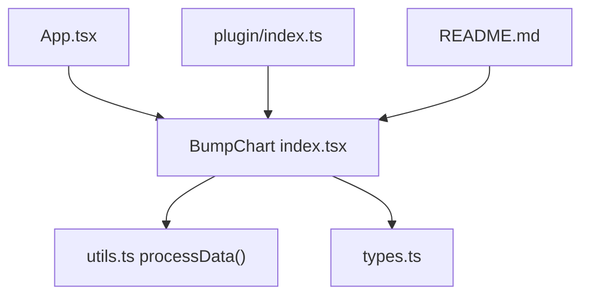
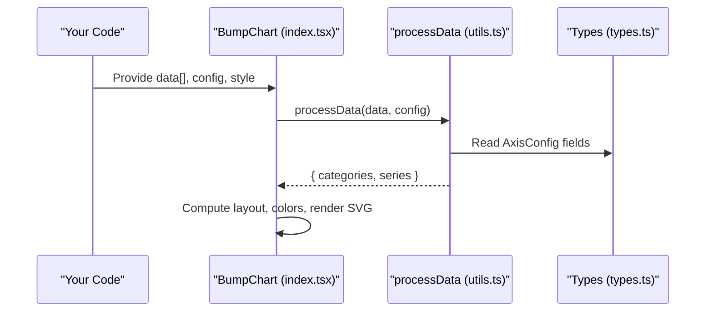
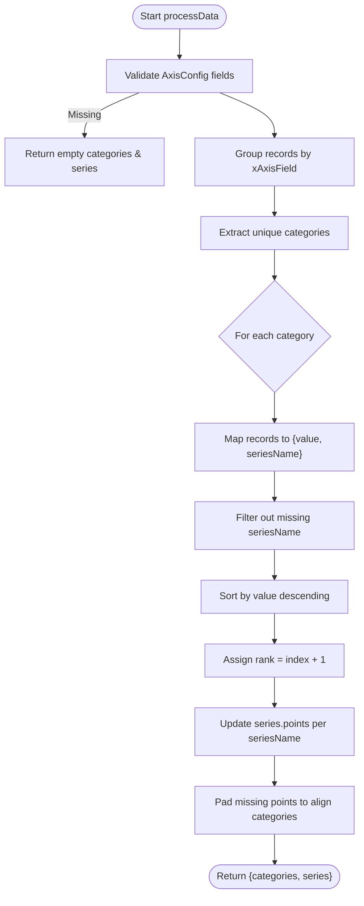
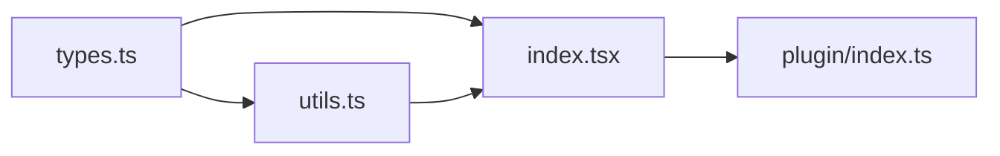

# Input Data Format

<cite>
**Referenced Files in This Document**
- [types.ts](file://src/BumpChart/types.ts)
- [utils.ts](file://src/BumpChart/utils.ts)
- [index.tsx](file://src/BumpChart/index.tsx)
- [App.tsx](file://src/App.tsx)
- [plugin/index.ts](file://src/plugin/index.ts)
- [README.md](file://README.md)
</cite>

## Table of Contents
1. Introduction
2. Project Structure
3. Core Components
4. Architecture Overview
5. Detailed Component Analysis
6. Dependency Analysis
7. Performance Considerations
8. Troubleshooting Guide
9. Conclusion
10. Appendices

## Introduction
This document specifies the input data format for the BumpChart component using the RawRecord interface and AxisConfig mapping. It explains how to structure flexible key-value records where each record represents a single data point, and how the x-axis (time/category), y-axis (ranking values), and series (entities) fields map to your raw data. It also covers required and optional properties, data type constraints, validation rules, naming conventions, consistency requirements, edge cases, and common pitfalls.

## Project Structure
The BumpChart implementation is organized into:
- Types and interfaces defining the input/output contracts
- Data processing utilities that transform raw records into ranked series
- The React component that renders the chart
- A plugin wrapper exposing the component for dashboard integration
- Example usage demonstrating time-series ranking across categories

**Diagram sources**
- [index.tsx:104-145](file://src/BumpChart/index.tsx#L104-L145)
- [utils.ts:30-112](file://src/BumpChart/utils.ts#L30-L112)
- [types.ts:1-68](file://src/BumpChart/types.ts#L1-L68)
- [plugin/index.ts:43-82](file://src/plugin/index.ts#L43-L82)
- [README.md:23-52](file://README.md#L23-L52)

**Section sources**
- [index.tsx:104-145](file://src/BumpChart/index.tsx#L104-L145)
- [utils.ts:30-112](file://src/BumpChart/utils.ts#L30-L112)
- [types.ts:1-68](file://src/BumpChart/types.ts#L1-L68)
- [plugin/index.ts:43-82](file://src/plugin/index.ts#L43-L82)
- [README.md:23-52](file://README.md#L23-L52)

## Core Components
- RawRecord: A flexible key-value object where keys are field names and values can be string, number, or undefined.
- AxisConfig: Declares which fields in RawRecord represent:
  - xAxisField: category/time dimension (x-axis)
  - yAxisField: numeric value used to compute rank (y-axis)
  - seriesField: entity identifier (series/line)
- BumpChartProps: Accepts data as an array of RawRecord, AxisConfig mapping, and optional style/layout options.

Key behaviors:
- Records with missing or empty xAxisField are ignored.
- Records with missing or empty seriesField are ignored.
- Missing or invalid yAxisField values are treated as zero during ranking.
- Series points are aligned per category; missing points are filled with placeholder entries (rank -1, value 0).

**Section sources**
- [types.ts:1-12](file://src/BumpChart/types.ts#L1-L12)
- [types.ts:37-49](file://src/BumpChart/types.ts#L37-L49)
- [utils.ts:20-28](file://src/BumpChart/utils.ts#L20-L28)
- [utils.ts:30-48](file://src/BumpChart/utils.ts#L30-L48)
- [utils.ts:55-97](file://src/BumpChart/utils.ts#L55-L97)
- [utils.ts:99-112](file://src/BumpChart/utils.ts#L99-L112)

## Architecture Overview
Data flows from your raw dataset through a mapping configuration into a structured set of series and categories, then into rendering.

**Diagram sources**
- [index.tsx:120-145](file://src/BumpChart/index.tsx#L120-L145)
- [utils.ts:30-112](file://src/BumpChart/utils.ts#L30-L112)
- [types.ts:5-12](file://src/BumpChart/types.ts#L5-L12)

## Detailed Component Analysis

### RawRecord and AxisConfig Mapping
- RawRecord allows arbitrary keys; only the fields specified in AxisConfig matter for rendering.
- AxisConfig requires three strings: xAxisField, yAxisField, seriesField. These must match keys present in your data objects.

Mapping semantics:
- x-axis (category/time): Each unique value of xAxisField becomes a column on the chart.
- y-axis (ranking): For each category, records are sorted by yAxisField descending to determine rank.
- series (entity): Each unique seriesField value forms one line/series across categories.

Validation and normalization:
- If any of xAxisField, yAxisField, seriesField is missing in config, no data is processed.
- Records without a valid xAxisField or seriesField are skipped.
- Non-numeric or missing yAxisField values are normalized to zero before ranking.

**Section sources**
- [types.ts:1-12](file://src/BumpChart/types.ts#L1-L12)
- [utils.ts:30-48](file://src/BumpChart/utils.ts#L30-L48)
- [utils.ts:20-28](file://src/BumpChart/utils.ts#L20-L28)

### Data Processing Logic
The processing pipeline groups records by category, ranks them within each category, and builds series-aligned point arrays.

**Diagram sources**
- [utils.ts:30-112](file://src/BumpChart/utils.ts#L30-L112)

**Section sources**
- [utils.ts:30-112](file://src/BumpChart/utils.ts#L30-L112)

### Rendering and Layout
- Categories become columns along the x-axis.
- Ranks are computed per category and mapped to y-axis positions.
- Series lines connect nodes across categories using smooth curves.
- Missing points (where a series has no data for a category) are represented with placeholders and do not draw visible nodes or connections.

**Section sources**
- [index.tsx:29-90](file://src/BumpChart/index.tsx#L29-L90)
- [index.tsx:224-283](file://src/BumpChart/index.tsx#L224-L283)

### Example Usage Patterns
Below are patterns you can implement with RawRecord and AxisConfig. Replace field names with your own keys while keeping the same structure.

- Time-series ranking (e.g., cities over years)
  - xAxisField: year-like field
  - yAxisField: numeric metric
  - seriesField: city name
  - See example data pattern in demo app.

- Categorical ranking (e.g., products by quarter)
  - xAxisField: quarter label
  - yAxisField: sales count or revenue
  - seriesField: product name

- Mixed types (string labels with numeric metrics)
  - xAxisField can be string labels like quarters or months
  - yAxisField must be numeric or convertible to number
  - seriesField identifies entities (strings)

- Sparse data (missing series in some categories)
  - Ensure consistent xAxisField values across all series if you want aligned timelines
  - Missing series points are padded internally; they will not show nodes or connections

- Duplicate entries (same series in same category)
  - All records for the same category are considered; duplicates will be ranked based on their values. If two entries have identical values, stable ordering is not guaranteed beyond sort order.

- Ordering requirements
  - You do not need to pre-sort data; sorting happens per category during processing.
  - Category order is derived from the first occurrence in the dataset.

**Section sources**
- [App.tsx:5-39](file://src/App.tsx#L5-L39)
- [utils.ts:55-97](file://src/BumpChart/utils.ts#L55-L97)
- [utils.ts:99-112](file://src/BumpChart/utils.ts#L99-L112)

## Dependency Analysis
- BumpChart depends on utils.processData for transforming RawRecord[] into structured series and categories.
- Types define the contract between props, config, and internal structures.
- Plugin wrapper re-exports the component and schema for dashboard registration.

**Diagram sources**
- [types.ts:1-68](file://src/BumpChart/types.ts#L1-L68)
- [utils.ts:1-2](file://src/BumpChart/utils.ts#L1-L2)
- [index.tsx:1-3](file://src/BumpChart/index.tsx#L1-L3)
- [plugin/index.ts:1-5](file://src/plugin/index.ts#L1-L5)

**Section sources**
- [types.ts:1-68](file://src/BumpChart/types.ts#L1-L68)
- [utils.ts:1-2](file://src/BumpChart/utils.ts#L1-L2)
- [index.tsx:1-3](file://src/BumpChart/index.tsx#L1-L3)
- [plugin/index.ts:1-5](file://src/plugin/index.ts#L1-L5)

## Performance Considerations
- Sorting is performed per category; complexity is roughly O(N log N) per category due to ranking.
- Grouping uses a Map keyed by category; overall grouping is O(N).
- Padding ensures series alignment; minimal overhead proportional to number of series times number of categories.
- For very large datasets, consider:
  - Pre-aggregating duplicate entries per category and series
  - Limiting the number of series or categories rendered
  - Using memoization at the consumer layer to avoid unnecessary recomputation

[No sources needed since this section provides general guidance]

## Troubleshooting Guide
Common issues and resolutions:

- No data displayed
  - Ensure AxisConfig includes all three fields and they exist in your data.
  - Verify xAxisField and seriesField values are non-empty strings.
  - Check that yAxisField values are numeric or convertible to numbers.

- Inconsistent category order
  - Category order follows first appearance in data. If you need a specific order, ensure your data reflects that order.

- Missing series points
  - Missing points are padded internally; they will not render nodes or connections. Ensure your xAxisField values are consistent across series to achieve aligned timelines.

- Duplicates in the same category
  - All records are ranked; duplicates will affect rankings based on their values. If you intend to aggregate, pre-aggregate before passing to the chart.

- Empty or null series names
  - Records with missing seriesField are filtered out. Ensure seriesField contains valid identifiers.

- Non-numeric values in yAxisField
  - Non-numeric or missing values are treated as zero. Normalize your data to numeric values beforehand for accurate ranking.

**Section sources**
- [utils.ts:20-28](file://src/BumpChart/utils.ts#L20-L28)
- [utils.ts:30-48](file://src/BumpChart/utils.ts#L30-L48)
- [utils.ts:55-97](file://src/BumpChart/utils.ts#L55-L97)
- [utils.ts:99-112](file://src/BumpChart/utils.ts#L99-L112)

## Conclusion
The BumpChart accepts flexible RawRecord arrays mapped via AxisConfig to produce ranked series across categories. By ensuring consistent field names, numeric y-values, and complete series across categories, you can reliably visualize ranking changes over time or other dimensions. Use the provided examples and guidelines to structure your data effectively and avoid common pitfalls.

[No sources needed since this section summarizes without analyzing specific files]

## Appendices

### Field Mapping Reference
- xAxisField: String or number representing category/time. Used to create columns.
- yAxisField: Numeric value used to compute rank within each category.
- seriesField: String identifying the entity (line/series).

**Section sources**
- [types.ts:5-12](file://src/BumpChart/types.ts#L5-L12)
- [README.md:77-83](file://README.md#L77-L83)

### Data Type Constraints and Validation Rules
- RawRecord values: string | number | undefined
- yAxisField normalization: undefined/null/empty -> 0; non-numeric -> 0
- Filtering: records with missing xAxisField or seriesField are excluded
- Ranking: higher yAxisField values get better rank (lower number)
- Alignment: missing series points are padded with placeholder entries

**Section sources**
- [types.ts:1-3](file://src/BumpChart/types.ts#L1-L3)
- [utils.ts:20-28](file://src/BumpChart/utils.ts#L20-L28)
- [utils.ts:30-48](file://src/BumpChart/utils.ts#L30-L48)
- [utils.ts:55-97](file://src/BumpChart/utils.ts#L55-L97)
- [utils.ts:99-112](file://src/BumpChart/utils.ts#L99-L112)

### Naming Conventions and Consistency Requirements
- Choose clear, stable field names for xAxisField, yAxisField, seriesField.
- Keep seriesField values consistent across categories to enable continuous lines.
- Maintain consistent xAxisField values across series for aligned timelines.
- Avoid mixing units in yAxisField; normalize to a single unit before ranking.

**Section sources**
- [App.tsx:5-39](file://src/App.tsx#L5-L39)
- [utils.ts:55-97](file://src/BumpChart/utils.ts#L55-L97)

### Edge Cases
- Missing values: yAxisField missing -> 0; xAxisField or seriesField missing -> record ignored
- Duplicate entries: all records ranked; duplicates influence ranking based on values
- Data ordering: no pre-sort required; category order is first-seen order
- Sparse series: padding fills gaps; no visible node/connection for missing points

**Section sources**
- [utils.ts:20-28](file://src/BumpChart/utils.ts#L20-L28)
- [utils.ts:30-48](file://src/BumpChart/utils.ts#L30-L48)
- [utils.ts:55-97](file://src/BumpChart/utils.ts#L55-L97)
- [utils.ts:99-112](file://src/BumpChart/utils.ts#L99-L112)