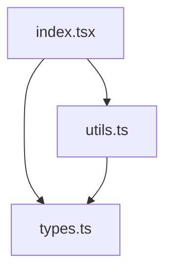
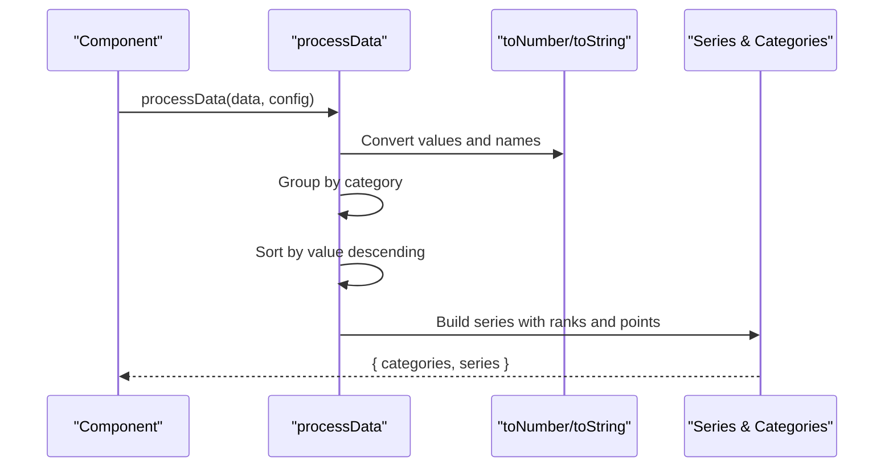
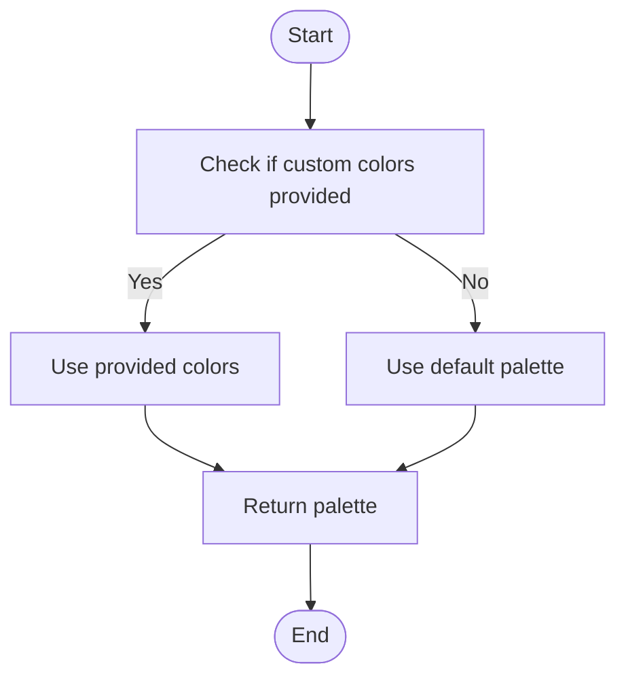
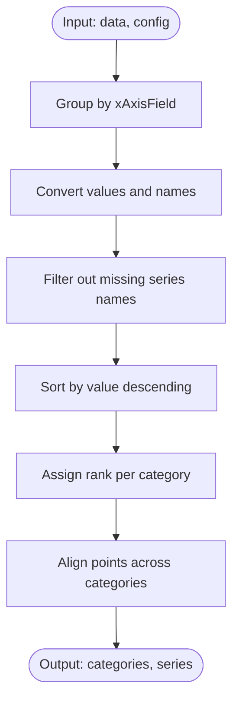
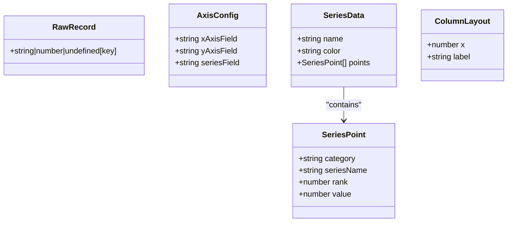
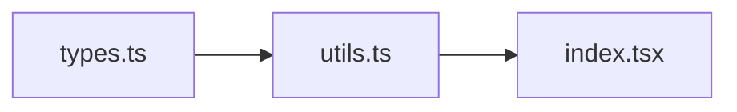

# Processing Utilities

<cite>
**Referenced Files in This Document**
- [utils.ts](file://src/BumpChart/utils.ts)
- [types.ts](file://src/BumpChart/types.ts)
- [index.tsx](file://src/BumpChart/index.tsx)
- [README.md](file://README.md)
</cite>

## Table of Contents
1. [Introduction](#introduction)
2. [Project Structure](#project-structure)
3. [Core Components](#core-components)
4. [Architecture Overview](#architecture-overview)
5. [Detailed Component Analysis](#detailed-component-analysis)
6. [Dependency Analysis](#dependency-analysis)
7. [Performance Considerations](#performance-considerations)
8. [Troubleshooting Guide](#troubleshooting-guide)
9. [Conclusion](#conclusion)
10. [Appendices](#appendices)

## Introduction
This document focuses on the utility functions that power data processing for the BumpChart component. It explains how colors are assigned and managed across series, how raw data is transformed into ranked series, and which internal helpers support sorting, validation, and conversions. It also provides guidance for extending utilities, optimizing performance with large datasets, and troubleshooting common issues.

## Project Structure
The BumpChart module is organized into:
- Types and interfaces defining input/output contracts
- Utility functions for color management and data processing
- The React component orchestrating layout and rendering

**Diagram sources**
- [index.tsx:1-4](file://src/BumpChart/index.tsx#L1-L4)
- [utils.ts:1-2](file://src/BumpChart/utils.ts#L1-L2)
- [types.ts:1-12](file://src/BumpChart/types.ts#L1-L12)

**Section sources**
- [index.tsx:1-4](file://src/BumpChart/index.tsx#L1-L4)
- [utils.ts:1-2](file://src/BumpChart/utils.ts#L1-L2)
- [types.ts:1-12](file://src/BumpChart/types.ts#L1-L12)

## Core Components
This section documents the key utility functions used by the BumpChart component.

- getColors(colors?: string[]): string[]
  - Purpose: Returns a color palette for series. If a custom palette is provided and non-empty, it is returned; otherwise, a default palette is used.
  - Parameters:
    - colors: Optional array of hex color strings. If omitted or empty, defaults apply.
  - Returns: Array of color strings to be used for series coloring.
  - Usage example: See usage in the component where style.colors is passed to getColors.
  - Section sources
    - [utils.ts:3-18](file://src/BumpChart/utils.ts#L3-L18)
    - [index.tsx:125-133](file://src/BumpChart/index.tsx#L125-L133)

- processData(data: RawRecord[], config: AxisConfig): { categories: string[]; series: SeriesData[] }
  - Purpose: Transforms raw records into categorized series with ranks and values aligned per category.
  - Parameters:
    - data: Array of records with arbitrary fields.
    - config: Object specifying xAxisField (category), yAxisField (numeric value), and seriesField (series identifier).
  - Returns:
    - categories: Ordered list of unique category labels from xAxisField.
    - series: Array of series objects, each with name, color, and an array of points aligned to categories.
  - Behavior highlights:
    - Groups records by category.
    - Converts values to numbers and series names to strings safely.
    - Filters out entries without a valid series name.
    - Sorts within each category by descending numeric value to compute rank.
    - Builds series map ensuring consistent point arrays across all categories.
    - Pads missing points with placeholder entries so each series has one point per category.
  - Section sources
    - [utils.ts:30-112](file://src/BumpChart/utils.ts#L30-L112)
    - [types.ts:1-12](file://src/BumpChart/types.ts#L1-L12)
    - [types.ts:51-62](file://src/BumpChart/types.ts#L51-L62)

Internal helpers used by processData:
- toNumber(value: string | number | undefined): number
  - Purpose: Safely converts values to numbers; returns 0 for undefined, null, empty string, or NaN results.
  - Section sources
    - [utils.ts:20-24](file://src/BumpChart/utils.ts#L20-L24)

- toString(value: string | number | undefined): string
  - Purpose: Safely converts values to strings; returns empty string for undefined or null.
  - Section sources
    - [utils.ts:26-28](file://src/BumpChart/utils.ts#L26-L28)

## Architecture Overview
The data flow from raw input to processed series involves type-safe configuration, robust conversion, grouping, ranking, and alignment.

**Diagram sources**
- [index.tsx:120-133](file://src/BumpChart/index.tsx#L120-L133)
- [utils.ts:30-112](file://src/BumpChart/utils.ts#L30-L112)
- [utils.ts:20-28](file://src/BumpChart/utils.ts#L20-L28)

## Detailed Component Analysis

### Color Assignment and Management
- getColors ensures a stable palette is always available. When no custom palette is provided, a built-in default palette is used. In the component, the returned palette is applied cyclically to series so each series gets a distinct color when possible.
- The component merges user-provided style with defaults and then computes colors via getColors before mapping them onto series.

**Diagram sources**
- [utils.ts:3-18](file://src/BumpChart/utils.ts#L3-L18)
- [index.tsx:115-133](file://src/BumpChart/index.tsx#L115-L133)

**Section sources**
- [utils.ts:3-18](file://src/BumpChart/utils.ts#L3-L18)
- [index.tsx:115-133](file://src/BumpChart/index.tsx#L115-L133)

### Data Processing Pipeline
- Grouping: Records are grouped by the configured xAxisField to form categories.
- Conversion: Numeric values are parsed safely; invalid values become 0. Series names are normalized to strings; missing names are filtered out.
- Ranking: Within each category, records are sorted by value descending to assign ranks starting at 1.
- Alignment: Each series accumulates points per category. Missing categories are padded so every series has a point for each category, enabling smooth line drawing even when some series skip certain categories.

**Diagram sources**
- [utils.ts:30-112](file://src/BumpChart/utils.ts#L30-L112)

**Section sources**
- [utils.ts:30-112](file://src/BumpChart/utils.ts#L30-L112)

### Type Contracts and Data Structures
- RawRecord: Flexible record with string, number, or undefined values keyed by field names.
- AxisConfig: Specifies which fields represent category, value, and series identity.
- SeriesPoint: Represents a single point in a series with category, seriesName, rank, and value.
- SeriesData: Aggregates name, color, and ordered points for a series.
- ColumnLayout: Used internally for column positioning during rendering.

**Diagram sources**
- [types.ts:1-12](file://src/BumpChart/types.ts#L1-L12)
- [types.ts:51-67](file://src/BumpChart/types.ts#L51-L67)

**Section sources**
- [types.ts:1-12](file://src/BumpChart/types.ts#L1-L12)
- [types.ts:51-67](file://src/BumpChart/types.ts#L51-L67)

## Dependency Analysis
- index.tsx depends on utils.ts for data transformation and color management.
- utils.ts depends on types.ts for type definitions.
- The component composes these utilities to produce rendered output.

**Diagram sources**
- [types.ts:1-12](file://src/BumpChart/types.ts#L1-L12)
- [utils.ts:1-2](file://src/BumpChart/utils.ts#L1-L2)
- [index.tsx:1-4](file://src/BumpChart/index.tsx#L1-L4)

**Section sources**
- [index.tsx:1-4](file://src/BumpChart/index.tsx#L1-L4)
- [utils.ts:1-2](file://src/BumpChart/utils.ts#L1-L2)
- [types.ts:1-12](file://src/BumpChart/types.ts#L1-L12)

## Performance Considerations
- Time complexity:
  - Grouping by category: O(n) using a Map.
  - Sorting within each category: O(k log k) per category, where k is the number of records per category.
  - Building series and aligning points: O(n) overall due to single-pass accumulation and padding.
- Space complexity:
  - Map-based grouping and series storage: O(n) additional memory.
- Recommendations for large datasets:
  - Pre-validate and normalize data upstream to reduce conversion overhead inside processData.
  - Ensure xAxisField values are stable and minimal to reduce Map churn.
  - Avoid excessive re-renders by memoizing inputs (already done in the component via useMemo).
  - Consider batching updates if data changes frequently.
  - For very large series counts, consider limiting visible series or implementing virtualization at the rendering layer.

[No sources needed since this section provides general guidance]

## Troubleshooting Guide
Common issues and resolutions:
- Empty or missing fields:
  - If xAxisField, yAxisField, or seriesField are not set, processData returns empty categories and series. Verify AxisConfig.
  - Records with missing series names are filtered out; ensure seriesField contains valid identifiers.
- Invalid numeric values:
  - Non-numeric or missing values convert to 0; verify yAxisField contains expected numbers.
- Unexpected rankings:
  - Rankings are computed per category based on descending value; confirm data integrity and field mappings.
- Misaligned points:
  - Points are padded to match categories; if lines appear broken, check whether series have missing categories intentionally.
- Colors not applying:
  - Ensure style.colors is provided correctly; getColors returns defaults when none are provided.

**Section sources**
- [utils.ts:30-112](file://src/BumpChart/utils.ts#L30-L112)
- [types.ts:5-12](file://src/BumpChart/types.ts#L5-L12)

## Conclusion
The BumpChart utilities provide robust data transformation, safe conversions, and consistent color management. By understanding the processing pipeline—grouping, conversion, ranking, and alignment—you can extend functionality confidently, optimize for large datasets, and troubleshoot effectively.

[No sources needed since this section summarizes without analyzing specific files]

## Appendices

### API Reference Summary
- getColors(colors?: string[]): string[]
  - Returns a color palette for series; uses defaults when none provided.
- processData(data: RawRecord[], config: AxisConfig): { categories: string[]; series: SeriesData[] }
  - Transforms raw data into ranked series aligned by categories.

**Section sources**
- [utils.ts:16-18](file://src/BumpChart/utils.ts#L16-L18)
- [utils.ts:30-112](file://src/BumpChart/utils.ts#L30-L112)
- [types.ts:1-12](file://src/BumpChart/types.ts#L1-L12)
- [types.ts:51-62](file://src/BumpChart/types.ts#L51-L62)

### Usage Examples
- Basic usage of BumpChart with data and configuration is documented in the project README.
- Example props include data, config (axis fields), style (colors, labels), dimensions, title, loading state, and empty text.

**Section sources**
- [README.md:23-52](file://README.md#L23-L52)