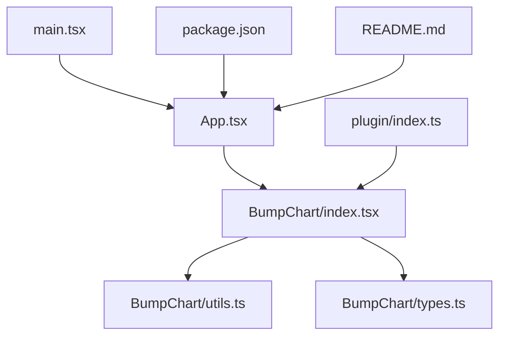
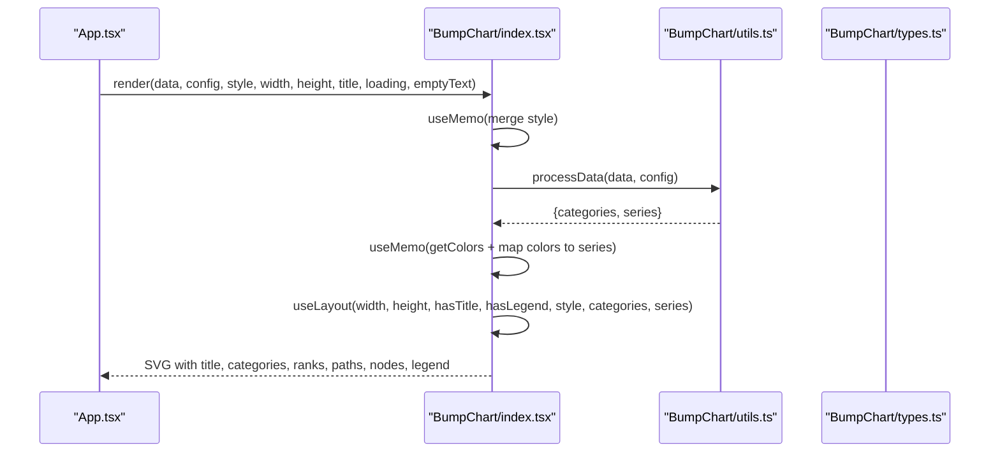
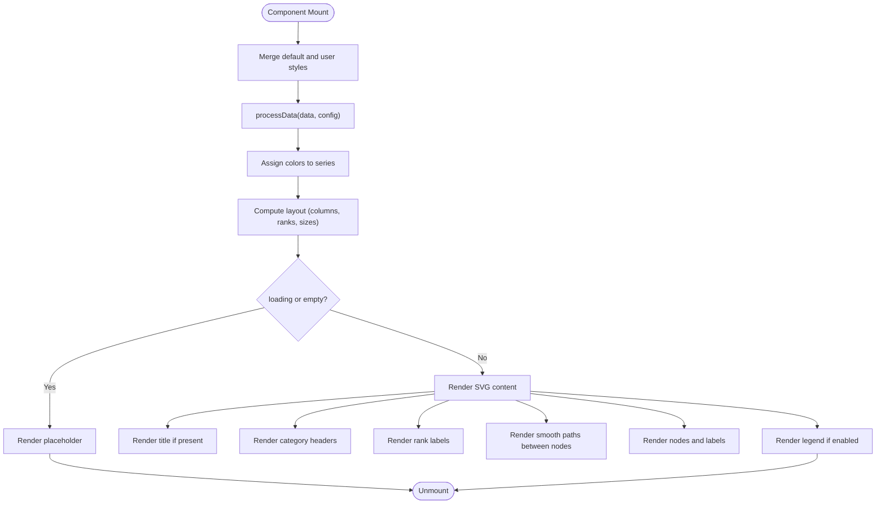
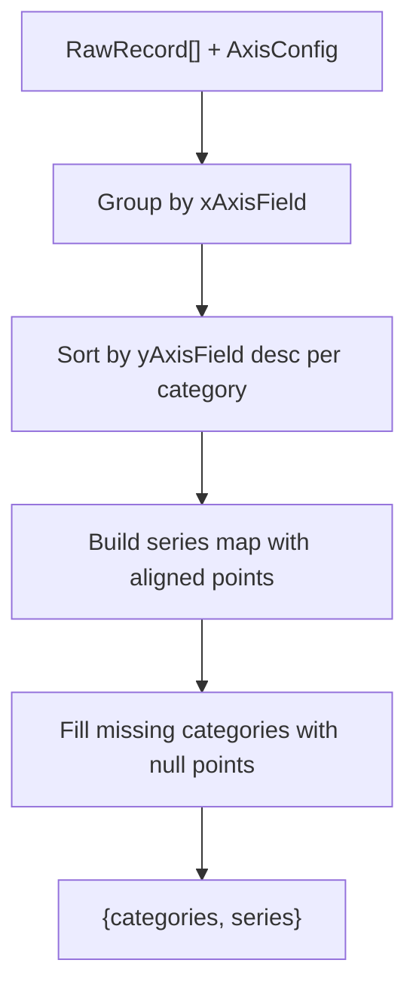
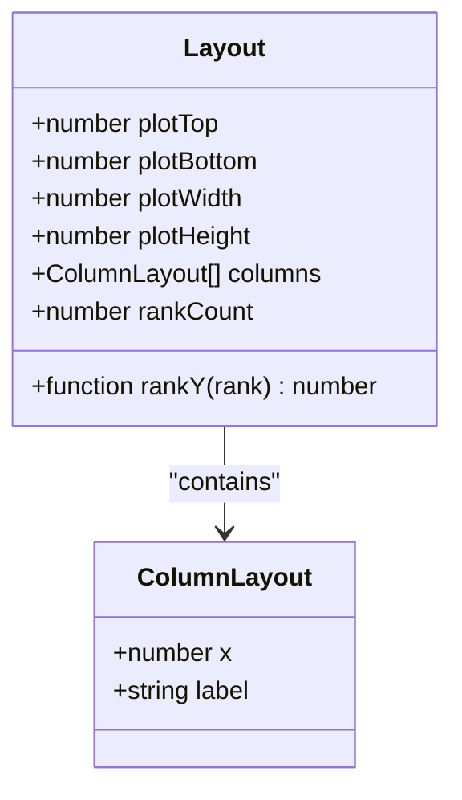
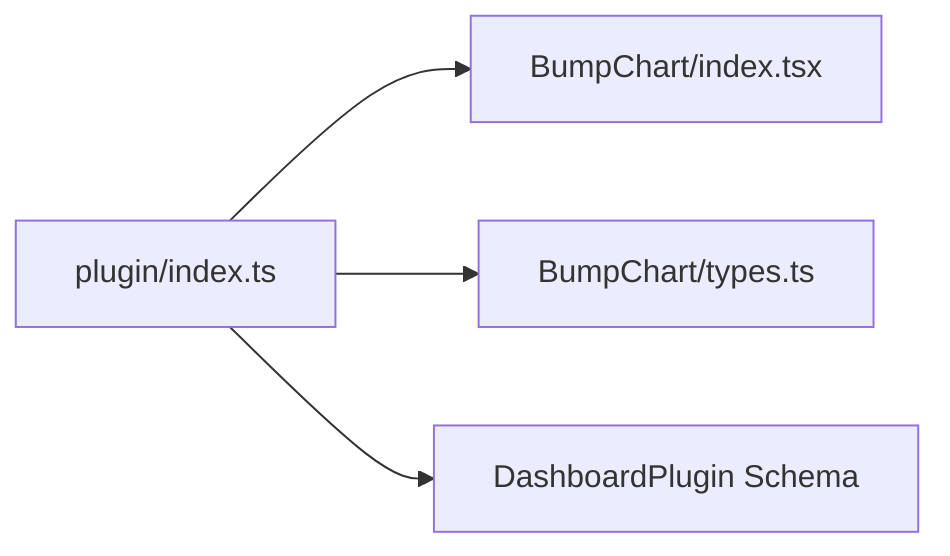
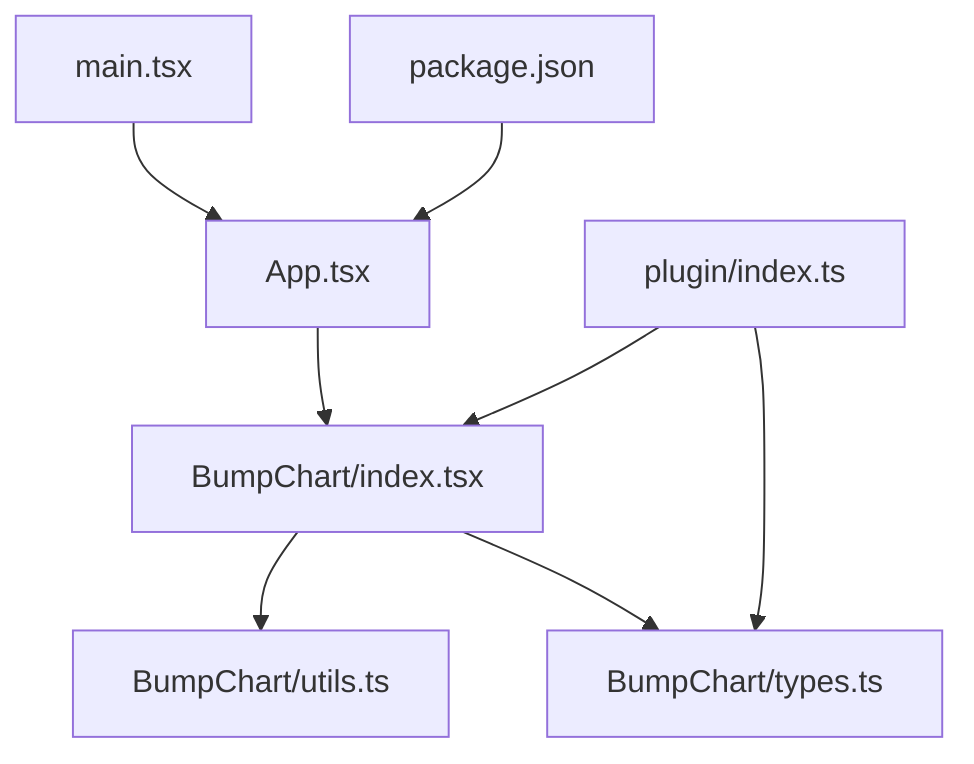

# Advanced Implementation Patterns

<cite>
**Referenced Files in This Document**
- [index.tsx](file://src/BumpChart/index.tsx)
- [types.ts](file://src/BumpChart/types.ts)
- [utils.ts](file://src/BumpChart/utils.ts)
- [App.tsx](file://src/App.tsx)
- [main.tsx](file://src/main.tsx)
- [index.ts](file://src/plugin/index.ts)
- [README.md](file://README.md)
- [package.json](file://package.json)
</cite>

## Table of Contents
1. [Introduction](#introduction)
2. [Project Structure](#project-structure)
3. [Core Components](#core-components)
4. [Architecture Overview](#architecture-overview)
5. [Detailed Component Analysis](#detailed-component-analysis)
6. [Dependency Analysis](#dependency-analysis)
7. [Performance Considerations](#performance-considerations)
8. [Troubleshooting Guide](#troubleshooting-guide)
9. [Conclusion](#conclusion)
10. [Appendices](#appendices)

## Introduction
This document provides advanced implementation patterns for building complex BumpChart scenarios using the provided React component and utilities. It focuses on performance optimization with memoization, efficient data transformation, large dataset handling strategies, dynamic styling, conditional rendering, error handling, validation, integration with state management and data fetching hooks, real-time updates, composition patterns, prop drilling alternatives, and performance monitoring approaches. The guidance is grounded in the actual codebase structure and behavior.

## Project Structure
The project is a React-based dashboard plugin that renders a multi-series ranking change chart (Bump Chart) using pure SVG. Key modules:
- BumpChart component: core rendering, layout computation, and memoized processing
- Types: shared interfaces for props, styles, series data, and axis configuration
- Utils: data processing pipeline and color management
- App: demo usage with interactive field selection and style toggles
- Plugin: exports the component as a dashboard plugin with metadata and schema
- Entry points: main.tsx mounts the app; package.json defines dependencies and scripts

**Diagram sources**
- [App.tsx:1-193](file://src/App.tsx#L1-L193)
- [index.tsx:1-340](file://src/BumpChart/index.tsx#L1-L340)
- [utils.ts:1-113](file://src/BumpChart/utils.ts#L1-L113)
- [types.ts:1-68](file://src/BumpChart/types.ts#L1-L68)
- [index.ts:1-85](file://src/plugin/index.ts#L1-L85)
- [main.tsx:1-10](file://src/main.tsx#L1-L10)
- [package.json:1-44](file://package.json#L1-L44)
- [README.md:1-115](file://README.md#L1-L115)

**Section sources**
- [App.tsx:1-193](file://src/App.tsx#L1-L193)
- [index.tsx:1-340](file://src/BumpChart/index.tsx#L1-L340)
- [utils.ts:1-113](file://src/BumpChart/utils.ts#L1-L113)
- [types.ts:1-68](file://src/BumpChart/types.ts#L1-L68)
- [index.ts:1-85](file://src/plugin/index.ts#L1-L85)
- [main.tsx:1-10](file://src/main.tsx#L1-L10)
- [package.json:1-44](file://package.json#L1-L44)
- [README.md:1-115](file://README.md#L1-L115)

## Core Components
- BumpChart component:
  - Accepts data, config, style, dimensions, title, loading, emptyText
  - Uses useMemo to compute merged style, processed categories/series, colors, colored series, and layout
  - Renders SVG with title, category headers, rank labels, smooth paths, nodes, and optional legend
  - Handles loading and empty states via conditional rendering
- Utilities:
  - processData groups by category, ranks per category, builds series with aligned points, fills missing slots
  - getColors returns theme colors or defaults
- Types:
  - AxisConfig, BumpChartStyle, BumpChartProps, SeriesPoint, SeriesData, ColumnLayout define contracts
- Plugin:
  - Exposes bumpChartPlugin with metadata and schema for dashboard registration

**Section sources**
- [index.tsx:104-337](file://src/BumpChart/index.tsx#L104-L337)
- [utils.ts:16-113](file://src/BumpChart/utils.ts#L16-L113)
- [types.ts:1-68](file://src/BumpChart/types.ts#L1-L68)
- [index.ts:1-85](file://src/plugin/index.ts#L1-L85)

## Architecture Overview
The architecture separates concerns into three layers:
- Presentation layer: BumpChart renders SVG based on computed layout and styled series
- Data layer: utils.processData transforms raw records into ranked series aligned across categories
- Integration layer: plugin exposes the component as a dashboard plugin with schema and metadata

**Diagram sources**
- [App.tsx:56-183](file://src/App.tsx#L56-L183)
- [index.tsx:115-145](file://src/BumpChart/index.tsx#L115-L145)
- [utils.ts:30-113](file://src/BumpChart/utils.ts#L30-L113)
- [types.ts:1-68](file://src/BumpChart/types.ts#L1-L68)

## Detailed Component Analysis

### BumpChart Rendering Pipeline
- Style merging: default style merged with user-provided style via useMemo
- Data processing: categories and series derived from raw data and axis config
- Color assignment: colors cycle through series
- Layout computation: columns, plot area, rank spacing, node sizing
- Conditional rendering: loading state, empty state, then SVG content
- SVG elements: title, category headers, rank labels, smooth paths, nodes, legend

**Diagram sources**
- [index.tsx:115-145](file://src/BumpChart/index.tsx#L115-L145)
- [index.tsx:149-319](file://src/BumpChart/index.tsx#L149-L319)
- [utils.ts:30-113](file://src/BumpChart/utils.ts#L30-L113)

**Section sources**
- [index.tsx:115-319](file://src/BumpChart/index.tsx#L115-L319)

### Data Transformation and Ranking Logic
- Grouping: records grouped by xAxisField (category)
- Ranking: within each category, sort by yAxisField descending and assign ranks
- Series alignment: ensure each series has a point for every category; fill missing with rank -1 and value 0
- Output: categories array and series array with name, color, and ordered points

**Diagram sources**
- [utils.ts:30-113](file://src/BumpChart/utils.ts#L30-L113)

**Section sources**
- [utils.ts:30-113](file://src/BumpChart/utils.ts#L30-L113)

### Layout Computation and Smooth Path Generation
- Layout: calculates plot boundaries, column positions, row heights based on rank count
- Rank Y mapping: maps rank to y coordinate
- Smooth path: cubic bezier curve between consecutive nodes for visual continuity

**Diagram sources**
- [index.tsx:29-90](file://src/BumpChart/index.tsx#L29-L90)
- [index.tsx:92-102](file://src/BumpChart/index.tsx#L92-L102)
- [types.ts:64-68](file://src/BumpChart/types.ts#L64-L68)

**Section sources**
- [index.tsx:29-102](file://src/BumpChart/index.tsx#L29-L102)
- [types.ts:64-68](file://src/BumpChart/types.ts#L64-L68)

### Plugin Integration
- Exports BumpChart and types for consumers
- Defines DashboardPlugin interface and bumpChartPlugin object with metadata and schema
- Enables registration into dashboard frameworks supporting React components

**Diagram sources**
- [index.ts:1-85](file://src/plugin/index.ts#L1-L85)
- [index.tsx:1-340](file://src/BumpChart/index.tsx#L1-L340)
- [types.ts:1-68](file://src/BumpChart/types.ts#L1-L68)

**Section sources**
- [index.ts:1-85](file://src/plugin/index.ts#L1-L85)

## Dependency Analysis
- BumpChart depends on:
  - React hooks (useMemo)
  - utils.processData and getColors
  - types for props and styles
- App depends on:
  - BumpChart component
  - types for configuration and style
- Plugin depends on:
  - BumpChart and types
  - Exposes a standardized plugin interface

**Diagram sources**
- [App.tsx:1-193](file://src/App.tsx#L1-L193)
- [index.tsx:1-340](file://src/BumpChart/index.tsx#L1-L340)
- [utils.ts:1-113](file://src/BumpChart/utils.ts#L1-L113)
- [types.ts:1-68](file://src/BumpChart/types.ts#L1-L68)
- [index.ts:1-85](file://src/plugin/index.ts#L1-L85)
- [main.tsx:1-10](file://src/main.tsx#L1-L10)
- [package.json:1-44](file://package.json#L1-L44)

**Section sources**
- [App.tsx:1-193](file://src/App.tsx#L1-L193)
- [index.tsx:1-340](file://src/BumpChart/index.tsx#L1-L340)
- [utils.ts:1-113](file://src/BumpChart/utils.ts#L1-L113)
- [types.ts:1-68](file://src/BumpChart/types.ts#L1-L68)
- [index.ts:1-85](file://src/plugin/index.ts#L1-L85)
- [main.tsx:1-10](file://src/main.tsx#L1-L10)
- [package.json:1-44](file://package.json#L1-L44)

## Performance Considerations
- Memoization:
  - Use useMemo for style merging, data processing, color assignment, and layout computation to avoid recalculations on re-renders
  - Reference: [index.tsx:115-145](file://src/BumpChart/index.tsx#L115-L145), [index.tsx:29-90](file://src/BumpChart/index.tsx#L29-L90)
- Efficient transformations:
  - Grouping and ranking performed once per data/config change; series alignment ensures stable rendering
  - Reference: [utils.ts:30-113](file://src/BumpChart/utils.ts#L30-L113)
- Large datasets:
  - Consider virtualizing visible categories or limiting series count when rendering many items
  - Avoid excessive DOM nodes by filtering out invalid ranks before rendering
  - Reference: [index.tsx:225-283](file://src/BumpChart/index.tsx#L225-L283)
- Conditional rendering:
  - Early exit for loading and empty states reduces unnecessary work
  - Reference: [index.tsx:149-182](file://src/BumpChart/index.tsx#L149-L182)
- Styling performance:
  - Inline styles are simple but can be optimized further with CSS classes for static styles
  - Reference: [index.tsx:185-319](file://src/BumpChart/index.tsx#L185-L319)

[No sources needed since this section provides general guidance]

## Troubleshooting Guide
- Missing or invalid fields:
  - If xAxisField, yAxisField, or seriesField are undefined, processData returns empty categories and series
  - Reference: [utils.ts:30-38](file://src/BumpChart/utils.ts#L30-L38)
- Empty or loading states:
  - Ensure loading prop is correctly managed; emptyText is customizable for no-data scenarios
  - Reference: [index.tsx:149-182](file://src/BumpChart/index.tsx#L149-L182)
- Data validation:
  - Non-numeric values are coerced to 0; non-string series names are filtered out
  - Reference: [utils.ts:20-28](file://src/BumpChart/utils.ts#L20-L28), [utils.ts:57-64](file://src/BumpChart/utils.ts#L57-L64)
- Fallback scenarios:
  - Default colors used when custom colors are not provided
  - Reference: [utils.ts:16-18](file://src/BumpChart/utils.ts#L16-L18)
- Integration issues:
  - Verify plugin schema matches expected fields; ensure dashboard framework supports React components
  - Reference: [index.ts:7-82](file://src/plugin/index.ts#L7-L82)

**Section sources**
- [utils.ts:20-38](file://src/BumpChart/utils.ts#L20-L38)
- [index.tsx:149-182](file://src/BumpChart/index.tsx#L149-L182)
- [index.ts:7-82](file://src/plugin/index.ts#L7-L82)

## Conclusion
The BumpChart implementation demonstrates robust patterns for performance optimization, data transformation, and flexible styling. By leveraging memoization, structured data processing, and conditional rendering, it handles complex scenarios efficiently. The plugin architecture enables easy integration into dashboard frameworks. For advanced use cases, consider extending memoization strategies, adding virtualization for large datasets, and integrating with state management libraries for real-time updates.

[No sources needed since this section summarizes without analyzing specific files]

## Appendices

### Advanced Usage Patterns
- Custom data transformations:
  - Extend processData to support additional aggregations or filters
  - Reference: [utils.ts:30-113](file://src/BumpChart/utils.ts#L30-L113)
- Dynamic style updates:
  - Toggle theme colors and rank labels via style prop changes
  - Reference: [App.tsx:65-72](file://src/App.tsx#L65-L72), [index.tsx:115-118](file://src/BumpChart/index.tsx#L115-L118)
- Conditional rendering based on data state:
  - Show/hide legend based on series count and style flags
  - Reference: [index.tsx:135-137](file://src/BumpChart/index.tsx#L135-L137), [index.tsx:285-317](file://src/BumpChart/index.tsx#L285-L317)
- Integration with React state management:
  - Manage config and style via useState or external stores (e.g., Redux, Zustand)
  - Reference: [App.tsx:57-76](file://src/App.tsx#L57-L76)
- Real-time data updates:
  - Update data prop incrementally; rely on useMemo to minimize re-renders
  - Reference: [index.tsx:120-123](file://src/BumpChart/index.tsx#L120-L123)
- Prop drilling alternatives:
  - Lift state up or use context to pass config/style down to multiple charts
  - Reference: [App.tsx:57-76](file://src/App.tsx#L57-L76)
- Performance monitoring:
  - Measure render times and update frequency; optimize memoization dependencies
  - Reference: [index.tsx:115-145](file://src/BumpChart/index.tsx#L115-L145)

**Section sources**
- [utils.ts:30-113](file://src/BumpChart/utils.ts#L30-L113)
- [App.tsx:57-76](file://src/App.tsx#L57-L76)
- [index.tsx:115-145](file://src/BumpChart/index.tsx#L115-L145)
- [index.tsx:135-137](file://src/BumpChart/index.tsx#L135-L137)
- [index.tsx:285-317](file://src/BumpChart/index.tsx#L285-L317)