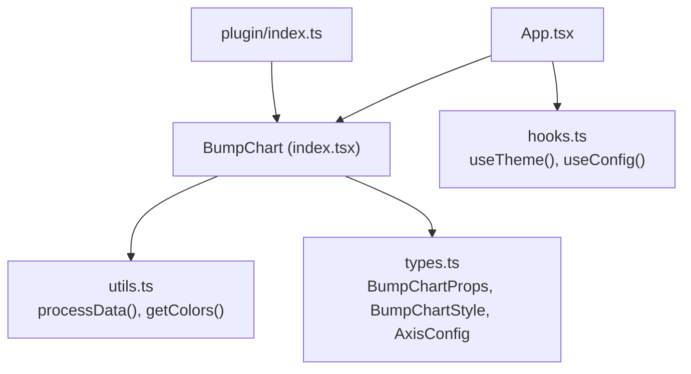
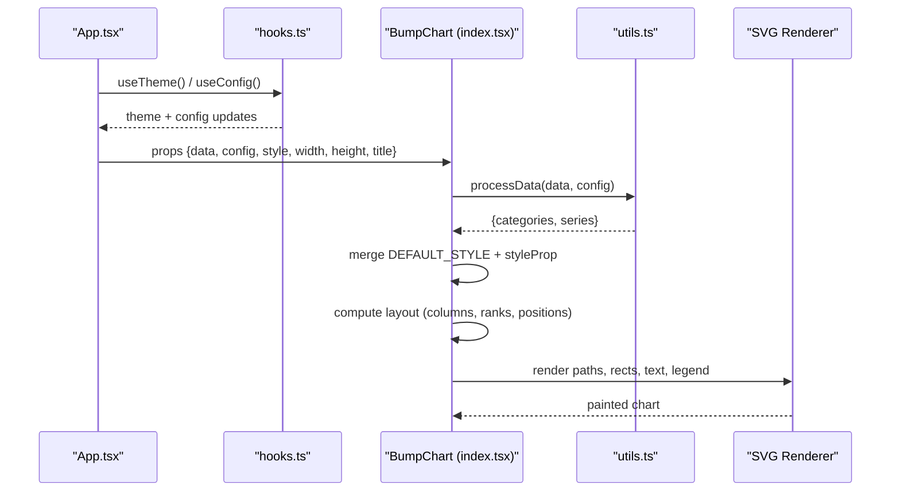
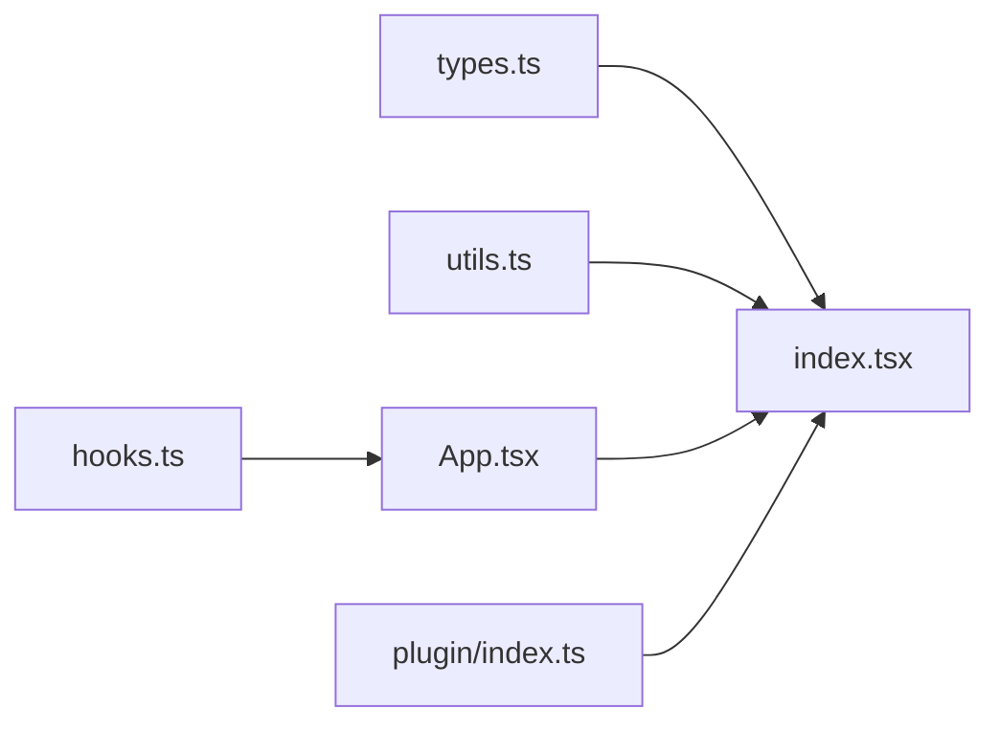

# Advanced Styling Patterns

<cite>
**Referenced Files in This Document**
- [index.tsx](file://src/BumpChart/index.tsx)
- [types.ts](file://src/BumpChart/types.ts)
- [utils.ts](file://src/BumpChart/utils.ts)
- [App.tsx](file://src/App.tsx)
- [hooks.ts](file://src/hooks.ts)
- [plugin/index.ts](file://src/plugin/index.ts)
- [README.md](file://README.md)
</cite>

## Table of Contents
1. [Introduction](#introduction)
2. [Project Structure](#project-structure)
3. [Core Components](#core-components)
4. [Architecture Overview](#architecture-overview)
5. [Detailed Component Analysis](#detailed-component-analysis)
6. [Dependency Analysis](#dependency-analysis)
7. [Performance Considerations](#performance-considerations)
8. [Troubleshooting Guide](#troubleshooting-guide)
9. [Conclusion](#conclusion)
10. [Appendices](#appendices)

## Introduction
This document explains advanced styling patterns for the BumpChart component, focusing on custom color schemes, theme integration with CSS-in-JS solutions, responsive design, SVG styling techniques (including gradients and animations), reusable style components, dark/light mode switching, accessibility considerations, and interactive visual customizations such as hover effects and transitions while maintaining performance.

## Project Structure
The project is a React-based dashboard plugin that renders a pure-SVG Bump Chart. The core chart logic lives under src/BumpChart, with types and utilities separated for clarity. The App demonstrates usage and theme integration via hooks. The plugin entry exposes the component to dashboard frameworks.

**Diagram sources**
- [index.tsx:104-339](file://src/BumpChart/index.tsx#L104-L339)
- [utils.ts:30-112](file://src/BumpChart/utils.ts#L30-L112)
- [types.ts:14-49](file://src/BumpChart/types.ts#L14-L49)
- [App.tsx:67-131](file://src/App.tsx#L67-L131)
- [hooks.ts:4-34](file://src/hooks.ts#L4-L34)
- [plugin/index.ts:43-82](file://src/plugin/index.ts#L43-L82)

**Section sources**
- [index.tsx:104-339](file://src/BumpChart/index.tsx#L104-L339)
- [utils.ts:30-112](file://src/BumpChart/utils.ts#L30-L112)
- [types.ts:14-49](file://src/BumpChart/types.ts#L14-L49)
- [App.tsx:67-131](file://src/App.tsx#L67-L131)
- [hooks.ts:4-34](file://src/hooks.ts#L4-L34)
- [plugin/index.ts:43-82](file://src/plugin/index.ts#L43-L82)

## Core Components
- BumpChart component: Renders an SVG-based bump chart with configurable styles, title, legend, loading, and empty states. It computes layout, assigns colors per series, and draws paths, nodes, labels, and legend items.
- Types: Define props, axis configuration, style options, and internal data structures for series points and column layouts.
- Utilities: Provide data processing (grouping by category, ranking, aligning series points) and color resolution.
- Hooks: Integrate with dashboard theme changes and configuration updates.
- Plugin: Exposes the component and schema for dashboard registration.

Key styling surfaces exposed:
- colors: array of theme colors applied cyclically to series
- leftLabelWidth/rightLabelWidth: label spacing
- nodeWidth/nodeHeight: node sizing
- columnGap: spacing between columns
- padding: chart padding
- showLegend: toggle legend visibility
- rankPrefix/rankSuffix: localized rank labels

**Section sources**
- [index.tsx:104-339](file://src/BumpChart/index.tsx#L104-L339)
- [types.ts:14-49](file://src/BumpChart/types.ts#L14-L49)
- [utils.ts:30-112](file://src/BumpChart/utils.ts#L30-L112)
- [hooks.ts:4-34](file://src/hooks.ts#L4-L34)
- [plugin/index.ts:43-82](file://src/plugin/index.ts#L43-L82)

## Architecture Overview
The rendering pipeline merges default and user-provided styles, processes data into categories and series, computes layout, and renders SVG elements. Theme context from hooks can influence background and other UI aspects at the app level.

**Diagram sources**
- [App.tsx:67-131](file://src/App.tsx#L67-L131)
- [hooks.ts:4-34](file://src/hooks.ts#L4-L34)
- [index.tsx:104-339](file://src/BumpChart/index.tsx#L104-L339)
- [utils.ts:30-112](file://src/BumpChart/utils.ts#L30-L112)

## Detailed Component Analysis

### Custom Color Schemes and Dynamic Color Generation
- Color assignment strategy:
  - Colors are resolved via a utility that returns either provided colors or a default palette.
  - Series receive colors by index modulo the palette length, ensuring consistent cycling across series.
- Data-driven color mapping:
  - To derive colors from data properties (e.g., category or value ranges), extend the color resolution step to compute a deterministic hash or scale based on series name/value and map to a palette or gradient stop.
  - Example pattern: compute a numeric key from seriesName or value, then map to a predefined palette or interpolate within a gradient range.

Implementation anchors:
- Color resolution function and defaults
- Series coloring loop in component

**Section sources**
- [utils.ts:3-18](file://src/BumpChart/utils.ts#L3-L18)
- [index.tsx:125-133](file://src/BumpChart/index.tsx#L125-L133)

### Theme Integration with CSS-in-JS Solutions
- Current approach:
  - The component uses inline styles for SVG attributes and container backgrounds/shadows.
  - App-level theme hook sets body attribute for theme mode and provides background color to the main container.
- CSS-in-JS integration:
  - Replace hardcoded colors with theme tokens passed via props or context.
  - Use a theme provider to supply variables like primary, secondary, surface, and text colors; map them to BumpChartStyle.colors and text fills.
  - For dynamic themes (light/dark), ensure contrast ratios meet accessibility guidelines.

Integration anchors:
- Theme hook and body attribute toggling
- App passing theme-aware style to BumpChart

**Section sources**
- [hooks.ts:4-34](file://src/hooks.ts#L4-L34)
- [App.tsx:67-131](file://src/App.tsx#L67-L131)
- [index.tsx:322-335](file://src/BumpChart/index.tsx#L322-L335)

### Responsive Design Patterns
- Current behavior:
  - Width and height are props; layout calculates column positions and row heights based on these dimensions.
- Responsive strategies:
  - Compute width/height from container size using ResizeObserver or window resize events; pass updated dimensions to BumpChart.
  - Use relative units or percentage widths where appropriate; keep fixed aspect ratio if needed.
  - Adjust label widths and font sizes proportionally to maintain readability on small screens.

Layout computation anchor:
- Layout calculation considering width, height, padding, and rank count

**Section sources**
- [index.tsx:29-89](file://src/BumpChart/index.tsx#L29-L89)

### SVG Styling Techniques
- Paths:
  - Smooth curves are generated using cubic Bézier segments between consecutive ranked points.
- Nodes and Labels:
  - Rectangles represent nodes with rounded corners; text labels are positioned next to nodes.
- Legend:
  - Legend items are arranged in rows based on available width.

Styling anchors:
- Path generation function
- Rendering of paths, rects, and text

**Section sources**
- [index.tsx:92-102](file://src/BumpChart/index.tsx#L92-L102)
- [index.tsx:224-317](file://src/BumpChart/index.tsx#L224-L317)

### Gradient Applications
- Current state:
  - No gradients are used; strokes and fills are solid colors.
- How to add gradients:
  - Define SVG <defs> with linearGradient or radialGradient.
  - Map series to gradient IDs deterministically (e.g., by index).
  - Apply gradient to path stroke or rect fill.
  - Ensure sufficient contrast for accessibility.

Conceptual guidance:
- Create gradient definitions once per chart instance.
- Reuse gradients across multiple series when appropriate.

[No sources needed since this section provides conceptual guidance]

### Animation Implementations
- Current state:
  - No built-in animations; rendering is static.
- Recommended approaches:
  - Use CSS transitions on SVG elements (e.g., opacity, transform) for hover states.
  - Animate path drawing with stroke-dasharray/stroke-dashoffset for entrance effects.
  - Leverage requestAnimationFrame or libraries for complex transitions if needed.
- Performance tips:
  - Avoid animating large numbers of elements simultaneously.
  - Use transforms over layout-affecting properties.
  - Debounce resize handlers and limit re-renders.

Conceptual guidance:
- Add transition classes to nodes and paths.
- Trigger animations on mount or interaction.

[No sources needed since this section provides conceptual guidance]

### Reusable Style Components
- Strategy:
  - Extract style objects into reusable modules (e.g., theme palettes, typography scales, spacing tokens).
  - Compose BumpChartStyle from shared tokens to ensure consistency across charts.
- Benefits:
  - Centralized theming, easier maintenance, and consistent visuals across dashboards.

Conceptual guidance:
- Create a theme module exporting colors, fonts, and spacing.
- Merge theme defaults with overrides per chart instance.

[No sources needed since this section provides conceptual guidance]

### Dark/Light Mode Switching
- Current implementation:
  - Hook listens to dashboard theme changes and sets a body attribute for CSS selectors.
  - Background color is derived from theme and applied to the app’s main container.
- Extending to BumpChart:
  - Pass theme-aware colors to BumpChartStyle.colors and adjust text fills accordingly.
  - Optionally expose a prop to invert contrast for better readability in dark mode.

Theme anchors:
- Theme hook updating body attribute and background color
- App applying theme background

**Section sources**
- [hooks.ts:4-34](file://src/hooks.ts#L4-L34)
- [App.tsx:67-131](file://src/App.tsx#L67-L131)

### Accessibility Considerations in Styling
- Contrast:
  - Ensure sufficient contrast between text and background colors in both light and dark modes.
- Keyboard navigation:
  - If adding interactive elements (hover tooltips, focusable nodes), provide keyboard-accessible alternatives.
- Screen readers:
  - Add aria-labels or titles to SVG elements describing their meaning (e.g., series name and rank).
- Color independence:
  - Do not rely solely on color to convey information; consider patterns or labels.

Conceptual guidance:
- Wrap interactive nodes with focusable groups and role attributes.
- Provide descriptive titles for paths and nodes.

[No sources needed since this section provides conceptual guidance]

### Complex Visual Customizations: Hover Effects, Transitions, Interactive Elements
- Hover effects:
  - Add CSS transitions to node rects and path strokes on hover (scale, opacity, shadow).
- Transitions:
  - Animate legend item appearance or path drawing on initial load.
- Interactivity:
  - Implement click handlers to highlight a series or show details in a tooltip.
- Performance:
  - Limit re-renders by memoizing computed styles and avoiding unnecessary state updates.
  - Use event delegation for large datasets.

Conceptual guidance:
- Attach onMouseEnter/onMouseLeave to node groups.
- Maintain minimal state for active series to avoid heavy recomputation.

[No sources needed since this section provides conceptual guidance]

## Dependency Analysis
The BumpChart depends on:
- Types for props and style configuration
- Utilities for data processing and color resolution
- Hooks for theme and configuration management
- Plugin interface for dashboard integration

**Diagram sources**
- [types.ts:14-49](file://src/BumpChart/types.ts#L14-L49)
- [utils.ts:30-112](file://src/BumpChart/utils.ts#L30-L112)
- [index.tsx:104-339](file://src/BumpChart/index.tsx#L104-L339)
- [hooks.ts:4-34](file://src/hooks.ts#L4-L34)
- [App.tsx:67-131](file://src/App.tsx#L67-L131)
- [plugin/index.ts:43-82](file://src/plugin/index.ts#L43-L82)

**Section sources**
- [types.ts:14-49](file://src/BumpChart/types.ts#L14-L49)
- [utils.ts:30-112](file://src/BumpChart/utils.ts#L30-L112)
- [index.tsx:104-339](file://src/BumpChart/index.tsx#L104-L339)
- [hooks.ts:4-34](file://src/hooks.ts#L4-L34)
- [App.tsx:67-131](file://src/App.tsx#L67-L131)
- [plugin/index.ts:43-82](file://src/plugin/index.ts#L43-L82)

## Performance Considerations
- Memoization:
  - Use useMemo for expensive computations (layout, color assignment, data processing).
- Efficient rendering:
  - Avoid creating new style objects on every render; reuse constants or memoize.
- Interaction costs:
  - Debounce hover/focus handlers; batch updates.
- SVG optimization:
  - Minimize number of animated elements; prefer transform-based animations.
- Responsive updates:
  - Throttle resize events; update dimensions only when necessary.

[No sources needed since this section provides general guidance]

## Troubleshooting Guide
- Empty or loading states:
  - Ensure data and config are valid; check for missing fields in AxisConfig.
  - Verify loading flag and emptyText handling.
- Theme mismatches:
  - Confirm theme hook updates body attribute and background color.
  - Validate that BumpChartStyle colors adapt to theme tokens.
- Layout issues:
  - Check width/height props and padding; ensure categories and series arrays are non-empty.
- Legend overflow:
  - Adjust itemsPerRow calculation or container width to prevent clipping.

**Section sources**
- [index.tsx:149-182](file://src/BumpChart/index.tsx#L149-L182)
- [hooks.ts:4-34](file://src/hooks.ts#L4-L34)
- [App.tsx:67-131](file://src/App.tsx#L67-L131)

## Conclusion
The BumpChart provides a flexible, pure-SVG foundation for advanced styling. By extending color resolution, integrating theme tokens, implementing responsive layouts, and adding SVG gradients and animations, you can create rich, accessible, and performant visualizations. Reusable style components and careful attention to accessibility and performance will ensure robust customization across diverse dashboards.

[No sources needed since this section summarizes without analyzing specific files]

## Appendices

### API Reference Highlights
- BumpChartProps include data, config, style, dimensions, title, loading, and emptyText.
- BumpChartStyle exposes colors, label widths, node dimensions, column gap, padding, legend toggle, and rank label customization.
- AxisConfig maps xAxisField, yAxisField, and seriesField for data transformation.

**Section sources**
- [README.md:62-99](file://README.md#L62-L99)
- [types.ts:14-49](file://src/BumpChart/types.ts#L14-L49)