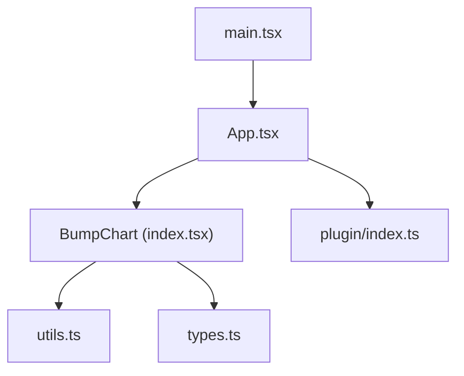
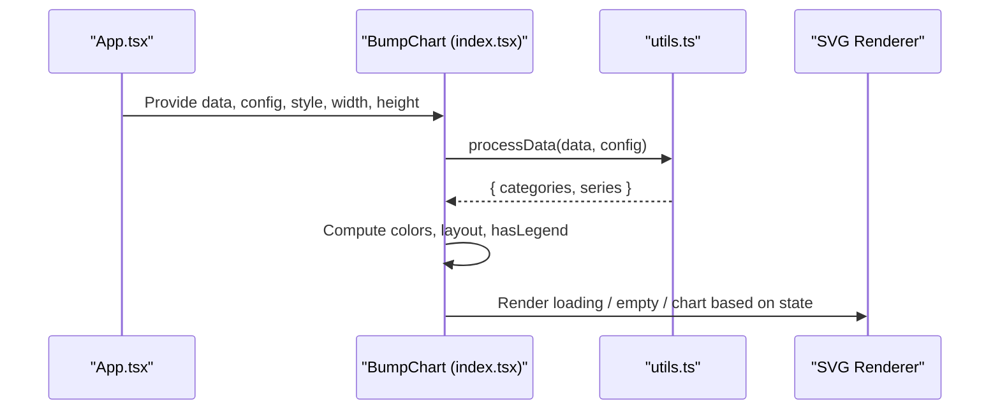
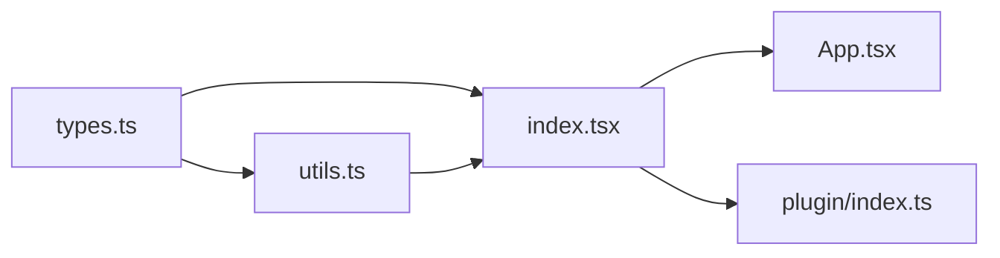

# Error Handling and Data Validation

<cite>
**Referenced Files in This Document**
- [index.tsx](file://src/BumpChart/index.tsx)
- [types.ts](file://src/BumpChart/types.ts)
- [utils.ts](file://src/BumpChart/utils.ts)
- [App.tsx](file://src/App.tsx)
- [main.tsx](file://src/main.tsx)
- [index.ts](file://src/plugin/index.ts)
</cite>

## Table of Contents
1. [Introduction](#introduction)
2. [Project Structure](#project-structure)
3. [Core Components](#core-components)
4. [Architecture Overview](#architecture-overview)
5. [Detailed Component Analysis](#detailed-component-analysis)
6. [Dependency Analysis](#dependency-analysis)
7. [Performance Considerations](#performance-considerations)
8. [Troubleshooting Guide](#troubleshooting-guide)
9. [Conclusion](#conclusion)
10. [Appendices](#appendices)

## Introduction
This document explains how BumpChart handles errors and validates data, focusing on robust input validation, TypeScript-based type safety, graceful degradation for malformed or incomplete datasets, fallback UI patterns, and user-friendly messaging. It also covers edge cases (empty datasets, missing fields, inconsistent formats, extreme values), defensive programming techniques, logging strategies, debugging approaches, and testing recommendations to ensure resilience in production environments.

## Project Structure
BumpChart is a React component with a clear separation between:
- Types and contracts: types.ts
- Data processing and utilities: utils.ts
- Rendering and layout logic: index.tsx
- Application integration and demo usage: App.tsx
- Plugin registration for dashboard frameworks: plugin/index.ts
- Entry point: main.tsx

**Diagram sources**
- [main.tsx:1-10](file://src/main.tsx#L1-L10)
- [App.tsx:1-132](file://src/App.tsx#L1-L132)
- [index.tsx:1-340](file://src/BumpChart/index.tsx#L1-L340)
- [utils.ts:1-113](file://src/BumpChart/utils.ts#L1-L113)
- [types.ts:1-68](file://src/BumpChart/types.ts#L1-L68)
- [index.ts:1-85](file://src/plugin/index.ts#L1-L85)

**Section sources**
- [main.tsx:1-10](file://src/main.tsx#L1-L10)
- [App.tsx:1-132](file://src/App.tsx#L1-L132)
- [index.tsx:1-340](file://src/BumpChart/index.tsx#L1-L340)
- [utils.ts:1-113](file://src/BumpChart/utils.ts#L1-L113)
- [types.ts:1-68](file://src/BumpChart/types.ts#L1-L68)
- [index.ts:1-85](file://src/plugin/index.ts#L1-L85)

## Core Components
- BumpChart component: renders the chart, manages loading/empty states, computes layout, and draws SVG elements.
- processData utility: transforms raw records into categories and series with ranks, handling missing or invalid values gracefully.
- Type definitions: define the shape of props, configuration, style, and internal data structures.
- Plugin interface: exposes BumpChart as a dashboard plugin with schema constraints for config.

Key error-handling and validation highlights:
- Defensive parsing of numeric and string fields.
- Early return when required axis fields are missing.
- Filtering out invalid points before rendering.
- Graceful empty state UI when no valid data is available.
- Safe layout calculations that avoid division by zero and handle single-column scenarios.

**Section sources**
- [index.tsx:104-337](file://src/BumpChart/index.tsx#L104-L337)
- [utils.ts:20-112](file://src/BumpChart/utils.ts#L20-L112)
- [types.ts:1-68](file://src/BumpChart/types.ts#L1-L68)
- [index.ts:43-82](file://src/plugin/index.ts#L43-L82)

## Architecture Overview
The data flow starts from application-level props and flows through validation and transformation before rendering.

**Diagram sources**
- [App.tsx:88-114](file://src/App.tsx#L88-L114)
- [index.tsx:120-145](file://src/BumpChart/index.tsx#L120-L145)
- [utils.ts:30-112](file://src/BumpChart/utils.ts#L30-L112)

## Detailed Component Analysis

### Data Validation and Transformation (utils.ts)
- Numeric conversion: safely converts undefined/null/empty strings to zero; non-numeric strings become zero via safe parsing.
- String conversion: coerces undefined/null to empty strings.
- Axis field validation: if xAxisField, yAxisField, or seriesField are missing, returns empty categories and series to prevent crashes.
- Grouping and ranking: groups records by category, filters out entries without a series name, sorts by value descending, and assigns rank starting at 1.
- Series alignment: ensures each series’ points array aligns with categories, inserting placeholder points with rank -1 where data is missing.
- Color assignment: cycles through provided or default colors for series.

Edge case handling:
- Missing axis fields: early exit with empty output.
- Empty or invalid series names: filtered out during ranking.
- Inconsistent category presence across series: placeholders inserted to maintain consistent length.
- Extreme values: treated as numbers; sorting still works but may produce large visual gaps—layout remains stable.

Complexity:
- Grouping and ranking: O(N log N) per category due to sorting.
- Series alignment: O(S × C) where S is number of series and C is number of categories.

Optimization opportunities:
- Pre-validate axis fields once at the component level to avoid repeated checks.
- Memoize expensive computations further if dataset grows significantly.

**Section sources**
- [utils.ts:20-28](file://src/BumpChart/utils.ts#L20-L28)
- [utils.ts:30-38](file://src/BumpChart/utils.ts#L30-L38)
- [utils.ts:40-64](file://src/BumpChart/utils.ts#L40-L64)
- [utils.ts:66-97](file://src/BumpChart/utils.ts#L66-L97)
- [utils.ts:99-112](file://src/BumpChart/utils.ts#L99-L112)

### Rendering and State Management (index.tsx)
- Loading state: displays a centered loading message when loading is true.
- Empty state: shows a customizable emptyText when there are no categories or series.
- Layout computation: calculates plot dimensions, column positions, row heights, and rank Y coordinates; guards against zero-height plots and single-column layouts.
- Rendering pipeline:
  - Title and category headers.
  - Rank labels on the left side.
  - Smooth paths connecting nodes across columns, skipping invalid ranks.
  - Nodes and labels for each valid point.
  - Optional legend with color swatches and series names.

Defensive checks:
- Filters points with rank < 1 before drawing lines and nodes.
- Guards against missing columns during line/path generation.
- Uses memoization for performance-sensitive computations.

Fallback UI:
- Loading indicator and empty state provide clear feedback to users.
- Customizable emptyText allows localization and context-specific messages.

**Section sources**
- [index.tsx:29-90](file://src/BumpChart/index.tsx#L29-L90)
- [index.tsx:104-145](file://src/BumpChart/index.tsx#L104-L145)
- [index.tsx:149-182](file://src/BumpChart/index.tsx#L149-L182)
- [index.tsx:184-319](file://src/BumpChart/index.tsx#L184-L319)

### Type Safety and Contracts (types.ts)
- RawRecord: flexible record allowing string, number, or undefined values per key.
- AxisConfig: defines xAxisField, yAxisField, seriesField for mapping data to chart axes.
- BumpChartStyle: optional styling properties including colors, label widths, node sizes, padding, legend toggle, and rank label formatting.
- BumpChartProps: props passed to the component, including data, config, style, dimensions, title, loading, and emptyText.
- Internal structures: SeriesPoint, SeriesData, ColumnLayout used for processed data and layout.

TypeScript benefits:
- Compile-time checks reduce runtime errors.
- Clear contracts guide consumers to provide correct shapes.
- Optional fields allow flexible configurations while maintaining safety.

**Section sources**
- [types.ts:1-68](file://src/BumpChart/types.ts#L1-L68)

### Plugin Integration and Schema Constraints (plugin/index.ts)
- Exposes BumpChart as a dashboard plugin with metadata and schema.
- Schema declares data as an array of objects and config as an object with required fields: xAxisField, yAxisField, seriesField.
- Provides a typed interface for plugin configuration, ensuring consistency when integrated into dashboard frameworks.

Validation implications:
- Dashboard framework can enforce schema constraints before passing props to BumpChart.
- Required fields in schema help catch misconfiguration early.

**Section sources**
- [index.ts:1-85](file://src/plugin/index.ts#L1-L85)

### Application Usage and Readiness Guard (App.tsx)
- Builds AxisConfig from user settings with defaults.
- Computes readiness flag based on presence of all required axis fields.
- Conditionally renders BumpChart or an empty-state UI when not ready.
- Passes localized titles and empty text to enhance user experience.

Defensive pattern:
- Ensures chart only renders when fully configured, preventing partial or invalid states.

**Section sources**
- [App.tsx:88-120](file://src/App.tsx#L88-L120)

## Dependency Analysis
BumpChart’s dependencies and relationships emphasize low coupling and clear boundaries:
- index.tsx depends on utils.ts for data transformation and types.ts for contracts.
- App.tsx composes BumpChart with configuration and styles.
- plugin/index.ts re-exports BumpChart and types for external consumption.

**Diagram sources**
- [types.ts:1-68](file://src/BumpChart/types.ts#L1-L68)
- [utils.ts:1-113](file://src/BumpChart/utils.ts#L1-L113)
- [index.tsx:1-340](file://src/BumpChart/index.tsx#L1-L340)
- [App.tsx:1-132](file://src/App.tsx#L1-L132)
- [index.ts:1-85](file://src/plugin/index.ts#L1-L85)

**Section sources**
- [types.ts:1-68](file://src/BumpChart/types.ts#L1-L68)
- [utils.ts:1-113](file://src/BumpChart/utils.ts#L1-L113)
- [index.tsx:1-340](file://src/BumpChart/index.tsx#L1-L340)
- [App.tsx:1-132](file://src/App.tsx#L1-L132)
- [index.ts:1-85](file://src/plugin/index.ts#L1-L85)

## Performance Considerations
- Memoization: useMemo is used for layout and derived data to minimize recomputation on prop changes.
- Efficient grouping: Map-based grouping reduces overhead compared to repeated scans.
- Sorting cost: Ranking involves sorting per category; consider limiting dataset size or paginating if needed.
- Rendering optimization: Filtering invalid points before rendering avoids unnecessary DOM operations.

[No sources needed since this section provides general guidance]

## Troubleshooting Guide
Common issues and recovery strategies:
- Missing axis fields:
  - Symptom: Chart shows empty state immediately.
  - Cause: processData returns empty categories and series when any required field is absent.
  - Recovery: Ensure xAxisField, yAxisField, and seriesField are set in config; use App.tsx readiness guard to prevent rendering until configured.
- Empty datasets:
  - Symptom: Displays emptyText.
  - Cause: No valid categories or series after processing.
  - Recovery: Validate upstream data source; provide meaningful emptyText; consider retry mechanisms.
- Invalid numeric values:
  - Symptom: Points with NaN or non-numeric values treated as zero.
  - Cause: toNumber sanitizes inputs.
  - Recovery: Clean data at ingestion; log warnings for non-numeric values; filter or replace invalid entries.
- Inconsistent series presence:
  - Symptom: Gaps in series over time.
  - Cause: Missing records for certain categories.
  - Recovery: Placeholders inserted automatically; ensure downstream logic handles rank -1 appropriately.
- Extreme values:
  - Symptom: Large jumps in rankings; potential visual artifacts.
  - Cause: Sorting by value regardless of magnitude.
  - Recovery: Consider normalization or clamping values; add tooltips to show actual values.

Logging and debugging:
- Add console logs around critical transformations (grouping, ranking, alignment) during development.
- Use browser dev tools to inspect computed categories and series arrays.
- Integrate structured logging in production to capture validation failures and recoveries.

Testing error scenarios:
- Provide datasets with missing fields, empty arrays, mixed types, and extreme values.
- Assert that chart renders empty/loading states correctly.
- Verify that series alignment maintains expected lengths and ranks.
- Check that legends and labels render without errors even with minimal data.

**Section sources**
- [utils.ts:30-38](file://src/BumpChart/utils.ts#L30-L38)
- [utils.ts:57-64](file://src/BumpChart/utils.ts#L57-L64)
- [utils.ts:80-108](file://src/BumpChart/utils.ts#L80-L108)
- [index.tsx:149-182](file://src/BumpChart/index.tsx#L149-L182)
- [App.tsx:100-120](file://src/App.tsx#L100-L120)

## Conclusion
BumpChart implements robust data validation and graceful degradation through defensive parsing, early exits for invalid configurations, filtering of invalid points, and clear fallback UI states. TypeScript enforces contracts, reducing runtime errors. The plugin schema helps catch misconfigurations early. For production resilience, augment logging, implement comprehensive tests for edge cases, and consider additional safeguards like value normalization and stricter validation at ingestion points.

[No sources needed since this section summarizes without analyzing specific files]

## Appendices

### Defensive Programming Techniques Used
- Safe numeric conversion with fallbacks.
- Coercion of undefined/null to safe defaults.
- Early validation of required configuration fields.
- Filtering invalid series names before ranking.
- Placeholder insertion to maintain consistent series lengths.

**Section sources**
- [utils.ts:20-28](file://src/BumpChart/utils.ts#L20-L28)
- [utils.ts:30-38](file://src/BumpChart/utils.ts#L30-L38)
- [utils.ts:57-64](file://src/BumpChart/utils.ts#L57-L64)
- [utils.ts:80-108](file://src/BumpChart/utils.ts#L80-L108)

### Fallback UI Patterns
- Loading state with centered message.
- Empty state with customizable text.
- Conditional rendering based on readiness flags.

**Section sources**
- [index.tsx:149-182](file://src/BumpChart/index.tsx#L149-L182)
- [App.tsx:100-120](file://src/App.tsx#L100-L120)

### Logging Strategies and Debugging Approaches
- Development-time console logs around data transformation steps.
- Inspect intermediate results (categories, series) using browser dev tools.
- Production-ready structured logging for validation failures and recoveries.

[No sources needed since this section provides general guidance]

### Testing Recommendations
- Unit tests for processData covering:
  - Missing axis fields.
  - Mixed-type values.
  - Empty datasets.
  - Inconsistent series presence.
  - Extreme values.
- Integration tests for BumpChart rendering:
  - Loading and empty states.
  - Correct layout and labels.
  - Legend visibility and content.

[No sources needed since this section provides general guidance]