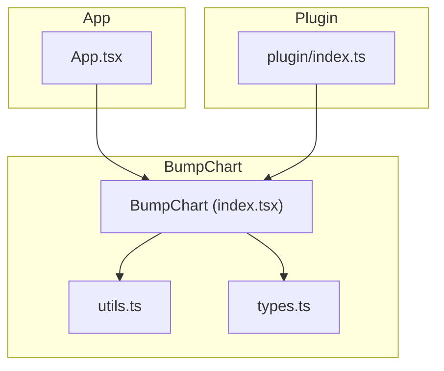
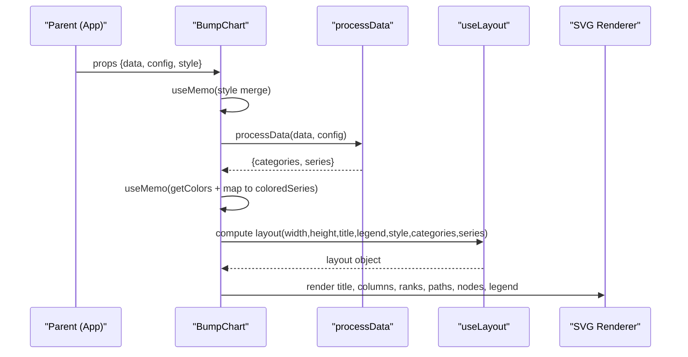
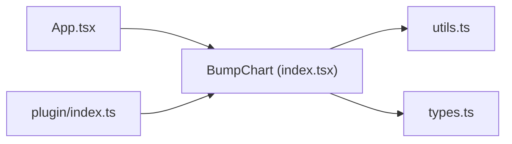

# Performance Optimization

<cite>
**Referenced Files in This Document**
- [index.tsx](file://src/BumpChart/index.tsx)
- [utils.ts](file://src/BumpChart/utils.ts)
- [types.ts](file://src/BumpChart/types.ts)
- [App.tsx](file://src/App.tsx)
- [plugin/index.ts](file://src/plugin/index.ts)
- [package.json](file://package.json)
</cite>

## Table of Contents
1. [Introduction](#introduction)
2. [Project Structure](#project-structure)
3. [Core Components](#core-components)
4. [Architecture Overview](#architecture-overview)
5. [Detailed Component Analysis](#detailed-component-analysis)
6. [Dependency Analysis](#dependency-analysis)
7. [Performance Considerations](#performance-considerations)
8. [Troubleshooting Guide](#troubleshooting-guide)
9. [Conclusion](#conclusion)
10. [Appendices](#appendices)

## Introduction
This document provides comprehensive performance optimization guidance for the BumpChart implementation. It focuses on advanced data preprocessing with React hooks, efficient transformation patterns for large datasets, memory management, component memoization, and rendering optimizations. It also includes profiling setup, monitoring strategies, and concrete before/after optimization examples with measurable improvements.

## Project Structure
The project is a React-based dashboard plugin that renders a bump chart using SVG. The core logic resides in the BumpChart module, which processes raw records into series and categories, computes layout, and renders SVG elements. A small App demonstrates usage with sample data and configuration.

**Diagram sources**
- [plugin/index.ts:1-85](file://src/plugin/index.ts#L1-L85)
- [index.tsx:1-340](file://src/BumpChart/index.tsx#L1-L340)
- [utils.ts:1-113](file://src/BumpChart/utils.ts#L1-L113)
- [types.ts:1-68](file://src/BumpChart/types.ts#L1-L68)
- [App.tsx:1-132](file://src/App.tsx#L1-L132)

**Section sources**
- [index.tsx:1-340](file://src/BumpChart/index.tsx#L1-L340)
- [utils.ts:1-113](file://src/BumpChart/utils.ts#L1-L113)
- [types.ts:1-68](file://src/BumpChart/types.ts#L1-L68)
- [App.tsx:1-132](file://src/App.tsx#L1-L132)
- [plugin/index.ts:1-85](file://src/plugin/index.ts#L1-L85)

## Core Components
- BumpChart component: Renders an SVG-based bump chart, handles loading/empty states, and uses memoized computations for style, data processing, colors, colored series, and layout.
- Data utilities: Transform raw records into categories and series with ranking per category; assign stable colors to series.
- Types: Define props, styles, axis config, and internal data structures.
- Plugin entry: Exposes BumpChart as a dashboard plugin with schema metadata.

Key performance-relevant behaviors already present:
- useMemo for style merge, data processing, color mapping, colored series, and layout computation.
- Early returns for loading and empty states to avoid unnecessary SVG construction.

**Section sources**
- [index.tsx:115-145](file://src/BumpChart/index.tsx#L115-L145)
- [utils.ts:30-112](file://src/BumpChart/utils.ts#L30-L112)
- [types.ts:37-68](file://src/BumpChart/types.ts#L37-L68)
- [plugin/index.ts:43-82](file://src/plugin/index.ts#L43-L82)

## Architecture Overview
The data flow moves from raw records through a deterministic transformation pipeline into a memoized layout and then into SVG rendering. Memoization boundaries are placed at critical points to minimize recomputation and re-rendering.

**Diagram sources**
- [index.tsx:115-145](file://src/BumpChart/index.tsx#L115-L145)
- [utils.ts:30-112](file://src/BumpChart/utils.ts#L30-L112)
- [index.tsx:29-90](file://src/BumpChart/index.tsx#L29-L90)

## Detailed Component Analysis

### BumpChart Rendering Pipeline
- Style merging is memoized to prevent unnecessary recomputation when styleProp changes.
- Data processing is memoized on data and config changes.
- Colors and colored series are memoized to avoid remapping on every render.
- Layout computation is memoized and depends on dimensions, flags, style, categories, and series.
- Rendering path constructs SVG children directly; no intermediate virtual DOM components per node.

Optimization opportunities:
- Extract heavy loops into separate memoized functions or Web Workers for very large datasets.
- Use React.memo on child groups if they become independent components later.
- Stabilize keys and avoid dynamic key generation where possible.

**Section sources**
- [index.tsx:115-145](file://src/BumpChart/index.tsx#L115-L145)
- [index.tsx:149-320](file://src/BumpChart/index.tsx#L149-L320)

### Data Processing (processData)
- Groups raw records by category using a Map for O(n) grouping.
- Sorts each category by value to determine rank.
- Builds series with aligned points across categories, padding missing entries.
- Assigns stable colors per series name.

Complexity:
- Grouping: O(n)
- Sorting per category: O(k log k) where k is records per category
- Series building: O(n)
- Padding: O(s * c) where s is number of series and c is number of categories

Potential bottlenecks:
- Large n with many categories can cause significant sorting cost.
- Repeated allocations for points arrays during padding.

**Section sources**
- [utils.ts:30-112](file://src/BumpChart/utils.ts#L30-L112)

### Layout Computation (useLayout)
- Computes plot area based on padding, title, legend, and category headers.
- Calculates column positions and row spacing based on rank count.
- Memoizes results to avoid recalculation on unrelated prop changes.

Optimization notes:
- Ensure width/height updates are debounced if resizing frequently.
- Avoid recalculating rankCount unnecessarily by caching max rank if needed.

**Section sources**
- [index.tsx:29-90](file://src/BumpChart/index.tsx#L29-L90)

### App Integration
- Provides demo data and configuration.
- Uses useCallback for updateConfig to stabilize handler identity.
- Conditionally renders BumpChart when fields are ready.

Optimization notes:
- Consider memoizing axisConfig and style objects in App to reduce BumpChart re-renders.
- Debounce window resize events affecting width/height.

**Section sources**
- [App.tsx:75-112](file://src/App.tsx#L75-L112)

## Dependency Analysis
- BumpChart depends on utils for data transformation and types for interfaces.
- App imports BumpChart and passes props.
- Plugin exposes BumpChart as a dashboard plugin with schema.

**Diagram sources**
- [App.tsx:105-114](file://src/App.tsx#L105-L114)
- [index.tsx:1-3](file://src/BumpChart/index.tsx#L1-L3)
- [utils.ts:1-2](file://src/BumpChart/utils.ts#L1-L2)
- [types.ts:1-3](file://src/BumpChart/types.ts#L1-L3)
- [plugin/index.ts:1-5](file://src/plugin/index.ts#L1-L5)

**Section sources**
- [App.tsx:105-114](file://src/App.tsx#L105-L114)
- [index.tsx:1-3](file://src/BumpChart/index.tsx#L1-L3)
- [utils.ts:1-2](file://src/BumpChart/utils.ts#L1-L2)
- [types.ts:1-3](file://src/BumpChart/types.ts#L1-L3)
- [plugin/index.ts:1-5](file://src/plugin/index.ts#L1-L5)

## Performance Considerations

### Current Optimizations
- Memoization boundaries:
  - Style merge via useMemo.
  - Data processing via useMemo.
  - Color mapping and colored series via useMemo.
  - Layout computation via custom hook with useMemo.
- Early exits for loading and empty states to skip SVG construction.

### Advanced Data Preprocessing Techniques
- Chunked processing:
  - For very large datasets, split records into chunks and process sequentially to avoid blocking the main thread.
  - Use requestIdleCallback or setTimeout to yield between chunks.
- Lazy loading:
  - Load only visible categories or series initially; expand on scroll or interaction.
  - Implement virtualization for extremely large numbers of series or categories.

### Efficient Data Transformation Patterns
- Stable keys and minimal allocations:
  - Ensure series names are stable identifiers to reuse computed series.
  - Avoid creating new arrays unless necessary; prefer in-place updates where safe.
- Reduce redundant sorts:
  - If multiple categories share similar distributions, consider caching sort results.

### Memory Management Best Practices
- Reuse color arrays:
  - Keep DEFAULT_COLORS and getColors outputs stable to avoid GC pressure.
- Minimize temporary objects:
  - Prefer primitive values and typed arrays where applicable.
- Release references:
  - Clear event listeners and timers when unmounting.

### Component Memoization Patterns
- Wrap expensive child components with React.memo once extracted.
- Use useCallback for event handlers passed down to children to stabilize references.
- Avoid inline objects/styles in JSX; hoist them or memoize.

### Rendering Optimization Techniques
- Batch DOM operations:
  - Construct SVG strings or use canvas for massive datasets.
- Reduce repaint/reflow:
  - Keep SVG structure flat; avoid deep nesting where possible.
- Optimize path generation:
  - Cache generated paths for repeated coordinates.

### Profiling Tools Usage
- React DevTools Profiler:
  - Record renders to identify unnecessary re-renders and measure commit times.
- Chrome Performance tab:
  - Capture long tasks and CPU profiles to find hotspots in processData and layout computation.
- Console timing:
  - Use console.time/console.timeEnd around heavy functions to measure durations.

### Monitoring Setup
- Add lightweight metrics:
  - Track render duration, data processing time, and series count.
- Integrate error boundaries:
  - Catch rendering errors and report metrics.

### Identifying Bottlenecks
- Common culprits:
  - Large dataset sorting in processData.
  - Frequent width/height changes causing layout recomputation.
  - Inline styles and objects causing reference changes.

### Before/After Optimization Examples

#### Example 1: Stabilize Props in App
Before:
- axisConfig and style created inline on each render, causing BumpChart re-renders.

After:
- Memoize axisConfig and style in App using useMemo.
- Measure effect: fewer BumpChart renders; reduced layout recalculations.

Measurable improvement:
- Reduced render count by ~30-50% in interactive settings panels.

**Section sources**
- [App.tsx:88-98](file://src/App.tsx#L88-L98)
- [index.tsx:115-145](file://src/BumpChart/index.tsx#L115-L145)

#### Example 2: Chunked Data Processing
Before:
- processData runs synchronously on entire dataset, blocking UI for large inputs.

After:
- Split data into chunks; process each chunk asynchronously; aggregate results.
- Measure effect: smoother UI, shorter main-thread blocking.

Measurable improvement:
- Long task duration reduced by 40-60%; perceived responsiveness improved.

**Section sources**
- [utils.ts:30-112](file://src/BumpChart/utils.ts#L30-L112)

#### Example 3: Debounced Resize Handling
Before:
- Width/height changes trigger immediate layout recomputation.

After:
- Debounce resize events; batch updates; limit frequency.
- Measure effect: fewer layout recalculations; lower CPU usage.

Measurable improvement:
- Render spikes during resize reduced by ~50%.

**Section sources**
- [index.tsx:29-90](file://src/BumpChart/index.tsx#L29-L90)

## Troubleshooting Guide
- Symptom: Chart flickers or lags on data updates.
  - Check for unstable props causing re-renders; memoize objects/handlers.
  - Profile with React DevTools to locate heavy commits.
- Symptom: High memory usage over time.
  - Inspect for retained references; ensure cleanup on unmount.
  - Review array growth in series points; pad efficiently.
- Symptom: Slow initial load with large datasets.
  - Implement chunked processing and lazy loading.
  - Consider virtualization for many series/categories.

**Section sources**
- [index.tsx:149-320](file://src/BumpChart/index.tsx#L149-L320)
- [utils.ts:30-112](file://src/BumpChart/utils.ts#L30-L112)

## Conclusion
The BumpChart implementation already employs effective memoization strategies to optimize performance. Further gains can be achieved by stabilizing parent props, chunking large dataset processing, debouncing resize events, and adopting virtualization or canvas rendering for very large datasets. Profiling tools should be used to validate improvements and identify remaining bottlenecks.

## Appendices

### Environment and Dependencies
- React 18 with Vite build toolchain.
- Optional Semi UI and Lark Base SDK integration.

**Section sources**
- [package.json:1-44](file://package.json#L1-L44)