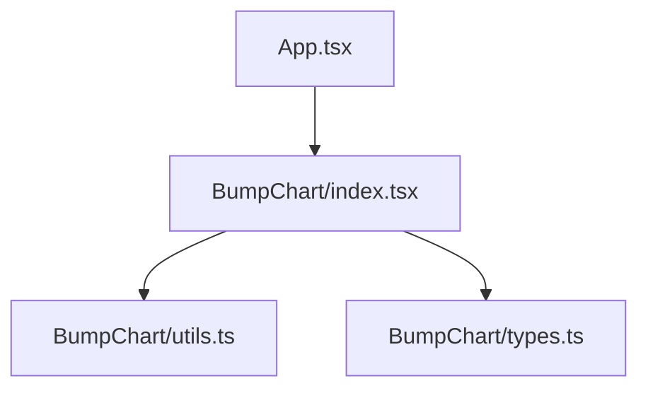
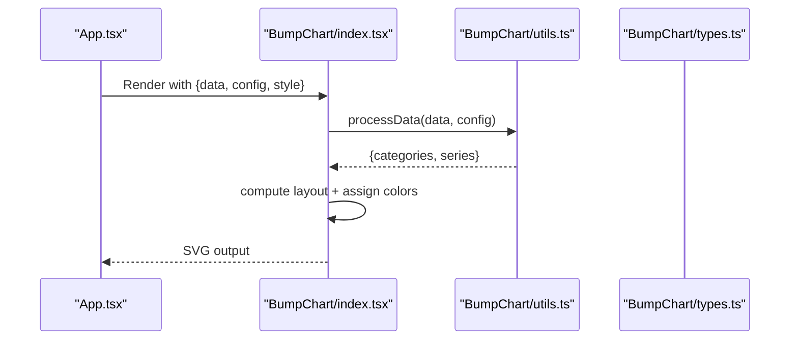
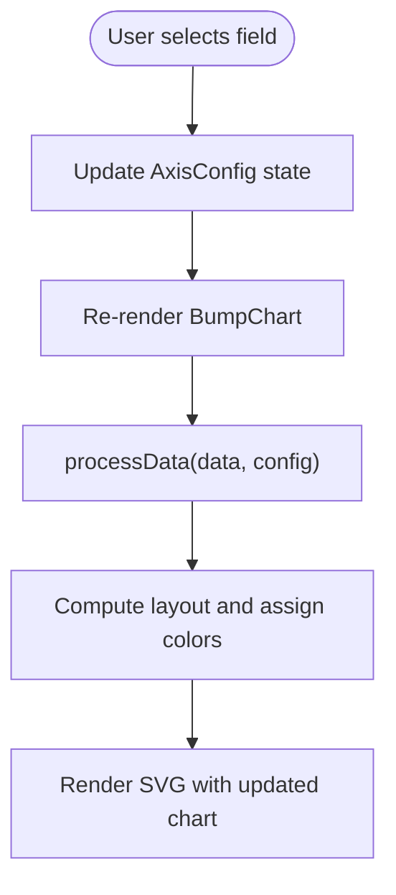
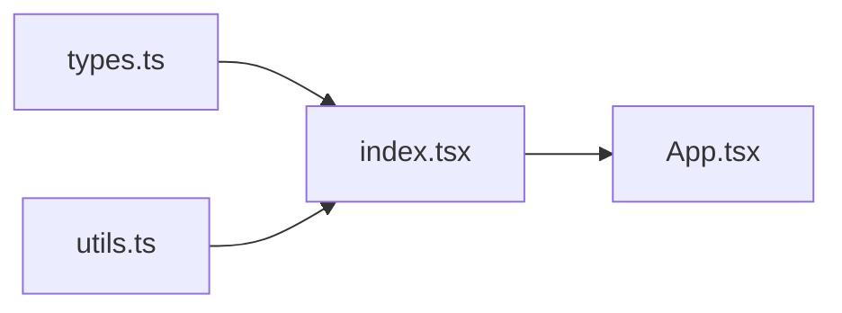

# Basic Usage Examples

<cite>
**Referenced Files in This Document**
- [index.tsx](file://src/BumpChart/index.tsx)
- [types.ts](file://src/BumpChart/types.ts)
- [utils.ts](file://src/BumpChart/utils.ts)
- [App.tsx](file://src/App.tsx)
- [README.md](file://README.md)
</cite>

## Table of Contents
1. [Introduction](#introduction)
2. [Project Structure](#project-structure)
3. [Core Components](#core-components)
4. [Architecture Overview](#architecture-overview)
5. [Detailed Component Analysis](#detailed-component-analysis)
6. [Dependency Analysis](#dependency-analysis)
7. [Performance Considerations](#performance-considerations)
8. [Troubleshooting Guide](#troubleshooting-guide)
9. [Conclusion](#conclusion)
10. [Appendices](#appendices)

## Introduction
This document provides practical, copy-ready examples for using the BumpChart component with minimal configuration. You will learn how to import and render a basic bump chart, map fields for time/category (x-axis), ranking values (y-axis), and series (entities), and apply basic styling options such as colors, labels, and legend visibility. It also explains the demo application’s interactive field selection feature that demonstrates dynamic configuration changes at runtime.

## Project Structure
The project is organized around a single React component library and a small demo app:
- BumpChart component implementation and types live under src/BumpChart.
- The demo app under src/App.tsx shows how to use the component with interactive controls.
- Utilities handle data processing and color management.

**Diagram sources**
- [App.tsx:1-10](file://src/App.tsx#L1-L10)
- [index.tsx:1-10](file://src/BumpChart/index.tsx#L1-L10)
- [utils.ts:1-5](file://src/BumpChart/utils.ts#L1-L5)
- [types.ts:1-12](file://src/BumpChart/types.ts#L1-L12)

**Section sources**
- [App.tsx:1-10](file://src/App.tsx#L1-L10)
- [index.tsx:1-10](file://src/BumpChart/index.tsx#L1-L10)
- [utils.ts:1-5](file://src/BumpChart/utils.ts#L1-L5)
- [types.ts:1-12](file://src/BumpChart/types.ts#L1-L12)

## Core Components
- BumpChart component renders an SVG-based bump chart from raw records and axis mapping configuration.
- Types define the input shape RawRecord[], AxisConfig for field mapping, and style options via BumpChartStyle.
- Utilities process raw data into categories and series with ranks, and manage color assignment.

Key props you will use most often:
- data: array of RawRecord objects
- config: AxisConfig specifying xAxisField, yAxisField, seriesField
- style: optional BumpChartStyle for colors, label widths, node sizes, padding, legend toggle, rank prefix/suffix
- width, height, title, loading, emptyText

**Section sources**
- [index.tsx:104-145](file://src/BumpChart/index.tsx#L104-L145)
- [types.ts:1-49](file://src/BumpChart/types.ts#L1-L49)
- [utils.ts:30-112](file://src/BumpChart/utils.ts#L30-L112)

## Architecture Overview
At a high level, the flow is:
- App passes data and AxisConfig to BumpChart.
- BumpChart uses processData to transform raw records into categories and series with ranks.
- Colors are assigned per series; layout is computed based on dimensions and style.
- SVG elements render category headers, rank labels, smooth connecting paths, nodes, and optional legend.

**Diagram sources**
- [App.tsx:176-183](file://src/App.tsx#L176-L183)
- [index.tsx:120-145](file://src/BumpChart/index.tsx#L120-L145)
- [utils.ts:30-112](file://src/BumpChart/utils.ts#L30-L112)
- [types.ts:1-12](file://src/BumpChart/types.ts#L1-L12)

## Detailed Component Analysis

### Minimal Setup: Import and Render
You can render a basic bump chart by providing:
- data: an array of RawRecord objects
- config: xAxisField, yAxisField, seriesField
- Optional: width, height, title, style

Example steps:
1. Import BumpChart from the component module.
2. Prepare your data as an array of objects where each object contains the fields referenced by config.
3. Pass config with xAxisField set to your time/category field (e.g., year), yAxisField set to the numeric value used for ranking (e.g., value), and seriesField set to the entity identifier (e.g., city).
4. Optionally set width, height, title, and style (colors, rankPrefix/rankSuffix, showLegend).

Reference paths for a minimal example:
- [App.tsx:176-183](file://src/App.tsx#L176-L183)
- [README.md:27-52](file://README.md#L27-L52)

What happens under the hood:
- processData groups records by xAxisField, sorts by yAxisField within each group to compute ranks, and builds series arrays aligned to categories.
- BumpChart computes layout and renders SVG elements accordingly.

**Section sources**
- [App.tsx:176-183](file://src/App.tsx#L176-L183)
- [utils.ts:30-112](file://src/BumpChart/utils.ts#L30-L112)
- [index.tsx:120-145](file://src/BumpChart/index.tsx#L120-L145)

### Essential Props and Data Structure
- RawRecord: flexible record type with string or number values keyed by field names.
- AxisConfig:
  - xAxisField: string field name used as categories/time (e.g., "year")
  - yAxisField: string field name containing numeric values used to compute ranks (e.g., "value")
  - seriesField: string field name identifying entities (e.g., "city")
- BumpChartStyle:
  - colors: array of hex strings; cycles if fewer than series
  - leftLabelWidth/rightLabelWidth: spacing for rank labels
  - nodeWidth/nodeHeight: size of node rectangles
  - columnGap: spacing between columns (used in layout calculations)
  - padding: top/right/bottom/left margins
  - showLegend: boolean to display legend
  - rankPrefix/rankSuffix: text around rank numbers (e.g., “第” and “名”)

Data preparation pattern:
- Ensure every record has the three fields specified in config.
- yAxisField should be numeric or convertible to a number; non-numeric values are treated as zero during ranking.
- seriesField must be a non-empty string to identify each series.

Reference paths:
- [types.ts:1-49](file://src/BumpChart/types.ts#L1-L49)
- [utils.ts:20-28](file://src/BumpChart/utils.ts#L20-L28)
- [utils.ts:30-112](file://src/BumpChart/utils.ts#L30-L112)

**Section sources**
- [types.ts:1-49](file://src/BumpChart/types.ts#L1-L49)
- [utils.ts:20-28](file://src/BumpChart/utils.ts#L20-L28)
- [utils.ts:30-112](file://src/BumpChart/utils.ts#L30-L112)

### Step-by-Step Field Mapping Examples
Use the demo data structure to map fields:
- xAxisField: "year" (time/category)
- yAxisField: "value" (ranking value)
- seriesField: "city" (entity)

Steps:
1. Define data as an array of objects with keys matching your chosen fields.
2. Create AxisConfig with the above mappings.
3. Pass these to BumpChart along with optional style and dimensions.

Reference paths:
- [App.tsx:5-39](file://src/App.tsx#L5-L39)
- [App.tsx:57-61](file://src/App.tsx#L57-L61)
- [App.tsx:176-183](file://src/App.tsx#L176-L183)

How it works:
- processData groups by xAxisField ("year"), sorts by yAxisField ("value") descending to compute ranks, and creates series per seriesField ("city").
- Each series gets a consistent color and a points array aligned to the category timeline.

**Section sources**
- [App.tsx:5-39](file://src/App.tsx#L5-L39)
- [App.tsx:57-61](file://src/App.tsx#L57-L61)
- [utils.ts:30-112](file://src/BumpChart/utils.ts#L30-L112)

### Interactive Field Selection in the Demo
The demo app demonstrates dynamic configuration changes:
- Three dropdowns allow selecting xAxisField, yAxisField, and seriesField from available fields.
- Changing any selection updates state and re-renders BumpChart with the new mapping instantly.
- A checkbox toggles a custom color palette for visual comparison.

Key behaviors:
- handleFieldChange updates the current AxisConfig in state.
- BumpChart receives the updated config and recalculates categories, series, and ranks.

Reference paths:
- [App.tsx:57-76](file://src/App.tsx#L57-L76)
- [App.tsx:97-174](file://src/App.tsx#L97-L174)
- [App.tsx:176-183](file://src/App.tsx#L176-L183)

**Diagram sources**
- [App.tsx:74-76](file://src/App.tsx#L74-L76)
- [utils.ts:30-112](file://src/BumpChart/utils.ts#L30-L112)
- [index.tsx:120-145](file://src/BumpChart/index.tsx#L120-L145)

**Section sources**
- [App.tsx:74-76](file://src/App.tsx#L74-L76)
- [App.tsx:97-174](file://src/App.tsx#L97-L174)
- [App.tsx:176-183](file://src/App.tsx#L176-L183)

### Basic Styling Options
Common style options to customize appearance:
- colors: override default palette; cycles across series
- rankPrefix/rankSuffix: customize rank labels (e.g., “第” and “名”)
- showLegend: enable legend display
- padding: adjust margins around the plot area
- nodeWidth/nodeHeight: control node rectangle sizes
- leftLabelWidth/rightLabelWidth: allocate space for rank labels

Reference paths:
- [index.tsx:5-27](file://src/BumpChart/index.tsx#L5-L27)
- [types.ts:14-35](file://src/BumpChart/types.ts#L14-L35)
- [App.tsx:65-72](file://src/App.tsx#L65-L72)

**Section sources**
- [index.tsx:5-27](file://src/BumpChart/index.tsx#L5-L27)
- [types.ts:14-35](file://src/BumpChart/types.ts#L14-L35)
- [App.tsx:65-72](file://src/App.tsx#L65-L72)

### Complete Copy-Ready Example References
For a complete, runnable example, see:
- Minimal usage example in README: [README.md:27-52](file://README.md#L27-L52)
- Demo app integration: [App.tsx:176-183](file://src/App.tsx#L176-L183)

These references provide full prop usage including data, config, style, width, height, and title.

**Section sources**
- [README.md:27-52](file://README.md#L27-L52)
- [App.tsx:176-183](file://src/App.tsx#L176-L183)

## Dependency Analysis
The component relies on utilities for data transformation and color management, and types for contracts.

**Diagram sources**
- [types.ts:1-12](file://src/BumpChart/types.ts#L1-L12)
- [utils.ts:1-5](file://src/BumpChart/utils.ts#L1-L5)
- [index.tsx:1-10](file://src/BumpChart/index.tsx#L1-L10)
- [App.tsx:1-10](file://src/App.tsx#L1-L10)

**Section sources**
- [types.ts:1-12](file://src/BumpChart/types.ts#L1-L12)
- [utils.ts:1-5](file://src/BumpChart/utils.ts#L1-L5)
- [index.tsx:1-10](file://src/BumpChart/index.tsx#L1-L10)
- [App.tsx:1-10](file://src/App.tsx#L1-L10)

## Performance Considerations
- useMemo is used to memoize layout computation and processed data, reducing unnecessary recalculations when props change.
- Color assignment is memoized to avoid recomputation.
- For large datasets, ensure yAxisField values are numeric to avoid conversion overhead and ensure stable rankings.

[No sources needed since this section provides general guidance]

## Troubleshooting Guide
Common issues and resolutions:
- Empty chart or missing lines:
  - Verify xAxisField, yAxisField, and seriesField exist in all records.
  - Ensure yAxisField values are numeric or convertible to numbers; non-numeric values are treated as zero.
- Unexpected ranks:
  - Check that seriesField identifies unique entities consistently.
  - Confirm there are no null/undefined series names; they are filtered out.
- Missing legend or labels:
  - Enable showLegend in style to display legend.
  - Adjust leftLabelWidth/rightLabelWidth to accommodate rank labels.

Reference paths:
- [utils.ts:20-28](file://src/BumpChart/utils.ts#L20-L28)
- [utils.ts:55-96](file://src/BumpChart/utils.ts#L55-L96)
- [index.tsx:135-145](file://src/BumpChart/index.tsx#L135-L145)

**Section sources**
- [utils.ts:20-28](file://src/BumpChart/utils.ts#L20-L28)
- [utils.ts:55-96](file://src/BumpChart/utils.ts#L55-L96)
- [index.tsx:135-145](file://src/BumpChart/index.tsx#L135-L145)

## Conclusion
You now have the essentials to render a basic bump chart with minimal configuration, map fields for time/category, ranking values, and series, and apply common styling options. The demo app illustrates how dynamic field selection updates the chart in real time. Use the provided reference paths to integrate the component into your own projects and adapt configurations to your data.

[No sources needed since this section summarizes without analyzing specific files]

## Appendices

### Data Preparation Patterns Using RawRecord
- Keep field names consistent with AxisConfig.
- Prefer numeric values for yAxisField; convert strings to numbers beforehand if necessary.
- Ensure seriesField values are stable identifiers for entities across categories.

Reference paths:
- [types.ts:1-12](file://src/BumpChart/types.ts#L1-L12)
- [utils.ts:20-28](file://src/BumpChart/utils.ts#L20-L28)

**Section sources**
- [types.ts:1-12](file://src/BumpChart/types.ts#L1-L12)
- [utils.ts:20-28](file://src/BumpChart/utils.ts#L20-L28)