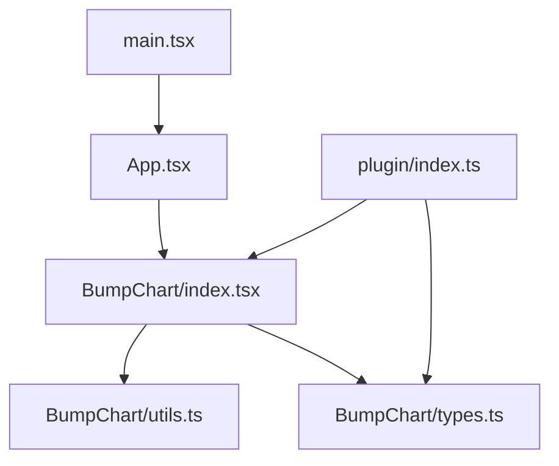
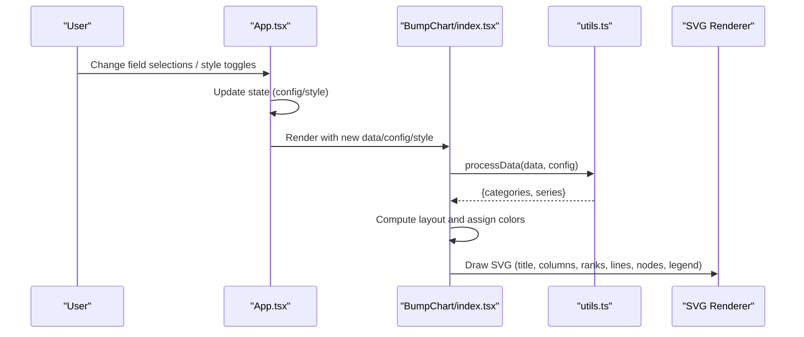
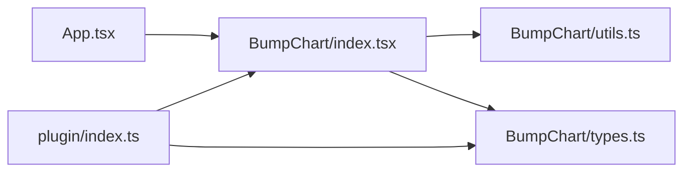

# Examples and Demos

<cite>
**Referenced Files in This Document**
- [index.tsx](file://src/BumpChart/index.tsx)
- [types.ts](file://src/BumpChart/types.ts)
- [utils.ts](file://src/BumpChart/utils.ts)
- [App.tsx](file://src/App.tsx)
- [main.tsx](file://src/main.tsx)
- [index.ts](file://src/plugin/index.ts)
- [README.md](file://README.md)
</cite>

## Table of Contents
1. Introduction
2. Project Structure
3. Core Components
4. Architecture Overview
5. Detailed Component Analysis
6. Dependency Analysis
7. Performance Considerations
8. Troubleshooting Guide
9. Conclusion
10. Appendices

## Introduction
This document provides comprehensive examples and demos for the BumpChart component, focusing on real-world usage patterns such as time-series rankings, product comparisons, and team leaderboards. It walks through the interactive demo application that demonstrates configurable fields, dynamic data updates, and various styling options. You will also find advanced examples covering custom data transformations, performance optimizations, and complex styling scenarios, along with best practices for data preparation, component composition, and integration patterns.

## Project Structure
The project is a React-based visualization library with a small demo app:
- BumpChart component implementation and utilities
- Types for props, styles, and data structures
- A plugin registration object for dashboard frameworks
- An interactive demo App showcasing configuration controls and live updates
- Entry point to mount the demo

**Diagram sources**
- [main.tsx:1-10](file://src/main.tsx#L1-L10)
- [App.tsx:1-193](file://src/App.tsx#L1-L193)
- [index.tsx:1-340](file://src/BumpChart/index.tsx#L1-L340)
- [utils.ts:1-113](file://src/BumpChart/utils.ts#L1-L113)
- [types.ts:1-68](file://src/BumpChart/types.ts#L1-L68)
- [index.ts:1-85](file://src/plugin/index.ts#L1-L85)

**Section sources**
- [main.tsx:1-10](file://src/main.tsx#L1-L10)
- [App.tsx:1-193](file://src/App.tsx#L1-L193)
- [index.tsx:1-340](file://src/BumpChart/index.tsx#L1-L340)
- [utils.ts:1-113](file://src/BumpChart/utils.ts#L1-L113)
- [types.ts:1-68](file://src/BumpChart/types.ts#L1-L68)
- [index.ts:1-85](file://src/plugin/index.ts#L1-L85)

## Core Components
- BumpChart: Renders an SVG-based bump chart with smooth curves connecting ranks across categories/time points. Supports title, legend, labels, and customizable styling.
- processData: Transforms raw records into series and categories based on axis configuration. Handles ranking, missing values, and alignment across time points.
- getColors: Provides default or custom color palettes for series.
- Plugin: Exposes a dashboard-compatible plugin object with metadata and schema for dynamic configuration.

Key capabilities:
- Configurable axes via xAxisField, yAxisField, seriesField
- Dynamic updates when config changes
- Styling control for colors, spacing, labels, legend, and rank formatting
- Loading and empty states

**Section sources**
- [index.tsx:104-337](file://src/BumpChart/index.tsx#L104-L337)
- [utils.ts:30-112](file://src/BumpChart/utils.ts#L30-L112)
- [index.ts:43-82](file://src/plugin/index.ts#L43-L82)

## Architecture Overview
The demo app composes the BumpChart with user-driven configuration. Data flows from raw records through processing into rendered SVG elements. The plugin exposes a standardized interface for dashboard integration.

**Diagram sources**
- [App.tsx:56-183](file://src/App.tsx#L56-L183)
- [index.tsx:104-337](file://src/BumpChart/index.tsx#L104-L337)
- [utils.ts:30-112](file://src/BumpChart/utils.ts#L30-L112)

## Detailed Component Analysis

### Interactive Demo Walkthrough
The demo showcases:
- Field mapping controls for xAxisField, yAxisField, seriesField
- Toggle for using a specific color palette
- Live rendering of the BumpChart with title and dimensions

Common patterns demonstrated:
- Time-series rankings: year as xAxisField, value as yAxisField, city as seriesField
- Product comparisons: swap fields to group by product over time
- Team leaderboards: use team identifiers as seriesField and metric as yAxisField

To adapt this pattern:
- Prepare your dataset as an array of objects with three fields corresponding to xAxisField, yAxisField, and seriesField
- Bind UI controls to update config state
- Pass config and data to BumpChart; optionally set width/height/title/style

**Section sources**
- [App.tsx:5-76](file://src/App.tsx#L5-L76)
- [App.tsx:78-183](file://src/App.tsx#L78-L183)

### Data Preparation and Processing
- RawRecord: flexible key-value pairs with string or number values
- AxisConfig: defines how to interpret fields for axes and series
- processData groups by category (xAxisField), sorts by value (yAxisField), assigns ranks, and aligns series across categories

Best practices:
- Ensure yAxisField contains numeric values or coercible strings
- Provide consistent series names across categories to maintain continuity
- Handle missing entries gracefully; the processor pads missing points with placeholder ranks

Complexity:
- Grouping and sorting per category: O(N log N) where N is records per category
- Series alignment: linear pass over categories and series

**Section sources**
- [types.ts:1-68](file://src/BumpChart/types.ts#L1-L68)
- [utils.ts:30-112](file://src/BumpChart/utils.ts#L30-L112)

### Rendering and Layout
- Layout computation uses width, height, padding, label widths, node sizes, and category count to position columns and ranks
- Smooth paths connect consecutive ranked points using cubic bezier curves
- Nodes are rectangles with rounded corners; labels appear next to nodes
- Legend is optional and auto-wraps based on available width

Styling options:
- colors: cycle through provided palette or defaults
- leftLabelWidth/rightLabelWidth: control label spacing
- nodeWidth/nodeHeight: adjust visual emphasis
- padding: fine-tune margins
- showLegend: toggle legend visibility
- rankPrefix/rankSuffix: customize rank labels

Performance considerations:
- useMemo used for layout and derived data to avoid recomputation on unrelated renders
- SVG path generation is efficient for moderate series counts

**Section sources**
- [index.tsx:29-90](file://src/BumpChart/index.tsx#L29-L90)
- [index.tsx:92-102](file://src/BumpChart/index.tsx#L92-L102)
- [index.tsx:184-318](file://src/BumpChart/index.tsx#L184-L318)

### Dashboard Plugin Integration
- bumpChartPlugin exposes name, version, type, component, meta, and schema
- Schema describes required fields for dynamic dashboards
- Re-exports BumpChart and types for direct usage

Integration steps:
- Import bumpChartPlugin and register it with your dashboard framework
- Configure via schema properties (data, config, style)
- Use title, width, height for presentation

**Section sources**
- [index.ts:1-85](file://src/plugin/index.ts#L1-L85)

### Example Scenarios

#### Time-Series Rankings
- Use year or month as xAxisField
- Use a metric like revenue or score as yAxisField
- Use entity names (e.g., cities, products) as seriesField
- Benefits: visualize shifting leadership over time

Implementation reference:
- See demo data structure and field bindings in the demo app

**Section sources**
- [App.tsx:5-39](file://src/App.tsx#L5-L39)
- [App.tsx:56-76](file://src/App.tsx#L56-L76)

#### Product Comparisons
- Set xAxisField to time periods
- Set seriesField to product identifiers
- Set yAxisField to sales or engagement metrics
- Customize colors to match brand palette

Configuration tips:
- Use showLegend to identify products
- Adjust nodeWidth/nodeHeight for clarity with many products

**Section sources**
- [index.tsx:115-133](file://src/BumpChart/index.tsx#L115-L133)
- [index.tsx:285-317](file://src/BumpChart/index.tsx#L285-L317)

#### Team Leaderboards
- xAxisField can be quarter or month
- seriesField identifies teams
- yAxisField is performance metric
- Rank prefix/suffix can be localized

Styling tips:
- Increase leftLabelWidth for longer rank labels
- Use distinct colors per team

**Section sources**
- [index.tsx:211-222](file://src/BumpChart/index.tsx#L211-L222)
- [index.tsx:115-133](file://src/BumpChart/index.tsx#L115-L133)

### Advanced Examples

#### Custom Data Transformations
- Pre-aggregate raw data into the required shape before passing to BumpChart
- Normalize series names to ensure continuity across categories
- Map non-numeric values to numbers or handle missing data explicitly

Reference:
- processData expects yAxisField to be numeric or coercible

**Section sources**
- [utils.ts:20-28](file://src/BumpChart/utils.ts#L20-L28)
- [utils.ts:30-112](file://src/BumpChart/utils.ts#L30-L112)

#### Performance Optimizations
- Memoize large datasets and computed configs at the parent level
- Limit visible series to top N if needed
- Reduce nodeWidth/nodeHeight for dense charts
- Avoid frequent re-renders by batching config updates

References:
- useMemo usage in component for layout and derived data

**Section sources**
- [index.tsx:115-145](file://src/BumpChart/index.tsx#L115-L145)

#### Complex Styling Scenarios
- Multi-row legends for many series
- Custom rank prefixes/suffixes for localization
- Padding adjustments for titles and legends
- Color cycling for consistent branding

References:
- Legend layout and wrapping logic
- Rank label formatting

**Section sources**
- [index.tsx:285-317](file://src/BumpChart/index.tsx#L285-L317)
- [index.tsx:211-222](file://src/BumpChart/index.tsx#L211-L222)

## Dependency Analysis
The component relies on React hooks for memoization and SVG rendering. Utilities encapsulate data processing and color management. The plugin layer standardizes integration.

**Diagram sources**
- [App.tsx:1-193](file://src/App.tsx#L1-L193)
- [index.tsx:1-340](file://src/BumpChart/index.tsx#L1-L340)
- [utils.ts:1-113](file://src/BumpChart/utils.ts#L1-L113)
- [types.ts:1-68](file://src/BumpChart/types.ts#L1-L68)
- [index.ts:1-85](file://src/plugin/index.ts#L1-L85)

**Section sources**
- [App.tsx:1-193](file://src/App.tsx#L1-L193)
- [index.tsx:1-340](file://src/BumpChart/index.tsx#L1-L340)
- [utils.ts:1-113](file://src/BumpChart/utils.ts#L1-L113)
- [types.ts:1-68](file://src/BumpChart/types.ts#L1-L68)
- [index.ts:1-85](file://src/plugin/index.ts#L1-L85)

## Performance Considerations
- Use memoization at the parent level for expensive computations
- Keep series count reasonable; consider filtering to top N
- Optimize SVG size by adjusting node dimensions and column gaps
- Batch config updates to minimize re-renders
- For large datasets, pre-process and cache transformed series

[No sources needed since this section provides general guidance]

## Troubleshooting Guide
Common issues and resolutions:
- Empty chart: Ensure xAxisField, yAxisField, seriesField are correctly mapped and present in data
- Incorrect rankings: Verify yAxisField contains numeric values; check for missing or invalid entries
- Misaligned series: Ensure consistent series names across categories; missing points are padded automatically
- Legend overflow: Enable showLegend only when necessary; adjust width to accommodate items
- Slow rendering: Reduce series count or node sizes; memoize inputs

Validation checks:
- Confirm data has at least one record per category
- Check that series names are stable across time points
- Validate config keys exist in each record

**Section sources**
- [utils.ts:30-112](file://src/BumpChart/utils.ts#L30-L112)
- [index.tsx:149-182](file://src/BumpChart/index.tsx#L149-L182)

## Conclusion
The BumpChart component offers a flexible, performant way to visualize ranking changes across time or categories. The interactive demo illustrates how to configure fields, apply styles, and update data dynamically. By following the best practices outlined here—preparing clean data, leveraging memoization, and tuning styles—you can build robust dashboards featuring time-series rankings, product comparisons, and team leaderboards.

[No sources needed since this section summarizes without analyzing specific files]

## Appendices

### API Quick Reference
- BumpChartProps: data, config, style, width, height, title, loading, emptyText
- AxisConfig: xAxisField, yAxisField, seriesField
- BumpChartStyle: colors, leftLabelWidth, rightLabelWidth, nodeWidth, nodeHeight, columnGap, padding, showLegend, rankPrefix, rankSuffix

For full details, see the README and type definitions.

**Section sources**
- [README.md:62-99](file://README.md#L62-L99)
- [types.ts:1-68](file://src/BumpChart/types.ts#L1-L68)

### Getting Started
Run the demo locally:
- Install dependencies and start dev server
- Open the local URL to interact with the demo

Build outputs include ES and UMD modules plus type declarations.

**Section sources**
- [README.md:14-21](file://README.md#L14-L21)
- [README.md:100-110](file://README.md#L100-L110)