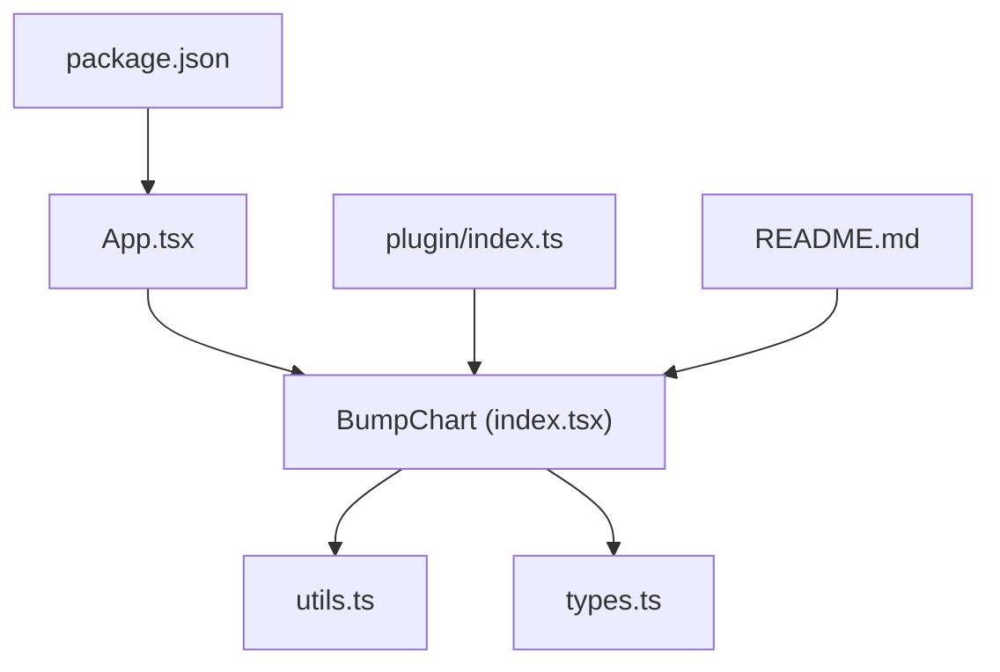
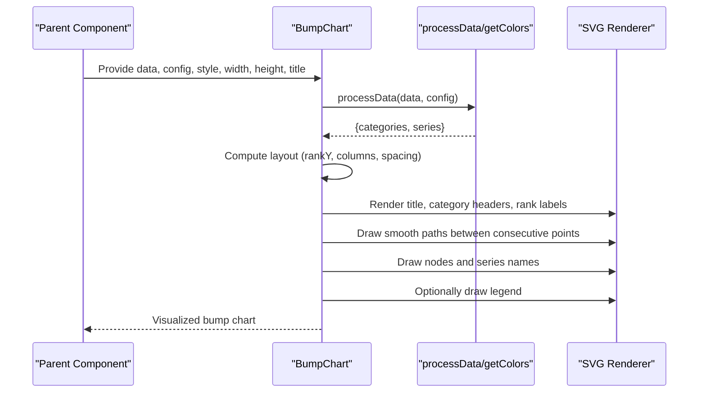
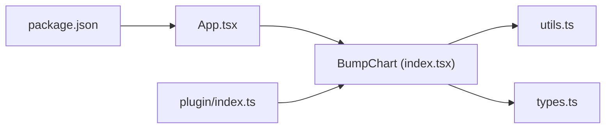

# Real-World Use Cases

<cite>
**Referenced Files in This Document**
- [index.tsx](file://src/BumpChart/index.tsx)
- [types.ts](file://src/BumpChart/types.ts)
- [utils.ts](file://src/BumpChart/utils.ts)
- [App.tsx](file://src/App.tsx)
- [plugin/index.ts](file://src/plugin/index.ts)
- [README.md](file://README.md)
- [package.json](file://package.json)
</cite>

## Table of Contents
1. Introduction
2. Project Structure
3. Core Components
4. Architecture Overview
5. Detailed Component Analysis
6. Dependency Analysis
7. Performance Considerations
8. Troubleshooting Guide
9. Conclusion
10. Appendices

## Introduction
This document provides comprehensive, real-world use cases for the BumpChart component to visualize time-series rankings and category-based rankings. It demonstrates practical applications such as city population rankings over years, product sales performance tracking, team leaderboards, website traffic analysis, stock market comparisons, and academic institution rankings. It also covers interactive dashboard patterns (filtering, sorting, drill-down), production-ready data formatting, accessibility considerations, mobile responsiveness, cross-browser compatibility, and best practices for visualization design and user experience.

The BumpChart is a pure SVG React component that transforms tabular records into ranked series with smooth connecting curves, configurable labels, legends, and styling.

## Project Structure
At a high level:
- The BumpChart component lives under src/BumpChart and includes rendering logic, layout computation, and utilities for data processing and color assignment.
- Types define the input shape and configuration.
- App.tsx demonstrates usage with sample data and dynamic configuration.
- plugin/index.ts exposes a dashboard plugin interface for integration into dashboard frameworks.
- README.md documents API and quick start.
- package.json defines dependencies and scripts.

**Diagram sources**
- [App.tsx:1-132](file://src/App.tsx#L1-L132)
- [index.tsx:1-340](file://src/BumpChart/index.tsx#L1-L340)
- [utils.ts:1-113](file://src/BumpChart/utils.ts#L1-L113)
- [types.ts:1-68](file://src/BumpChart/types.ts#L1-L68)
- [plugin/index.ts:1-85](file://src/plugin/index.ts#L1-L85)
- [README.md:1-115](file://README.md#L1-L115)
- [package.json:1-44](file://package.json#L1-L44)

**Section sources**
- [App.tsx:1-132](file://src/App.tsx#L1-L132)
- [index.tsx:1-340](file://src/BumpChart/index.tsx#L1-L340)
- [utils.ts:1-113](file://src/BumpChart/utils.ts#L1-L113)
- [types.ts:1-68](file://src/BumpChart/types.ts#L1-L68)
- [plugin/index.ts:1-85](file://src/plugin/index.ts#L1-L85)
- [README.md:1-115](file://README.md#L1-L115)
- [package.json:1-44](file://package.json#L1-L44)

## Core Components
- BumpChart component renders an SVG-based bump chart with:
  - Title, category headers, rank labels, smooth connecting paths, nodes, and optional legend.
  - Layout calculation based on width/height, padding, node sizes, and number of ranks.
  - Data transformation via processData to group by categories, compute ranks per category, and build series with points aligned across categories.
- Utilities:
  - getColors returns theme colors or defaults.
  - processData handles grouping, ranking, and alignment of series points.
- Types:
  - AxisConfig maps fields for x-axis (time/category), y-axis (value for ranking), and series (entity identifier).
  - BumpChartStyle controls visual aspects like colors, label widths, node dimensions, padding, legend visibility, and rank prefix/suffix.
- Plugin:
  - Exposes bumpChartPlugin for dashboard registration with metadata and schema.

Key implementation references:
- Rendering and layout: [index.tsx:29-90](file://src/BumpChart/index.tsx#L29-L90), [index.tsx:149-319](file://src/BumpChart/index.tsx#L149-L319)
- Data processing: [utils.ts:30-112](file://src/BumpChart/utils.ts#L30-L112)
- Types and props: [types.ts:1-68](file://src/BumpChart/types.ts#L1-L68)
- Demo usage: [App.tsx:19-50](file://src/App.tsx#L19-L50), [App.tsx:88-114](file://src/App.tsx#L88-L114)
- Plugin export: [plugin/index.ts:43-82](file://src/plugin/index.ts#L43-L82)

**Section sources**
- [index.tsx:29-90](file://src/BumpChart/index.tsx#L29-L90)
- [index.tsx:149-319](file://src/BumpChart/index.tsx#L149-L319)
- [utils.ts:30-112](file://src/BumpChart/utils.ts#L30-L112)
- [types.ts:1-68](file://src/BumpChart/types.ts#L1-L68)
- [App.tsx:19-50](file://src/App.tsx#L19-L50)
- [App.tsx:88-114](file://src/App.tsx#L88-L114)
- [plugin/index.ts:43-82](file://src/plugin/index.ts#L43-L82)

## Architecture Overview
The BumpChart follows a clear separation of concerns:
- Input data and axis mapping are provided via props and AxisConfig.
- Data is transformed into structured series and categories using utils.processData.
- Layout is computed once per render cycle based on dimensions and style.
- SVG elements are rendered conditionally based on loading, empty state, title, legend, and data presence.

**Diagram sources**
- [index.tsx:120-145](file://src/BumpChart/index.tsx#L120-L145)
- [utils.ts:30-112](file://src/BumpChart/utils.ts#L30-L112)
- [index.tsx:184-319](file://src/BumpChart/index.tsx#L184-L319)

## Detailed Component Analysis

### Time-Series Ranking: City Population Over Years
Use case: Track how cities’ populations change their relative ranking across multiple years.

- Data format: Each record contains a year (category), city (series), and value (population metric).
- Axis mapping: xAxisField = year, yAxisField = value, seriesField = city.
- Visualization: Smooth curves connect each city’s rank across years; nodes show current rank and city name.

Implementation reference:
- Sample dataset and configuration: [App.tsx:19-50](file://src/App.tsx#L19-L50), [App.tsx:88-98](file://src/App.tsx#L88-L98)
- Rendering pipeline: [index.tsx:120-145](file://src/BumpChart/index.tsx#L120-L145), [index.tsx:184-319](file://src/BumpChart/index.tsx#L184-L319)

Best practices:
- Ensure consistent category ordering (e.g., chronological years).
- Use meaningful rank prefixes/suffixes for localization (e.g., “第” and “名”).
- Keep the number of visible series manageable; consider filtering top N entities.

**Section sources**
- [App.tsx:19-50](file://src/App.tsx#L19-L50)
- [App.tsx:88-98](file://src/App.tsx#L88-L98)
- [index.tsx:120-145](file://src/BumpChart/index.tsx#L120-L145)
- [index.tsx:184-319](file://src/BumpChart/index.tsx#L184-L319)

### Product Sales Performance Tracking
Use case: Monitor monthly or quarterly sales rankings of products to identify trends and shifts.

- Data format: Records include period (month/quarter), product name, and sales figure.
- Axis mapping: xAxisField = period, yAxisField = sales, seriesField = product.
- Interactions: Add filters for product categories or time windows; sort by latest period rank.

Production pattern:
- Precompute ranks server-side if needed, but BumpChart can handle ranking internally.
- Use showLegend to help users identify series quickly.
- Adjust nodeWidth/nodeHeight for dense datasets.

References:
- Configurable style and legend: [types.ts:14-35](file://src/BumpChart/types.ts#L14-L35)
- Legend rendering: [index.tsx:285-317](file://src/BumpChart/index.tsx#L285-L317)

**Section sources**
- [types.ts:14-35](file://src/BumpChart/types.ts#L14-L35)
- [index.tsx:285-317](file://src/BumpChart/index.tsx#L285-L317)

### Team Leaderboards in Sports or Business
Use case: Display weekly or seasonal leaderboards for teams or individuals based on performance metrics.

- Data format: Records include season/week, team/player, and score/metric.
- Axis mapping: xAxisField = season/week, yAxisField = score, seriesField = team/player.
- UX tips: Highlight top performers; allow toggling to view bottom-ranked entities.

Design guidance:
- Use distinct colors per series; ensure sufficient contrast for accessibility.
- Limit visible ranks to reduce clutter; implement pagination or expand/collapse.

References:
- Color assignment and cycling: [utils.ts:3-18](file://src/BumpChart/utils.ts#L3-L18), [index.tsx:125-133](file://src/BumpChart/index.tsx#L125-L133)

**Section sources**
- [utils.ts:3-18](file://src/BumpChart/utils.ts#L3-L18)
- [index.tsx:125-133](file://src/BumpChart/index.tsx#L125-L133)

### Category-Based Rankings: Website Traffic Analysis
Use case: Compare website traffic across different channels (organic, paid, social) over months.

- Data format: Records include month, channel, and visits.
- Axis mapping: xAxisField = month, yAxisField = visits, seriesField = channel.
- Interaction: Filter by channel type; sort by latest month rank.

Visualization notes:
- Use category headers to distinguish groups if needed.
- Enable legend to clarify channel identities.

References:
- Category header rendering: [index.tsx:198-209](file://src/BumpChart/index.tsx#L198-L209)
- Legend rendering: [index.tsx:285-317](file://src/BumpChart/index.tsx#L285-L317)

**Section sources**
- [index.tsx:198-209](file://src/BumpChart/index.tsx#L198-L209)
- [index.tsx:285-317](file://src/BumpChart/index.tsx#L285-L317)

### Stock Market Performance Comparisons
Use case: Rank stocks by price or volume changes across quarters.

- Data format: Records include quarter, ticker symbol, and metric (e.g., percentage change).
- Axis mapping: xAxisField = quarter, yAxisField = metric, seriesField = ticker.
- UX: Allow toggling between metrics; highlight significant movers.

Accessibility:
- Ensure color palettes are distinguishable for color-blind users; provide text labels next to nodes.

References:
- Node and label rendering: [index.tsx:253-283](file://src/BumpChart/index.tsx#L253-L283)

**Section sources**
- [index.tsx:253-283](file://src/BumpChart/index.tsx#L253-L283)

### Academic Institution Rankings
Use case: Show university rankings over years based on research output or student satisfaction.

- Data format: Records include year, institution, and score.
- Axis mapping: xAxisField = year, yAxisField = score, seriesField = institution.
- Interaction: Drill down to view detailed scores per year; filter by region or type.

Design tips:
- Use concise labels; avoid overlapping text by adjusting leftLabelWidth and padding.

References:
- Label widths and padding: [types.ts:14-35](file://src/BumpChart/types.ts#L14-L35), [index.tsx:5-27](file://src/BumpChart/index.tsx#L5-L27)

**Section sources**
- [types.ts:14-35](file://src/BumpChart/types.ts#L14-L35)
- [index.tsx:5-27](file://src/BumpChart/index.tsx#L5-L27)

### Interactive Dashboards: Filtering, Sorting, and Drill-Down
Patterns:
- Filtering: Pass filtered subsets of data to BumpChart based on user selections (e.g., region, category).
- Sorting: Sort series by latest rank or by absolute values before rendering.
- Drill-down: On click, navigate to a detail view showing full time-series for a selected series.

Integration:
- Wrap BumpChart in a dashboard container that manages state for filters and sorts.
- Use plugin registration to embed charts within dashboards.

References:
- Plugin registration and schema: [plugin/index.ts:43-82](file://src/plugin/index.ts#L43-L82)
- Demo app wiring: [App.tsx:67-129](file://src/App.tsx#L67-L129)

**Section sources**
- [plugin/index.ts:43-82](file://src/plugin/index.ts#L43-L82)
- [App.tsx:67-129](file://src/App.tsx#L67-L129)

## Dependency Analysis
BumpChart depends on:
- React for component structure and hooks.
- Internal utilities for data processing and color management.
- Optional dashboard SDK for plugin registration.

**Diagram sources**
- [App.tsx:1-132](file://src/App.tsx#L1-L132)
- [index.tsx:1-340](file://src/BumpChart/index.tsx#L1-L340)
- [utils.ts:1-113](file://src/BumpChart/utils.ts#L1-L113)
- [types.ts:1-68](file://src/BumpChart/types.ts#L1-L68)
- [plugin/index.ts:1-85](file://src/plugin/index.ts#L1-L85)
- [package.json:1-44](file://package.json#L1-L44)

**Section sources**
- [App.tsx:1-132](file://src/App.tsx#L1-L132)
- [index.tsx:1-340](file://src/BumpChart/index.tsx#L1-L340)
- [utils.ts:1-113](file://src/BumpChart/utils.ts#L1-L113)
- [types.ts:1-68](file://src/BumpChart/types.ts#L1-L68)
- [plugin/index.ts:1-85](file://src/plugin/index.ts#L1-L85)
- [package.json:1-44](file://package.json#L1-L44)

## Performance Considerations
- Data size: For large datasets, pre-aggregate and limit visible series to improve rendering performance.
- Memoization: The component uses memoized computations for layout and series coloring to avoid unnecessary recalculations.
- SVG efficiency: Avoid excessive DOM nodes; consider virtualizing or paginating when many series exist.
- Responsive sizing: Dynamically adjust width/height based on container size to maintain readability.

[No sources needed since this section provides general guidance]

## Troubleshooting Guide
Common issues and resolutions:
- No data displayed:
  - Ensure xAxisField, yAxisField, and seriesField are correctly mapped.
  - Verify data contains valid numeric values for ranking.
- Empty state message:
  - Check for missing categories or series names; the component shows a customizable emptyText.
- Loading state:
  - Set loading prop while fetching data; the component displays a loading indicator.
- Legend not visible:
  - Enable showLegend in style; ensure there are series to display.

References:
- Empty and loading states: [index.tsx:149-182](file://src/BumpChart/index.tsx#L149-L182)
- Field validation and early return: [utils.ts:30-38](file://src/BumpChart/utils.ts#L30-L38)

**Section sources**
- [index.tsx:149-182](file://src/BumpChart/index.tsx#L149-L182)
- [utils.ts:30-38](file://src/BumpChart/utils.ts#L30-L38)

## Conclusion
The BumpChart component offers a flexible, lightweight solution for visualizing multi-series rankings over time or categories. Its pure SVG approach ensures minimal dependencies and broad compatibility. By following the documented patterns for data formatting, configuration, and interaction, you can build accessible, responsive, and production-ready dashboards for diverse use cases including city rankings, product sales, team leaderboards, website traffic, stock comparisons, and academic institution rankings.

[No sources needed since this section summarizes without analyzing specific files]

## Appendices

### Accessibility Considerations
- Provide descriptive titles and labels for screen readers.
- Ensure sufficient color contrast and offer alternative indicators beyond color (e.g., text labels next to nodes).
- Support keyboard navigation for interactive elements in surrounding dashboards.

[No sources needed since this section provides general guidance]

### Mobile Responsiveness
- Adjust width/height dynamically based on viewport size.
- Reduce node sizes and label widths on small screens to prevent overlap.
- Consider enabling/disabling legend based on available space.

[No sources needed since this section provides general guidance]

### Cross-Browser Compatibility
- Pure SVG rendering ensures compatibility across modern browsers.
- Test font rendering and text anchoring across platforms.
- Validate SVG path generation for smooth curves.

[No sources needed since this section provides general guidance]

### Best Practices for Visualization Design and UX
- Limit the number of visible series to reduce cognitive load.
- Use consistent color schemes and clear legends.
- Provide contextual information (titles, subtitles, annotations).
- Offer interactive controls (filters, sorts, drill-downs) to enhance exploration.

[No sources needed since this section provides general guidance]