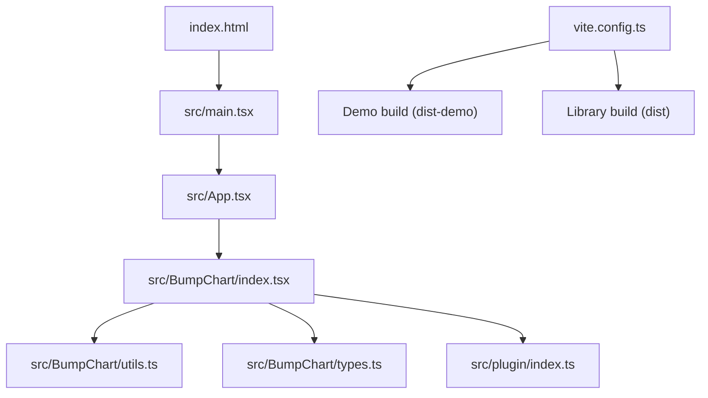
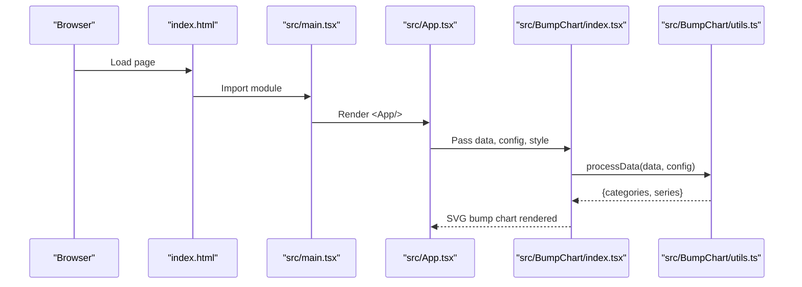
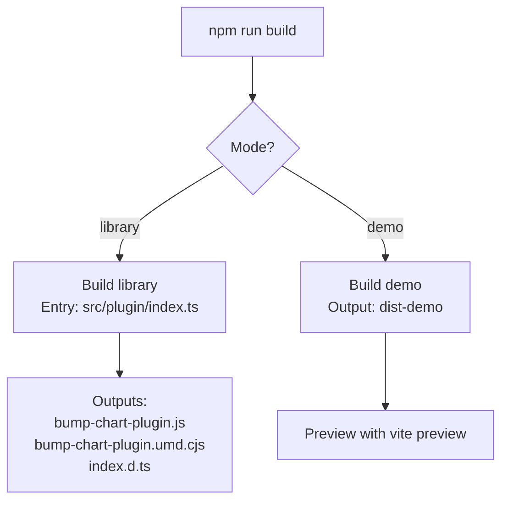
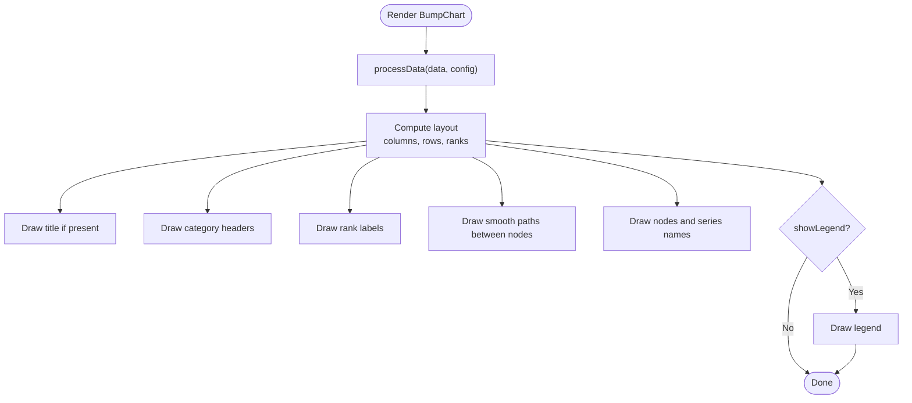
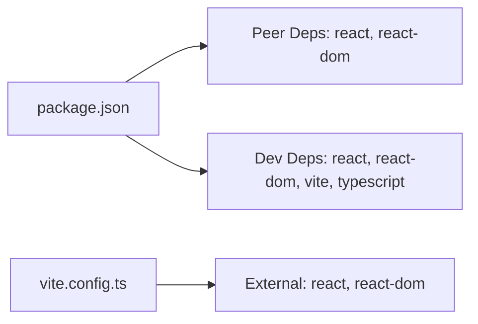

# Getting Started

<cite>
**Referenced Files in This Document**
- [package.json](file://package.json)
- [README.md](file://README.md)
- [vite.config.ts](file://vite.config.ts)
- [index.html](file://index.html)
- [tsconfig.json](file://tsconfig.json)
- [src/main.tsx](file://src/main.tsx)
- [src/App.tsx](file://src/App.tsx)
- [src/BumpChart/index.tsx](file://src/BumpChart/index.tsx)
- [src/BumpChart/types.ts](file://src/BumpChart/types.ts)
- [src/BumpChart/utils.ts](file://src/BumpChart/utils.ts)
- [src/plugin/index.ts](file://src/plugin/index.ts)
</cite>

## Table of Contents
1. Introduction
2. Project Structure
3. Core Components
4. Architecture Overview
5. Detailed Component Analysis
6. Dependency Analysis
7. Performance Considerations
8. Troubleshooting Guide
9. Conclusion
10. Appendices

## Introduction
Bump charts visualize how multiple entities change their ranking over time or across categories. They are ideal for showing trends like city rankings, product performance, or team standings across periods. The BumpChart dashboard plugin provides a pure SVG-based React component and a dashboard plugin registration object to integrate bump charts into dashboards with minimal dependencies.

Key characteristics:
- Pure SVG rendering without extra chart libraries
- Configurable axis fields (time/category, value, series)
- Smooth curves connecting ranks between columns
- Customizable colors, spacing, legend, and rank labels
- Dashboard plugin interface for easy registration

## Project Structure
The project is organized as a React + TypeScript application with Vite. It supports two build modes:
- Demo mode: runs the development server and renders an interactive example
- Library mode: builds distributable files for consumption as a package

**Diagram sources**
- [index.html:1-21](file://index.html#L1-L21)
- [src/main.tsx:1-10](file://src/main.tsx#L1-L10)
- [src/App.tsx:1-193](file://src/App.tsx#L1-L193)
- [src/BumpChart/index.tsx:1-340](file://src/BumpChart/index.tsx#L1-L340)
- [src/BumpChart/utils.ts:1-113](file://src/BumpChart/utils.ts#L1-L113)
- [src/BumpChart/types.ts:1-68](file://src/BumpChart/types.ts#L1-L68)
- [src/plugin/index.ts:1-85](file://src/plugin/index.ts#L1-L85)
- [vite.config.ts:1-46](file://vite.config.ts#L1-L46)

**Section sources**
- [index.html:1-21](file://index.html#L1-L21)
- [vite.config.ts:1-46](file://vite.config.ts#L1-L46)
- [package.json:1-41](file://package.json#L1-L41)

## Core Components
- BumpChart component: Renders a multi-series bump chart using SVG, computes layout, processes data, and draws nodes, lines, labels, and optional legend.
- Data processing utilities: Group records by category, compute ranks per category, align series points, and assign colors.
- Types: Define props, styles, axis configuration, and internal data structures.
- Plugin export: Exposes a dashboard plugin object that wraps the BumpChart component with metadata and schema for dashboard frameworks.

**Section sources**
- [src/BumpChart/index.tsx:1-340](file://src/BumpChart/index.tsx#L1-L340)
- [src/BumpChart/utils.ts:1-113](file://src/BumpChart/utils.ts#L1-L113)
- [src/BumpChart/types.ts:1-68](file://src/BumpChart/types.ts#L1-L68)
- [src/plugin/index.ts:1-85](file://src/plugin/index.ts#L1-L85)

## Architecture Overview
The runtime flow starts from the HTML entry, mounts React via ReactDOM, and renders the App which uses the BumpChart component. During library builds, the plugin index re-exports the component and types and exposes a dashboard plugin object.

**Diagram sources**
- [index.html:1-21](file://index.html#L1-L21)
- [src/main.tsx:1-10](file://src/main.tsx#L1-L10)
- [src/App.tsx:1-193](file://src/App.tsx#L1-L193)
- [src/BumpChart/index.tsx:1-340](file://src/BumpChart/index.tsx#L1-L340)
- [src/BumpChart/utils.ts:1-113](file://src/BumpChart/utils.ts#L1-L113)

## Detailed Component Analysis

### Installation and Setup
- Install dependencies using npm or yarn:
  - npm install
  - yarn install
- Ensure your project has React 18.x installed as peer dependency. The package declares React 18.x peer dependencies.

**Section sources**
- [package.json:18-21](file://package.json#L18-L21)
- [package.json:22-31](file://package.json#L22-L31)

### Quick Start: Minimal Working Example
To render a basic bump chart in your own React app:
- Import the BumpChart component from the package.
- Provide data as an array of records with three fields: xAxisField (category/time), yAxisField (numeric value), seriesField (entity name).
- Configure axis mapping via AxisConfig.
- Optionally set width, height, title, and style.

Example usage pattern (refer to the demo for concrete values):
- See the demo data and configuration in the application file for a working dataset and field mappings.

**Section sources**
- [src/App.tsx:5-39](file://src/App.tsx#L5-L39)
- [src/App.tsx:56-76](file://src/App.tsx#L56-L76)
- [src/App.tsx:176-183](file://src/App.tsx#L176-L183)
- [src/BumpChart/types.ts:1-12](file://src/BumpChart/types.ts#L1-L12)

### Development Environment Setup with Vite
- Run the development server:
  - npm run dev
  - yarn dev
- Open http://localhost:5173 to view the demo.

Vite configuration highlights:
- Uses React plugin and d.ts generation plugin.
- In library mode, builds ES and UMD outputs with externalized React and React DOM.
- In demo mode, outputs to dist-demo.

**Section sources**
- [package.json:12-16](file://package.json#L12-L16)
- [vite.config.ts:1-46](file://vite.config.ts#L1-L46)
- [index.html:1-21](file://index.html#L1-L21)

### Dual Build System: Demo vs Library Mode
- Demo mode (default):
  - Runs the interactive example under src/App.tsx.
  - Output directory: dist-demo.
- Library mode:
  - Entry point: src/plugin/index.ts.
  - Outputs:
    - bump-chart-plugin.js (ES module)
    - bump-chart-plugin.umd.cjs (UMD)
    - index.d.ts (type declarations)
  - Externalizes react and react-dom so consumers provide them.

**Diagram sources**
- [vite.config.ts:6-38](file://vite.config.ts#L6-L38)
- [package.json:12-16](file://package.json#L12-L16)

**Section sources**
- [vite.config.ts:6-38](file://vite.config.ts#L6-L38)
- [package.json:12-16](file://package.json#L12-L16)

### Using as a Dashboard Plugin
- Register the provided plugin object with your dashboard framework:
  - Import bumpChartPlugin from the package.
  - Call dashboard.register(bumpChartPlugin).
- The plugin includes metadata and a schema describing required fields for data and config.

**Section sources**
- [src/plugin/index.ts:1-85](file://src/plugin/index.ts#L1-L85)

### Rendering Flow Inside BumpChart
- Data processing:
  - Groups records by category (xAxisField).
  - Sorts by value (yAxisField) within each category to compute ranks.
  - Aligns series points across categories; missing entries are padded.
- Layout computation:
  - Calculates plot area, column positions, row heights based on rank count.
  - Handles title and legend space.
- Rendering:
  - Draws category headers, rank labels, smooth paths between nodes, node rectangles, series names, and optional legend.

**Diagram sources**
- [src/BumpChart/index.tsx:29-90](file://src/BumpChart/index.tsx#L29-L90)
- [src/BumpChart/index.tsx:149-319](file://src/BumpChart/index.tsx#L149-L319)
- [src/BumpChart/utils.ts:30-112](file://src/BumpChart/utils.ts#L30-L112)

**Section sources**
- [src/BumpChart/index.tsx:29-90](file://src/BumpChart/index.tsx#L29-L90)
- [src/BumpChart/index.tsx:149-319](file://src/BumpChart/index.tsx#L149-L319)
- [src/BumpChart/utils.ts:30-112](file://src/BumpChart/utils.ts#L30-L112)

## Dependency Analysis
- Peer dependencies:
  - react ^18.0.0
  - react-dom ^18.0.0
- Dev dependencies include React 18, TypeScript, Vite, and plugins for React and d.ts generation.
- Library build externalizes react and react-dom to avoid bundling them in the output.

**Diagram sources**
- [package.json:18-31](file://package.json#L18-L31)
- [vite.config.ts:25-33](file://vite.config.ts#L25-L33)

**Section sources**
- [package.json:18-31](file://package.json#L18-L31)
- [vite.config.ts:25-33](file://vite.config.ts#L25-L33)

## Performance Considerations
- Data processing complexity:
  - Grouping by category: O(n) where n is number of records.
  - Sorting within each category: O(k log k) per category, where k is records per category.
  - Series alignment: O(m) per series where m is number of categories.
- Rendering:
  - SVG path generation is linear in number of series and categories.
  - Avoid excessive series or categories to keep rendering responsive.
- Optimization tips:
  - Keep data normalized and ensure yAxisField contains numeric values.
  - Use memoization in consuming components to prevent unnecessary re-renders.
  - Limit legend items when showLegend is enabled.

[No sources needed since this section provides general guidance]

## Troubleshooting Guide
Common setup issues and resolutions:
- Missing React 18.x peer dependency:
  - Ensure your project installs react and react-dom at version 18.x.
  - The package declares these as peer dependencies.
- Development server not starting:
  - Verify Node.js and npm/yarn are installed.
  - Run npm install before npm run dev.
  - Check that port 5173 is available.
- Type errors during development:
  - Confirm TypeScript settings match the project’s tsconfig (module resolution, JSX).
  - Ensure imports use correct paths and types are aligned with AxisConfig and BumpChartProps.
- Library build issues:
  - When building for library mode, ensure react and react-dom are provided by the consumer app (they are externalized).
  - Confirm entry point is src/plugin/index.ts and formats are es/umd.

**Section sources**
- [package.json:18-21](file://package.json#L18-L21)
- [package.json:12-16](file://package.json#L12-L16)
- [vite.config.ts:16-35](file://vite.config.ts#L16-L35)
- [tsconfig.json:1-24](file://tsconfig.json#L1-L24)

## Conclusion
You now have everything needed to install, configure, and run the BumpChart dashboard plugin. Use the quick start to render a basic bump chart, leverage the dual build system for demos and library distribution, and register the plugin in your dashboard framework. For advanced customization, adjust AxisConfig and BumpChartStyle to fit your data and visual requirements.

[No sources needed since this section summarizes without analyzing specific files]

## Appendices

### API Reference Summary
- BumpChartProps:
  - data: RawRecord[]
  - config: AxisConfig
  - style?: BumpChartStyle
  - className?, width?, height?, title?, loading?, emptyText?
- AxisConfig:
  - xAxisField: string
  - yAxisField: string
  - seriesField: string
- BumpChartStyle:
  - colors?, leftLabelWidth?, rightLabelWidth?, nodeWidth?, nodeHeight?, columnGap?, padding?, showLegend?, rankPrefix?, rankSuffix?

**Section sources**
- [src/BumpChart/types.ts:1-68](file://src/BumpChart/types.ts#L1-L68)

### Running Commands
- Development:
  - npm run dev
  - yarn dev
- Build library:
  - npm run build
  - yarn build
- Preview built demo:
  - npm run preview
  - yarn preview

**Section sources**
- [package.json:12-16](file://package.json#L12-L16)