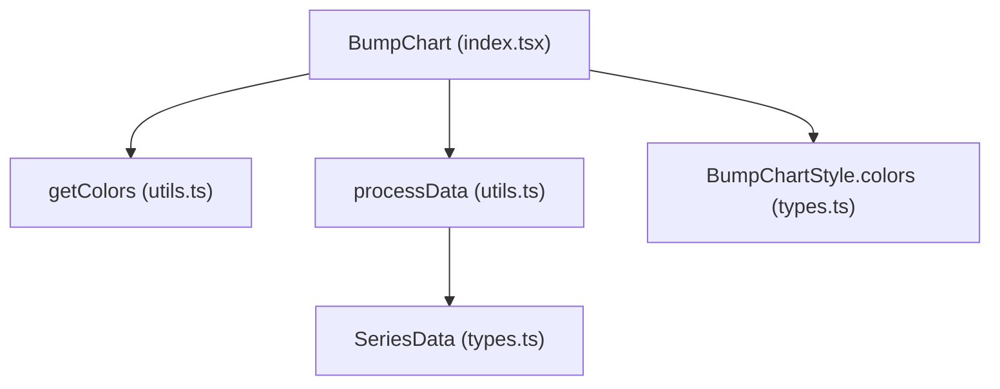
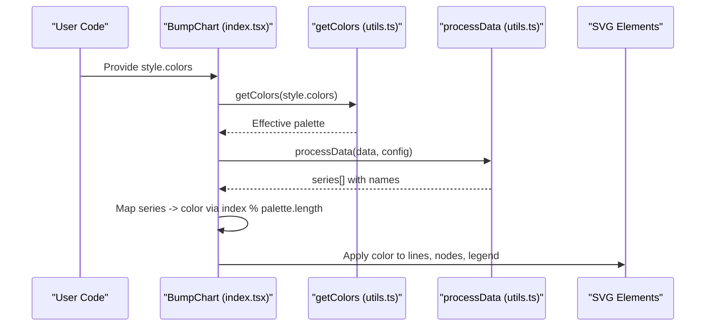
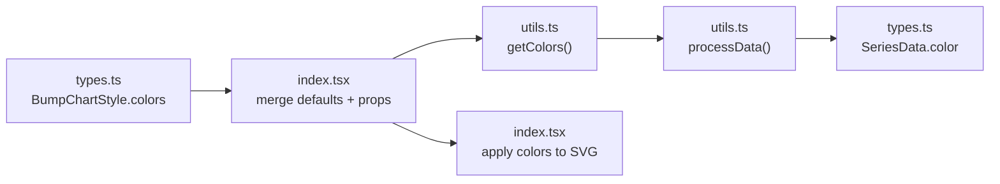

# Color Configuration

<cite>
**Referenced Files in This Document**
- [types.ts](file://src/BumpChart/types.ts)
- [utils.ts](file://src/BumpChart/utils.ts)
- [index.tsx](file://src/BumpChart/index.tsx)
- [App.tsx](file://src/App.tsx)
- [README.md](file://README.md)
</cite>

## Table of Contents
1. [Introduction](#introduction)
2. [Project Structure](#project-structure)
3. [Core Components](#core-components)
4. [Architecture Overview](#architecture-overview)
5. [Detailed Component Analysis](#detailed-component-analysis)
6. [Dependency Analysis](#dependency-analysis)
7. [Performance Considerations](#performance-considerations)
8. [Troubleshooting Guide](#troubleshooting-guide)
9. [Conclusion](#conclusion)
10. [Appendices](#appendices)

## Introduction
This document explains how color configuration works in the BumpChart component. It focuses on the colors property in the BumpChartStyle interface, the getColors utility function, and the algorithms that assign colors to series. You will learn how to customize single-color themes, gradient palettes, and brand-specific systems; how colors are automatically assigned; and how to override defaults. Guidance on accessibility (contrast ratios and color blindness considerations) is included to help you design inclusive charts.

## Project Structure
The color system spans three core files:
- Types define the style interface and data structures used by the chart.
- Utilities provide color resolution and data processing.
- The React component merges default styles with user-provided styles and applies colors during rendering.

**Diagram sources**
- [index.tsx:104-145](file://src/BumpChart/index.tsx#L104-L145)
- [utils.ts:16-18](file://src/BumpChart/utils.ts#L16-L18)
- [utils.ts:30-112](file://src/BumpChart/utils.ts#L30-L112)
- [types.ts:14-35](file://src/BumpChart/types.ts#L14-L35)
- [types.ts:58-62](file://src/BumpChart/types.ts#L58-L62)

**Section sources**
- [types.ts:14-35](file://src/BumpChart/types.ts#L14-L35)
- [utils.ts:16-18](file://src/BumpChart/utils.ts#L16-L18)
- [index.tsx:104-145](file://src/BumpChart/index.tsx#L104-L145)

## Core Components
- BumpChartStyle.colors: An optional array of color strings used as a theme palette. If not provided or empty, the component falls back to a built-in palette.
- getColors(colors?: string[]): Returns the effective palette. If a non-empty array is passed, it returns that array; otherwise, it returns the default palette.
- Automatic assignment: Each unique series receives a color from the palette in order, cycling through the palette when there are more series than colors.
- Rendering usage: Colors are applied to line segments, nodes, and legend swatches.

Key behaviors:
- Default palette is defined in utilities and mirrored in the component’s default style for convenience.
- The component computes an effective colors list via getColors and then maps each series to a color using index modulo palette length.

**Section sources**
- [types.ts:14-35](file://src/BumpChart/types.ts#L14-L35)
- [utils.ts:3-18](file://src/BumpChart/utils.ts#L3-L18)
- [index.tsx:5-27](file://src/BumpChart/index.tsx#L5-L27)
- [index.tsx:120-133](file://src/BumpChart/index.tsx#L120-L133)

## Architecture Overview
Color flow from props to rendered elements:

**Diagram sources**
- [index.tsx:115-133](file://src/BumpChart/index.tsx#L115-L133)
- [utils.ts:16-18](file://src/BumpChart/utils.ts#L16-L18)
- [utils.ts:30-112](file://src/BumpChart/utils.ts#L30-L112)

## Detailed Component Analysis

### BumpChartStyle.colors
- Purpose: Define the theme palette for series.
- Behavior:
  - If omitted or empty, the default palette is used.
  - If provided, it overrides the default palette entirely.
- Usage: Pass colors as part of the style prop to BumpChart.

Practical examples:
- Single-color theme: Provide an array with one color to apply that color to all series.
- Gradient palette: Provide a sequence of harmonious colors to create a gradient effect across series.
- Brand-specific system: Provide your brand palette to align with corporate identity.

Notes:
- The number of colors can be fewer than the number of series; colors cycle automatically.
- The README documents the colors property as part of BumpChartStyle.

**Section sources**
- [types.ts:14-35](file://src/BumpChart/types.ts#L14-L35)
- [README.md:85-99](file://README.md#L85-L99)
- [index.tsx:5-27](file://src/BumpChart/index.tsx#L5-L27)

### getColors Utility Function
- Role: Centralizes color palette selection logic.
- Algorithm:
  - If a non-empty array is provided, return it.
  - Otherwise, return the default palette.
- Integration:
  - Used by the component to compute the effective palette based on user-provided style.colors.
  - Also used internally by data processing to seed initial series colors before final mapping.

Complexity: O(1) time and space.

**Section sources**
- [utils.ts:3-18](file://src/BumpChart/utils.ts#L3-L18)
- [index.tsx:120-133](file://src/BumpChart/index.tsx#L120-L133)

### Automatic Color Assignment Algorithm
- Series discovery: Data is grouped by categories and sorted per category to determine ranks. Unique series names are collected in order of first appearance.
- Color assignment:
  - For each unique series, assign a color from the palette using index modulo palette length.
  - This ensures consistent color per series across all time points/categories.
- Rendering:
  - Lines connecting nodes use the series color.
  - Node rectangles use the series color.
  - Legend entries use the series color.

Edge cases handled:
- Missing values are treated as zero for ranking purposes.
- Series may have gaps; missing points are padded so that each series has a point per category.

**Section sources**
- [utils.ts:30-112](file://src/BumpChart/utils.ts#L30-L112)
- [index.tsx:224-317](file://src/BumpChart/index.tsx#L224-L317)

### Overriding Default Behavior
- To override the default palette, pass a colors array in style.
- To force a single color for all series, pass a single-element array.
- To disable automatic cycling, ensure your palette has at least as many colors as series.

Example patterns:
- Single-color theme: colors: ["#brand-primary"]
- Gradient palette: colors: ["#a0f", "#6cf", "#fd0", "#e66"]
- Brand system: colors: ["#0052cc", "#00b8d9", "#ffab00", "#e0245d"]

**Section sources**
- [index.tsx:5-27](file://src/BumpChart/index.tsx#L5-L27)
- [App.tsx:43-72](file://src/App.tsx#L43-L72)

### Practical Examples and Dynamic Schemes
- Static schemes:
  - Use a fixed palette for consistent branding across dashboards.
- Dynamic schemes based on data characteristics:
  - Compute a palette size equal to the number of unique series and generate colors algorithmically (e.g., HSL steps).
  - Use getColors to inject your computed palette into the component.
- Dynamic schemes based on user preferences:
  - Allow users to select a theme (e.g., light/dark, brand modes) and supply the corresponding colors array.
  - Re-render the chart with the new style.colors to update colors instantly.

Implementation hints:
- Compute colors once per render using useMemo to avoid unnecessary recalculations.
- Ensure the palette length matches or exceeds the number of series if you want to avoid cycling.

**Section sources**
- [index.tsx:115-133](file://src/BumpChart/index.tsx#L115-L133)
- [App.tsx:63-72](file://src/App.tsx#L63-L72)

## Dependency Analysis
Color-related dependencies and interactions:

Observations:
- Cohesion: Color logic is cohesive within utils and the component.
- Coupling: The component depends on getColors and processData; types define contracts.
- No circular dependencies detected among these modules.

**Diagram sources**
- [types.ts:14-35](file://src/BumpChart/types.ts#L14-L35)
- [utils.ts:16-18](file://src/BumpChart/utils.ts#L16-L18)
- [utils.ts:30-112](file://src/BumpChart/utils.ts#L30-L112)
- [index.tsx:115-133](file://src/BumpChart/index.tsx#L115-L133)

**Section sources**
- [types.ts:14-35](file://src/BumpChart/types.ts#L14-L35)
- [utils.ts:16-18](file://src/BumpChart/utils.ts#L16-L18)
- [index.tsx:115-133](file://src/BumpChart/index.tsx#L115-L133)

## Performance Considerations
- Palette resolution is O(1) via getColors.
- Series-to-color mapping uses modulo arithmetic and is O(n) where n is the number of series.
- Recomputing colors is memoized in the component to avoid redundant work on stable inputs.
- Large datasets: Ensure the number of series remains reasonable; color assignment scales linearly with series count.

[No sources needed since this section provides general guidance]

## Troubleshooting Guide
Common issues and resolutions:
- Colors not appearing:
  - Verify that style.colors is provided as an array and not empty.
  - Check that series exist in the processed data; empty data results in no rendering.
- Unexpected color cycling:
  - If the palette has fewer colors than series, colors will cycle. Increase palette size to avoid repetition.
- Inconsistent series colors across updates:
  - Ensure series identification (seriesField) is stable and unique.
- Accessibility concerns:
  - Choose colors with sufficient contrast against the background.
  - Avoid relying solely on color to convey meaning; consider adding labels or patterns.
  - Test with color blindness simulators to ensure distinguishability.

**Section sources**
- [index.tsx:149-182](file://src/BumpChart/index.tsx#L149-L182)
- [utils.ts:30-112](file://src/BumpChart/utils.ts#L30-L112)

## Conclusion
BumpChart provides a flexible and predictable color system centered on the colors property in BumpChartStyle and the getColors utility. Colors are automatically assigned to series in a deterministic way, with simple rules for cycling and fallbacks. By supplying custom palettes, you can implement single-color themes, gradients, or brand systems. For accessible and inclusive designs, ensure adequate contrast and consider color blindness when selecting palettes.

[No sources needed since this section summarizes without analyzing specific files]

## Appendices

### API Reference: BumpChartStyle.colors
- Type: string[] | undefined
- Default: Built-in palette if not provided
- Behavior: Overrides default palette when provided; cycles if fewer colors than series

**Section sources**
- [types.ts:14-35](file://src/BumpChart/types.ts#L14-L35)
- [README.md:85-99](file://README.md#L85-L99)

### Example: Using a Custom Palette in App
- Demonstrates toggling between a predefined image-style palette and defaults.

**Section sources**
- [App.tsx:43-72](file://src/App.tsx#L43-L72)