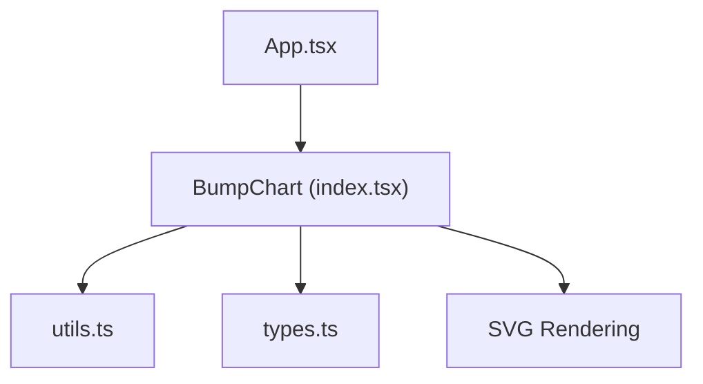
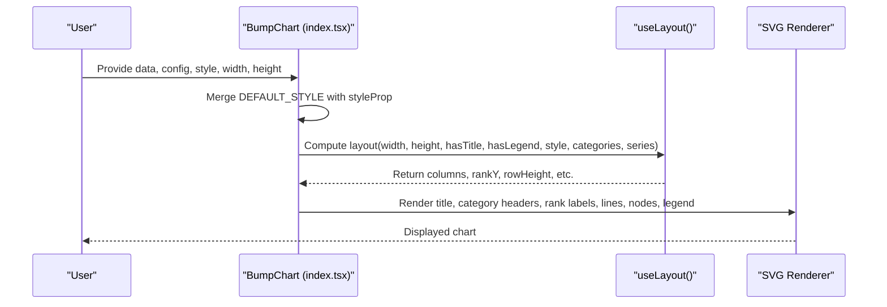
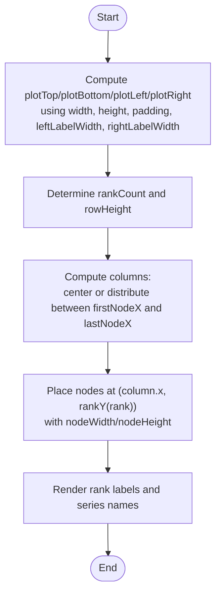
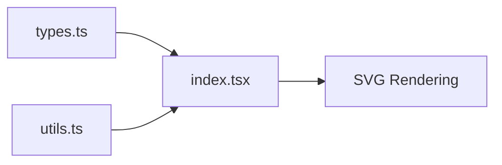

# Layout and Spacing

<cite>
**Referenced Files in This Document**
- [index.tsx](file://src/BumpChart/index.tsx)
- [types.ts](file://src/BumpChart/types.ts)
- [utils.ts](file://src/BumpChart/utils.ts)
- [README.md](file://README.md)
- [App.tsx](file://src/App.tsx)
</cite>

## Table of Contents
1. [Introduction](#introduction)
2. [Project Structure](#project-structure)
3. [Core Components](#core-components)
4. [Architecture Overview](#architecture-overview)
5. [Detailed Component Analysis](#detailed-component-analysis)
6. [Dependency Analysis](#dependency-analysis)
7. [Performance Considerations](#performance-considerations)
8. [Troubleshooting Guide](#troubleshooting-guide)
9. [Conclusion](#conclusion)
10. [Appendices](#appendices)

## Introduction
This document explains how to configure layout and spacing for the BumpChart component. It focuses on the style properties that control spacing and dimensions: leftLabelWidth, rightLabelWidth, nodeWidth, nodeHeight, columnGap, and padding. You will learn how these properties influence chart rendering, responsive behavior, and performance, with practical guidance for compact charts, wide layouts, and mobile-optimized configurations.

## Project Structure
The BumpChart is implemented as a React component with supporting utilities and type definitions:
- index.tsx: Main component, default styles, layout calculations, and SVG rendering
- types.ts: TypeScript interfaces for props, style, and data structures
- utils.ts: Data processing and color management
- README.md: API reference and usage examples
- App.tsx: Demo application showing typical usage

**Diagram sources**
- [index.tsx:104-337](file://src/BumpChart/index.tsx#L104-L337)
- [utils.ts:30-112](file://src/BumpChart/utils.ts#L30-L112)
- [types.ts:14-49](file://src/BumpChart/types.ts#L14-L49)

**Section sources**
- [index.tsx:1-337](file://src/BumpChart/index.tsx#L1-L337)
- [types.ts:1-68](file://src/BumpChart/types.ts#L1-L68)
- [utils.ts:1-113](file://src/BumpChart/utils.ts#L1-L113)
- [README.md:62-99](file://README.md#L62-L99)
- [App.tsx:56-183](file://src/App.tsx#L56-L183)

## Core Components
- BumpChart component: Accepts data, axis configuration, style, and dimensions; computes layout and renders an SVG chart.
- Style system: Merges user-provided style with defaults to define spacing and visual options.
- Layout engine: Calculates plot area, column positions, rank rows, and node placement based on width, height, and style properties.
- Data processor: Transforms raw records into series and categories used by the layout.

Key spacing-related style properties:
- leftLabelWidth: Width reserved for left-side rank labels
- rightLabelWidth: Right-side margin/label width
- nodeWidth: Width of each node rectangle
- nodeHeight: Height of each node rectangle
- columnGap: Intended spacing between columns (note: see detailed analysis below)
- padding: Chart inner margins (top, right, bottom, left)

**Section sources**
- [index.tsx:5-27](file://src/BumpChart/index.tsx#L5-L27)
- [index.tsx:29-90](file://src/BumpChart/index.tsx#L29-L90)
- [types.ts:14-35](file://src/BumpChart/types.ts#L14-L35)

## Architecture Overview
The layout calculation determines where nodes and labels are placed within the SVG canvas. The flow is:
- Merge default and user styles
- Compute plot boundaries using width, height, and padding
- Determine number of ranks and row spacing
- Distribute columns across the horizontal space
- Place nodes and labels according to node dimensions and label widths

**Diagram sources**
- [index.tsx:104-145](file://src/BumpChart/index.tsx#L104-L145)
- [index.tsx:184-318](file://src/BumpChart/index.tsx#L184-L318)

## Detailed Component Analysis

### Spacing Properties and Their Effects
- leftLabelWidth
  - Controls the horizontal space allocated for rank labels on the left side.
  - Larger values push the plot area inward from the left edge.
  - Used to position rank labels and determine the start of the plot area.
  - Reference: [index.tsx:18-18](file://src/BumpChart/index.tsx#L18-L18), [index.tsx:55-55](file://src/BumpChart/index.tsx#L55-L55), [index.tsx:212-222](file://src/BumpChart/index.tsx#L212-L222)

- rightLabelWidth
  - Defines the right-side margin or label width.
  - Reduces the available plot width from the right edge.
  - Reference: [index.tsx:19-19](file://src/BumpChart/index.tsx#L19-L19), [index.tsx:56-56](file://src/BumpChart/index.tsx#L56-L56)

- nodeWidth
  - Width of each node rectangle.
  - Influences the first and last node X positions via edge gaps and affects line endpoints.
  - Reference: [index.tsx:20-20](file://src/BumpChart/index.tsx#L20-L20), [index.tsx:60-63](file://src/BumpChart/index.tsx#L60-L63), [index.tsx:235-238](file://src/BumpChart/index.tsx#L235-L238), [index.tsx:260-268](file://src/BumpChart/index.tsx#L260-L268)

- nodeHeight
  - Height of each node rectangle.
  - Used to vertically center nodes around their rank Y coordinate.
  - Reference: [index.tsx:21-21](file://src/BumpChart/index.tsx#L21-L21), [index.tsx:260-268](file://src/BumpChart/index.tsx#L260-L268)

- columnGap
  - Declared in style but not directly used in current layout calculations.
  - Column distribution is computed from plotLeft, plotRight, and number of categories.
  - If you need explicit spacing between columns, adjust width/height or use padding to simulate gaps.
  - Reference: [types.ts:25-26](file://src/BumpChart/types.ts#L25-L26), [index.tsx:58-71](file://src/BumpChart/index.tsx#L58-L71)

- padding
  - Inner margins applied to all sides of the chart.
  - Determines plotTop, plotBottom, plotLeft, plotRight.
  - Affects title positioning, legend placement, and overall usable area.
  - Reference: [index.tsx:23-23](file://src/BumpChart/index.tsx#L23-L23), [index.tsx:45-57](file://src/BumpChart/index.tsx#L45-L57), [index.tsx:187-195](file://src/BumpChart/index.tsx#L187-L195), [index.tsx:286-316](file://src/BumpChart/index.tsx#L286-L316)

### Layout Calculations Internals
- Plot area computation:
  - plotTop = padding.top + titleHeight + categoryHeaderHeight
  - plotBottom = height - padding.bottom - legendHeight
  - plotLeft = padding.left + leftLabelWidth
  - plotRight = width - padding.right - rightLabelWidth
  - Reference: [index.tsx:41-57](file://src/BumpChart/index.tsx#L41-L57)

- Rank rows:
  - rankCount derived from maximum rank across series
  - rowHeight = plotHeight / (rankCount - 1) if multiple ranks; otherwise full plotHeight
  - rankY(rank) maps rank to Y coordinate
  - Reference: [index.tsx:49-53](file://src/BumpChart/index.tsx#L49-L53), [index.tsx:73-74](file://src/BumpChart/index.tsx#L73-L74)

- Columns distribution:
  - For single category, place at center of plot width
  - For multiple categories, distribute evenly between firstNodeX and lastNodeX
  - firstNodeX and lastNodeX incorporate nodeWidth and fixed edgeGap
  - Reference: [index.tsx:60-71](file://src/BumpChart/index.tsx#L60-L71)

- Node and label placement:
  - Nodes centered at column x and rank y
  - Series name labels positioned to the right of nodes with a small gap
  - Reference: [index.tsx:235-238](file://src/BumpChart/index.tsx#L235-L238), [index.tsx:260-279](file://src/BumpChart/index.tsx#L260-L279)

**Diagram sources**
- [index.tsx:41-74](file://src/BumpChart/index.tsx#L41-L74)
- [index.tsx:212-279](file://src/BumpChart/index.tsx#L212-L279)

**Section sources**
- [index.tsx:29-90](file://src/BumpChart/index.tsx#L29-L90)
- [index.tsx:184-318](file://src/BumpChart/index.tsx#L184-L318)
- [types.ts:14-35](file://src/BumpChart/types.ts#L14-L35)

### Responsive Behavior
- The chart respects the provided width and height. Adjusting these dimensions changes the plot area and column distribution.
- Legend items wrap based on available width minus padding; this can affect vertical space usage when enabled.
- Title and category headers occupy fixed heights that reduce the plot area.
- Reference: [index.tsx:187-209](file://src/BumpChart/index.tsx#L187-L209), [index.tsx:286-316](file://src/BumpChart/index.tsx#L286-L316)

### Examples and Guidelines

- Compact charts
  - Reduce padding to minimize whitespace
  - Use smaller nodeWidth and nodeHeight to fit more content
  - Increase leftLabelWidth only if rank labels are long
  - Keep column count moderate; fewer categories yield denser visuals
  - Reference: [index.tsx:5-27](file://src/BumpChart/index.tsx#L5-L27), [index.tsx:41-57](file://src/BumpChart/index.tsx#L41-L57)

- Wide layouts
  - Increase width to spread columns further apart
  - Maintain reasonable nodeWidth to avoid overly thin nodes
  - Adjust padding to balance margins and plot area
  - Reference: [index.tsx:58-71](file://src/BumpChart/index.tsx#L58-L71)

- Mobile-optimized configurations
  - Use smaller width and height
  - Reduce padding and node dimensions
  - Consider disabling legend to save space
  - Ensure leftLabelWidth accommodates rank labels without crowding
  - Reference: [index.tsx:18-23](file://src/BumpChart/index.tsx#L18-L23), [index.tsx:286-316](file://src/BumpChart/index.tsx#L286-L316)

- Relationship between spacing and dimensions
  - Total width consumed by leftLabelWidth, plot area, and rightLabelWidth plus padding must fit within the provided width
  - Total height consumed by padding, title/category header, plot area, and legend must fit within the provided height
  - Reference: [index.tsx:41-57](file://src/BumpChart/index.tsx#L41-L57), [index.tsx:187-209](file://src/BumpChart/index.tsx#L187-L209), [index.tsx:286-316](file://src/BumpChart/index.tsx#L286-L316)

- Optimal spacing guidelines
  - Content density: Increase nodeWidth/nodeHeight slightly for readability; decrease padding for dense datasets
  - Screen size: On small screens, reduce all spacing proportionally; on large screens, increase padding and node sizes for clarity
  - Column count: More categories require wider width or reduced nodeWidth to maintain legibility
  - Reference: [index.tsx:58-71](file://src/BumpChart/index.tsx#L58-L71), [index.tsx:41-57](file://src/BumpChart/index.tsx#L41-L57)

**Section sources**
- [index.tsx:5-27](file://src/BumpChart/index.tsx#L5-L27)
- [index.tsx:41-71](file://src/BumpChart/index.tsx#L41-L71)
- [index.tsx:187-316](file://src/BumpChart/index.tsx#L187-L316)
- [types.ts:14-35](file://src/BumpChart/types.ts#L14-L35)

## Dependency Analysis
- BumpChart depends on:
  - processData and getColors from utils.ts for data transformation and color assignment
  - Types from types.ts for prop and style definitions
- Layout calculations rely on width, height, style, categories, and series to compute positions
- Rendering uses computed layout to draw titles, headers, rank labels, lines, nodes, and legend

**Diagram sources**
- [index.tsx:1-3](file://src/BumpChart/index.tsx#L1-L3)
- [utils.ts:1-18](file://src/BumpChart/utils.ts#L1-L18)
- [types.ts:1-49](file://src/BumpChart/types.ts#L1-L49)

**Section sources**
- [index.tsx:1-3](file://src/BumpChart/index.tsx#L1-L3)
- [utils.ts:30-112](file://src/BumpChart/utils.ts#L30-L112)
- [types.ts:14-49](file://src/BumpChart/types.ts#L14-L49)

## Performance Considerations
- Data processing complexity:
  - Grouping by category and sorting per category yields O(N log N) due to ranking per category
  - Building series points involves map operations and array pushes; overall linear in total records
  - Reference: [utils.ts:40-97](file://src/BumpChart/utils.ts#L40-L97)
- Rendering considerations:
  - Number of SVG elements scales with number of series and categories; large datasets may benefit from reducing visible series or categories
  - Legend wrapping recalculates per render; consider disabling legend for very large series counts
  - Reference: [index.tsx:286-316](file://src/BumpChart/index.tsx#L286-L316)
- Optimization tips:
  - Preprocess data to limit extreme category counts
  - Use smaller nodeWidth/nodeHeight for dense datasets to reduce overlap and improve readability
  - Adjust padding to maximize plot area while maintaining label visibility
  - Reference: [index.tsx:41-71](file://src/BumpChart/index.tsx#L41-L71)

**Section sources**
- [utils.ts:40-97](file://src/BumpChart/utils.ts#L40-L97)
- [index.tsx:286-316](file://src/BumpChart/index.tsx#L286-L316)

## Troubleshooting Guide
- Overlapping nodes or labels:
  - Increase width or reduce column count
  - Decrease nodeWidth or increase padding
  - Check leftLabelWidth to ensure rank labels do not crowd the plot area
  - Reference: [index.tsx:58-71](file://src/BumpChart/index.tsx#L58-L71), [index.tsx:212-222](file://src/BumpChart/index.tsx#L212-L222)

- Cut-off content:
  - Verify padding values are sufficient for titles and legends
  - Ensure height accommodates title, category headers, plot area, and legend
  - Reference: [index.tsx:41-57](file://src/BumpChart/index.tsx#L41-L57), [index.tsx:187-209](file://src/BumpChart/index.tsx#L187-L209), [index.tsx:286-316](file://src/BumpChart/index.tsx#L286-L316)

- Inconsistent column spacing:
  - Note that columnGap is declared but not used; columns are distributed evenly based on plot width
  - Adjust width or padding to achieve desired spacing
  - Reference: [types.ts:25-26](file://src/BumpChart/types.ts#L25-L26), [index.tsx:58-71](file://src/BumpChart/index.tsx#L58-L71)

- Legend overflow:
  - Disable showLegend or reduce series count
  - Increase width to allow more legend items per row
  - Reference: [index.tsx:286-316](file://src/BumpChart/index.tsx#L286-L316)

**Section sources**
- [index.tsx:58-71](file://src/BumpChart/index.tsx#L58-L71)
- [index.tsx:187-316](file://src/BumpChart/index.tsx#L187-L316)
- [types.ts:25-26](file://src/BumpChart/types.ts#L25-L26)

## Conclusion
The BumpChart’s layout and spacing are controlled primarily through padding, leftLabelWidth, rightLabelWidth, nodeWidth, nodeHeight, and the chart’s width/height. While columnGap is defined in the style, it does not currently affect column distribution; columns are evenly spaced across the plot area. By adjusting these properties thoughtfully, you can create compact, wide, or mobile-optimized charts that remain readable and performant. For large datasets, consider reducing series/categories, tuning node dimensions, and managing legend visibility to maintain responsiveness.

## Appendices
- API reference for style properties:
  - colors, leftLabelWidth, rightLabelWidth, nodeWidth, nodeHeight, columnGap, padding, showLegend, rankPrefix, rankSuffix
  - Reference: [README.md:85-99](file://README.md#L85-L99)

- Example usage demonstrating basic configuration:
  - Reference: [App.tsx:176-183](file://src/App.tsx#L176-L183)