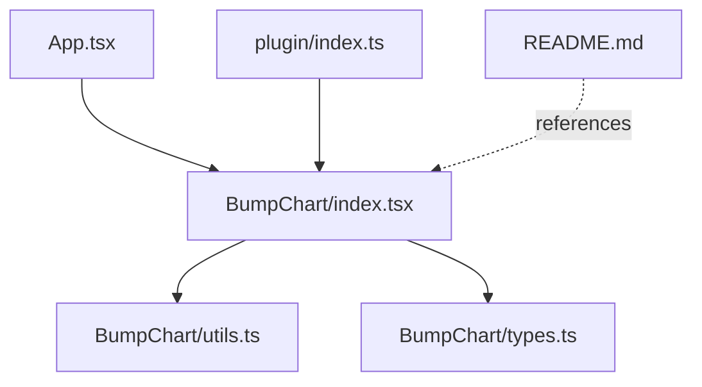
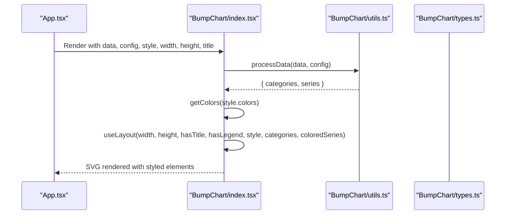
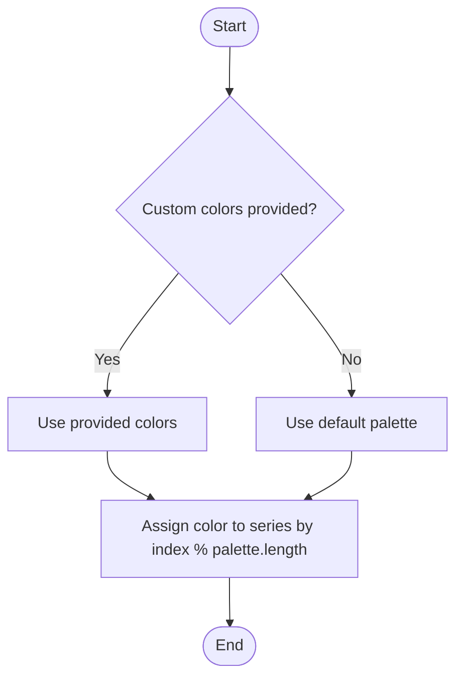
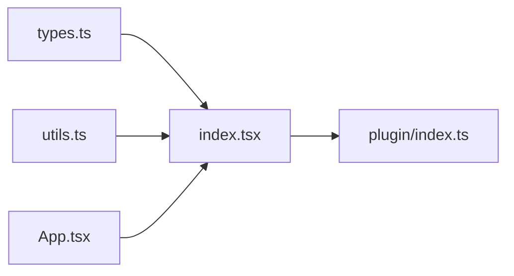

# Styling and Customization

<cite>
**Referenced Files in This Document**
- [index.tsx](file://src/BumpChart/index.tsx)
- [types.ts](file://src/BumpChart/types.ts)
- [utils.ts](file://src/BumpChart/utils.ts)
- [plugin/index.ts](file://src/plugin/index.ts)
- [App.tsx](file://src/App.tsx)
- [README.md](file://README.md)
</cite>

## Table of Contents
1. [Introduction](#introduction)
2. [Project Structure](#project-structure)
3. [Core Components](#core-components)
4. [Architecture Overview](#architecture-overview)
5. [Detailed Component Analysis](#detailed-component-analysis)
6. [Dependency Analysis](#dependency-analysis)
7. [Performance Considerations](#performance-considerations)
8. [Troubleshooting Guide](#troubleshooting-guide)
9. [Conclusion](#conclusion)
10. [Appendices](#appendices)

## Introduction
This document provides comprehensive styling and customization guidance for the BumpChart component. It explains the complete BumpChartStyle interface, color assignment algorithms, layout configuration options (margins, padding, responsive behavior), theme creation, custom label formatting, legend customization, CSS-in-JS patterns, accessibility considerations, and performance optimization guidelines for complex visualizations.

## Project Structure
The BumpChart implementation is organized into a focused set of files:
- Component and rendering logic: src/BumpChart/index.tsx
- Types and interfaces: src/BumpChart/types.ts
- Data processing and color utilities: src/BumpChart/utils.ts
- Dashboard plugin integration: src/plugin/index.ts
- Demo application showcasing usage and styles: src/App.tsx
- Documentation and API reference: README.md

**Diagram sources**
- [index.tsx:1-4](file://src/BumpChart/index.tsx#L1-L4)
- [utils.ts:1-2](file://src/BumpChart/utils.ts#L1-L2)
- [types.ts:1-68](file://src/BumpChart/types.ts#L1-L68)
- [plugin/index.ts:1-5](file://src/plugin/index.ts#L1-L5)
- [README.md:62-99](file://README.md#L62-L99)

**Section sources**
- [index.tsx:1-340](file://src/BumpChart/index.tsx#L1-L340)
- [types.ts:1-68](file://src/BumpChart/types.ts#L1-L68)
- [utils.ts:1-113](file://src/BumpChart/utils.ts#L1-L113)
- [plugin/index.ts:1-85](file://src/plugin/index.ts#L1-L85)
- [App.tsx:1-193](file://src/App.tsx#L1-L193)
- [README.md:1-115](file://README.md#L1-L115)

## Core Components
- BumpChart component renders an SVG-based bump chart with configurable style via BumpChartStyle.
- Default styles are merged with user-provided style to produce a fully resolved style object.
- Layout computation uses width, height, title presence, legend visibility, and style properties to compute plot area, columns, ranks, and node positions.
- Colors are assigned per series using a deterministic algorithm based on the provided or default color palette.

Key responsibilities:
- Style resolution and defaults
- Layout calculation for responsive positioning
- Color assignment and series coloring
- Rendering of title, category headers, rank labels, lines, nodes, and optional legend

**Section sources**
- [index.tsx:5-27](file://src/BumpChart/index.tsx#L5-L27)
- [index.tsx:29-90](file://src/BumpChart/index.tsx#L29-L90)
- [index.tsx:104-145](file://src/BumpChart/index.tsx#L104-L145)
- [utils.ts:3-18](file://src/BumpChart/utils.ts#L3-L18)

## Architecture Overview
The BumpChart architecture separates concerns between data processing, layout computation, and rendering:
- Data processing transforms raw records into categories and series with computed ranks.
- Layout computation determines column positions, row spacing, and plot boundaries based on dimensions and style.
- Rendering constructs SVG elements for title, category headers, rank labels, connecting paths, nodes, and legend.

**Diagram sources**
- [index.tsx:104-145](file://src/BumpChart/index.tsx#L104-L145)
- [utils.ts:30-112](file://src/BumpChart/utils.ts#L30-L112)
- [types.ts:37-68](file://src/BumpChart/types.ts#L37-L68)

## Detailed Component Analysis

### BumpChartStyle Interface
The BumpChartStyle interface defines all customizable visual and layout properties:
- colors: Array of theme colors used cyclically across series.
- leftLabelWidth: Width reserved for left-side rank labels.
- rightLabelWidth: Right-side padding/label width.
- nodeWidth: Width of each node rectangle.
- nodeHeight: Height of each node rectangle.
- columnGap: Intended spacing between columns (used indirectly by layout).
- padding: Object with top, right, bottom, left values controlling inner margins.
- showLegend: Boolean flag to display the legend at the bottom.
- rankPrefix: Prefix string for rank labels (e.g., “第”).
- rankSuffix: Suffix string for rank labels (e.g., “名”).

Defaults are applied when not provided, ensuring consistent appearance out of the box.

**Section sources**
- [types.ts:14-35](file://src/BumpChart/types.ts#L14-L35)
- [index.tsx:5-27](file://src/BumpChart/index.tsx#L5-L27)

### Color Assignment Algorithms
Color assignment occurs in two stages:
- Palette selection: If a custom colors array is provided, it is used; otherwise, a built-in default palette is used.
- Series coloring: Each series receives a color from the palette based on its index modulo the palette length, ensuring cycling for many series.

This approach guarantees deterministic and repeatable color assignments across renders.

**Diagram sources**
- [utils.ts:3-18](file://src/BumpChart/utils.ts#L3-L18)
- [index.tsx:125-133](file://src/BumpChart/index.tsx#L125-L133)

**Section sources**
- [utils.ts:3-18](file://src/BumpChart/utils.ts#L3-L18)
- [index.tsx:125-133](file://src/BumpChart/index.tsx#L125-L133)

### Layout Configuration Options
Layout is computed using width, height, title presence, legend visibility, and style properties:
- Title height: Adds vertical space if a title is present.
- Legend height: Adds vertical space if legend is enabled and there are series.
- Category header height: Fixed space for category labels above the plot area.
- Plot boundaries: Calculated from padding and label widths to define the plotting region.
- Rank rows: Row height derived from the maximum rank across series to evenly distribute ranks vertically.
- Columns: X positions for each category are distributed evenly across the plot width.

Responsive behavior:
- The chart adapts to different width and height inputs.
- Column distribution adjusts automatically based on the number of categories.
- Legend items wrap horizontally based on available width.

**Section sources**
- [index.tsx:29-90](file://src/BumpChart/index.tsx#L29-L90)
- [index.tsx:135-145](file://src/BumpChart/index.tsx#L135-L145)
- [index.tsx:285-317](file://src/BumpChart/index.tsx#L285-L317)

### Theme Creation
To create a custom theme:
- Provide a colors array in BumpChartStyle to establish your palette.
- Adjust padding, node dimensions, and label widths to match your design system.
- Optionally enable the legend and customize rank prefix/suffix for localization or branding.

Example references:
- Demonstrates passing a custom colors array and rank labels in the demo app.

**Section sources**
- [App.tsx:43-72](file://src/App.tsx#L43-L72)
- [index.tsx:5-27](file://src/BumpChart/index.tsx#L5-L27)

### Custom Label Formatting
Rank labels are formatted using rankPrefix and rankSuffix around the numeric rank value. You can localize or brand these labels by setting appropriate strings.

Category headers and series names are rendered directly from processed data; their font sizes and colors are controlled by inline styles within the component.

**Section sources**
- [index.tsx:211-222](file://src/BumpChart/index.tsx#L211-L222)
- [index.tsx:198-209](file://src/BumpChart/index.tsx#L198-L209)
- [index.tsx:253-283](file://src/BumpChart/index.tsx#L253-L283)

### Legend Customization
The legend displays a small colored rectangle and the series name for each series. It appears when showLegend is true and there are series. Items wrap into multiple rows based on available width.

You can control legend visibility via showLegend and adjust overall chart padding to ensure adequate space for legend placement.

**Section sources**
- [index.tsx:135-136](file://src/BumpChart/index.tsx#L135-L136)
- [index.tsx:285-317](file://src/BumpChart/index.tsx#L285-L317)

### CSS-in-JS Patterns and Integration
- Inline styles are used extensively for SVG text and shapes, providing straightforward customization without external CSS dependencies.
- The root container applies background, border radius, shadow, and overflow settings via inline styles.
- For advanced theming, you can extend the wrapper div’s className and apply global CSS or CSS-in-JS libraries (e.g., styled-components, Emotion) to target the container and SVG elements.

Integration notes:
- The component accepts a className prop for external styling hooks.
- Styles are encapsulated within the component; overriding requires targeting specific SVG attributes or wrapping with higher-level themes.

**Section sources**
- [index.tsx:184-319](file://src/BumpChart/index.tsx#L184-L319)
- [index.tsx:322-336](file://src/BumpChart/index.tsx#L322-L336)
- [types.ts:37-49](file://src/BumpChart/types.ts#L37-L49)

### Accessibility Considerations
Current implementation does not include explicit ARIA attributes or keyboard navigation for interactive elements. Recommendations:
- Add role="img" and aria-label to the root container to describe the visualization.
- Provide accessible titles and descriptions for the SVG and key elements (title, category headers, rank labels).
- Ensure sufficient color contrast for text and nodes against backgrounds.
- Consider adding focus management if interactivity is introduced later.

Note: These are best practices; the current codebase relies on static SVG rendering without interactive controls.

[No sources needed since this section provides general guidance]

## Dependency Analysis
The BumpChart component depends on:
- utils.ts for data processing and color palette selection.
- types.ts for TypeScript definitions of props, styles, and data structures.
- plugin/index.ts re-exports the component and exposes a dashboard plugin interface.

**Diagram sources**
- [types.ts:1-68](file://src/BumpChart/types.ts#L1-L68)
- [utils.ts:1-113](file://src/BumpChart/utils.ts#L1-L113)
- [index.tsx:1-4](file://src/BumpChart/index.tsx#L1-L4)
- [plugin/index.ts:1-5](file://src/plugin/index.ts#L1-L5)
- [App.tsx:1-3](file://src/App.tsx#L1-L3)

**Section sources**
- [index.tsx:1-4](file://src/BumpChart/index.tsx#L1-L4)
- [utils.ts:1-113](file://src/BumpChart/utils.ts#L1-L113)
- [types.ts:1-68](file://src/BumpChart/types.ts#L1-L68)
- [plugin/index.ts:1-85](file://src/plugin/index.ts#L1-L85)
- [App.tsx:1-193](file://src/App.tsx#L1-L193)

## Performance Considerations
- Memoization: The component uses useMemo for style resolution, data processing, color assignment, and layout computation to avoid unnecessary recalculations on re-renders.
- SVG rendering: All visuals are drawn with SVG primitives; keep the number of series and categories reasonable to maintain smooth rendering.
- Color palette size: Larger palettes increase memory usage slightly; reuse a fixed palette for consistency.
- Legend wrapping: Legend item count scales with series count; consider limiting visible series or enabling pagination if necessary.
- Responsive updates: Changing width/height triggers recomputation; batch updates where possible to reduce layout thrashing.

Optimization guidelines:
- Precompute and cache large datasets outside the component when feasible.
- Avoid frequent style changes during animations; update styles in batches.
- Use showLegend judiciously to reduce DOM nodes when not needed.
- Keep nodeWidth and nodeHeight proportional to chart size to balance readability and performance.

[No sources needed since this section provides general guidance]

## Troubleshooting Guide
Common issues and resolutions:
- Empty chart or loading state: Ensure data contains valid xAxisField, yAxisField, and seriesField values; check that numeric fields parse correctly.
- Missing ranks: Verify that yAxisField values are numbers; non-numeric entries are treated as zero and may affect ranking.
- Legend not appearing: Enable showLegend and ensure there are series; verify width is sufficient for legend wrapping.
- Overlapping labels: Increase leftLabelWidth or adjust padding to prevent overlap between rank labels and plot area.
- Inconsistent colors: Confirm colors array length and order; colors cycle based on series index modulo palette length.

Relevant implementation details:
- Data parsing and ranking logic
- Layout calculations for labels and plot area
- Legend rendering conditions

**Section sources**
- [utils.ts:20-28](file://src/BumpChart/utils.ts#L20-L28)
- [utils.ts:30-112](file://src/BumpChart/utils.ts#L30-L112)
- [index.tsx:149-182](file://src/BumpChart/index.tsx#L149-L182)
- [index.tsx:285-317](file://src/BumpChart/index.tsx#L285-L317)

## Conclusion
The BumpChart component offers robust styling and customization through the BumpChartStyle interface, deterministic color assignment, and flexible layout computation. By leveraging provided defaults and extending with custom themes, developers can tailor the visualization to diverse design systems while maintaining performance and clarity. Accessibility enhancements can be added incrementally to improve inclusivity.

[No sources needed since this section summarizes without analyzing specific files]

## Appendices

### API Reference Summary
- BumpChartProps: data, config, style, className, width, height, title, loading, emptyText.
- AxisConfig: xAxisField, yAxisField, seriesField.
- BumpChartStyle: colors, leftLabelWidth, rightLabelWidth, nodeWidth, nodeHeight, columnGap, padding, showLegend, rankPrefix, rankSuffix.

**Section sources**
- [README.md:62-99](file://README.md#L62-L99)
- [types.ts:37-68](file://src/BumpChart/types.ts#L37-L68)

### Example Usage References
- Demo app demonstrates dynamic field selection and custom color themes.
- Plugin export enables registration in dashboard frameworks.

**Section sources**
- [App.tsx:56-193](file://src/App.tsx#L56-L193)
- [plugin/index.ts:43-82](file://src/plugin/index.ts#L43-L82)