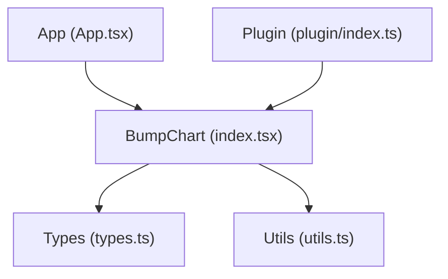
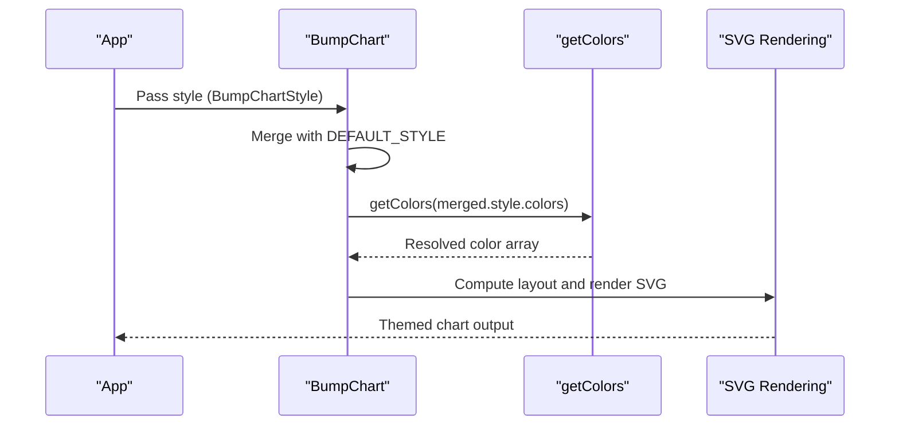
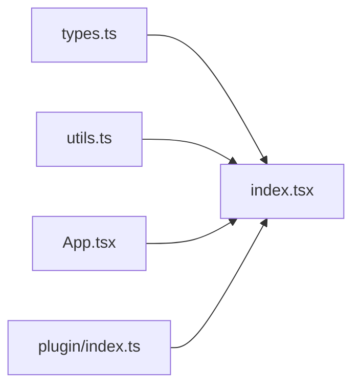

# Theme Creation

<cite>
**Referenced Files in This Document**
- [index.tsx](file://src/BumpChart/index.tsx)
- [types.ts](file://src/BumpChart/types.ts)
- [utils.ts](file://src/BumpChart/utils.ts)
- [App.tsx](file://src/App.tsx)
- [plugin/index.ts](file://src/plugin/index.ts)
- [README.md](file://README.md)
</cite>

## Table of Contents
1. [Introduction](#introduction)
2. [Project Structure](#project-structure)
3. [Core Components](#core-components)
4. [Architecture Overview](#architecture-overview)
5. [Detailed Component Analysis](#detailed-component-analysis)
6. [Dependency Analysis](#dependency-analysis)
7. [Performance Considerations](#performance-considerations)
8. [Troubleshooting Guide](#troubleshooting-guide)
9. [Conclusion](#conclusion)
10. [Appendices](#appendices)

## Introduction
This document explains how to create reusable themes for the BumpChart component using the BumpChartStyle interface. It covers building light and dark themes, brand-specific palettes, adaptive themes that respond to system preferences, combining color schemes with spacing and typography-like settings, ensuring accessibility, testing across devices, and integrating with popular styling solutions and design systems.

## Project Structure
The theme system centers on:
- A style interface that defines all visual aspects you can customize
- Default styles applied when no custom theme is provided
- Utilities that compute colors and process data
- The component that merges your theme with defaults and renders SVG elements

**Diagram sources**
- [index.tsx:104-118](file://src/BumpChart/index.tsx#L104-L118)
- [types.ts:14-49](file://src/BumpChart/types.ts#L14-L49)
- [utils.ts:16-18](file://src/BumpChart/utils.ts#L16-L18)
- [App.tsx:94-98](file://src/App.tsx#L94-L98)
- [plugin/index.ts:1-5](file://src/plugin/index.ts#L1-L5)

**Section sources**
- [index.tsx:104-118](file://src/BumpChart/index.tsx#L104-L118)
- [types.ts:14-49](file://src/BumpChart/types.ts#L14-L49)
- [utils.ts:16-18](file://src/BumpChart/utils.ts#L16-L18)
- [App.tsx:94-98](file://src/App.tsx#L94-L98)
- [plugin/index.ts:1-5](file://src/plugin/index.ts#L1-L5)

## Core Components
- BumpChartStyle: Defines the shape of a theme object. You can provide colors, label widths, node dimensions, column gap, padding, legend visibility, and rank label prefix/suffix.
- Default theme: The component merges a built-in default theme with any user-provided style to ensure consistent behavior.
- Color utility: Resolves the effective color palette used by series.

Key takeaways:
- Provide only the properties you need; missing ones fall back to defaults.
- Colors are assigned per series and cycle through the provided palette.
- Spacing and sizing properties control layout and readability.

**Section sources**
- [types.ts:14-49](file://src/BumpChart/types.ts#L14-L49)
- [index.tsx:5-27](file://src/BumpChart/index.tsx#L5-L27)
- [utils.ts:16-18](file://src/BumpChart/utils.ts#L16-L18)

## Architecture Overview
Theme application flow:
1. Your app constructs a BumpChartStyle object (theme).
2. BumpChart merges it with DEFAULT_STYLE.
3. getColors resolves the final palette from the merged style.
4. Series receive colors from the resolved palette.
5. Layout calculations use spacing and sizing properties from the theme.

**Diagram sources**
- [index.tsx:115-125](file://src/BumpChart/index.tsx#L115-L125)
- [utils.ts:16-18](file://src/BumpChart/utils.ts#L16-L18)

**Section sources**
- [index.tsx:115-125](file://src/BumpChart/index.tsx#L115-L125)
- [utils.ts:16-18](file://src/BumpChart/utils.ts#L16-L18)

## Detailed Component Analysis

### BumpChartStyle Interface
- colors: Array of hex or named colors used for series lines and nodes.
- leftLabelWidth/rightLabelWidth: Control horizontal space for rank labels and right-side padding.
- nodeWidth/nodeHeight: Size of the rectangular markers at each data point.
- columnGap: Horizontal spacing between categories (used in layout calculations).
- padding: Top/right/bottom/left margins inside the chart container.
- showLegend: Toggle legend display.
- rankPrefix/rankSuffix: Localized text around rank numbers.

Best practices:
- Keep enough leftLabelWidth for multi-digit ranks and localized prefixes/suffixes.
- Adjust padding to accommodate titles and legends without clipping.
- Use consistent node sizes for clarity across datasets.

**Section sources**
- [types.ts:14-49](file://src/BumpChart/types.ts#L14-L49)

### Default Theme and Merging
- The component defines a complete default theme including a curated color palette and sensible spacing.
- Any user-provided style is shallow-merged over defaults, so you only override what you need.

Implications:
- You can create minimal themes by providing only colors or only spacing.
- Defaults guarantee consistent baseline behavior across instances.

**Section sources**
- [index.tsx:5-27](file://src/BumpChart/index.tsx#L5-L27)
- [index.tsx:115-118](file://src/BumpChart/index.tsx#L115-L118)

### Color Resolution and Assignment
- getColors returns either the provided palette or a built-in default if none is supplied.
- Each series receives a color from the resolved palette, cycling as needed.

Guidance:
- Ensure sufficient contrast between series colors and background.
- Limit the number of distinct series to avoid excessive color repetition.

**Section sources**
- [utils.ts:16-18](file://src/BumpChart/utils.ts#L16-L18)
- [index.tsx:125-133](file://src/BumpChart/index.tsx#L125-L133)

### Layout and Typography-like Settings
- Title, category headers, rank labels, and series labels are rendered with fixed font sizes and weights in the component.
- While there is no explicit “typography” field, you can influence perceived typography via:
  - padding and label widths to prevent truncation
  - showLegend to manage label density
  - rankPrefix/rankSuffix for localized, readable rank labels

Accessibility note:
- Text colors are set internally; ensure your background and colors maintain adequate contrast.

**Section sources**
- [index.tsx:187-222](file://src/BumpChart/index.tsx#L187-L222)
- [index.tsx:272-280](file://src/BumpChart/index.tsx#L272-L280)
- [index.tsx:306-312](file://src/BumpChart/index.tsx#L306-L312)

### Legend Behavior
- Legend visibility is controlled by showLegend.
- When enabled, legend items wrap based on available width and padding.

Tip:
- Increase width or adjust padding to fit more legend items per row.

**Section sources**
- [index.tsx:135-145](file://src/BumpChart/index.tsx#L135-L145)
- [index.tsx:285-317](file://src/BumpChart/index.tsx#L285-L317)

### Plugin Integration
- The plugin exposes BumpChart and types for dashboard integration.
- Style can be passed through the plugin schema’s style property.

Use case:
- Define a theme once and reuse it across multiple dashboard widgets via the plugin.

**Section sources**
- [plugin/index.ts:1-5](file://src/plugin/index.ts#L1-L5)
- [plugin/index.ts:25-32](file://src/plugin/index.ts#L25-L32)
- [plugin/index.ts:77-80](file://src/plugin/index.ts#L77-L80)

## Dependency Analysis
- BumpChart depends on:
  - types.ts for BumpChartStyle and props
  - utils.ts for color resolution and data processing
- App demonstrates constructing a BumpChartStyle and passing it to BumpChart
- README documents the public API surface for consumers

**Diagram sources**
- [types.ts:14-49](file://src/BumpChart/types.ts#L14-L49)
- [utils.ts:16-18](file://src/BumpChart/utils.ts#L16-L18)
- [index.tsx:104-118](file://src/BumpChart/index.tsx#L104-L118)
- [App.tsx:94-98](file://src/App.tsx#L94-L98)
- [plugin/index.ts:1-5](file://src/plugin/index.ts#L1-L5)

**Section sources**
- [README.md:62-99](file://README.md#L62-L99)

## Performance Considerations
- useMemo usage ensures stable computations for layout and color assignment.
- Avoid excessively large color arrays; the palette cycles automatically.
- Keep legend enabled only when necessary to reduce DOM nodes.

[No sources needed since this section provides general guidance]

## Troubleshooting Guide
Common issues and resolutions:
- Labels truncated: Increase leftLabelWidth or adjust padding to fit longer rankPrefix/rankSuffix or larger fonts.
- Legend overflow: Increase chart width or reduce number of series; consider disabling legend for compact views.
- Poor contrast: Choose colors with sufficient contrast against the white background; test with accessibility tools.
- Inconsistent themes: Centralize BumpChartStyle definitions and reuse them across components to ensure consistency.

**Section sources**
- [index.tsx:187-222](file://src/BumpChart/index.tsx#L187-L222)
- [index.tsx:285-317](file://src/BumpChart/index.tsx#L285-L317)

## Conclusion
You can build robust, reusable themes for BumpChart by composing BumpChartStyle objects. Start with minimal overrides (colors or spacing), rely on defaults for everything else, and centralize themes for consistency. Combine thoughtful color choices with appropriate spacing and localized rank labels to achieve accessible, readable charts across devices and contexts.

[No sources needed since this section summarizes without analyzing specific files]

## Appendices

### Creating Reusable Themes
- Light theme: Provide a bright, high-contrast palette and standard padding.
- Dark theme: Provide a darker palette and consider adjusting padding to account for different visual weight.
- Brand theme: Use brand-defined colors and consistent spacing to match product identity.
- Adaptive theme: Derive theme values from system preferences (e.g., prefers-color-scheme) and recompute BumpChartStyle accordingly.

Implementation pattern:
- Define theme objects as plain BumpChartStyle values.
- Merge with defaults at runtime where needed.
- Export themes from a dedicated module for reuse.

**Section sources**
- [types.ts:14-49](file://src/BumpChart/types.ts#L14-L49)
- [index.tsx:5-27](file://src/BumpChart/index.tsx#L5-L27)
- [index.tsx:115-118](file://src/BumpChart/index.tsx#L115-L118)

### Combining Color Schemes with Spacing and Typography-like Settings
- Pair a cohesive color palette with balanced padding and label widths to prevent overlap.
- Use showLegend to control information density.
- Set rankPrefix/rankSuffix for localized, readable rank labels.

**Section sources**
- [index.tsx:187-222](file://src/BumpChart/index.tsx#L187-L222)
- [index.tsx:285-317](file://src/BumpChart/index.tsx#L285-L317)
- [types.ts:14-49](file://src/BumpChart/types.ts#L14-L49)

### Best Practices for Consistency Across Multiple Instances
- Centralize theme definitions in a single module.
- Reuse the same BumpChartStyle across components to ensure uniformity.
- Validate themes visually across different data sizes and screen widths.

**Section sources**
- [index.tsx:115-118](file://src/BumpChart/index.tsx#L115-L118)

### Dynamic Theme Switching
- Maintain theme state in your application and pass a new BumpChartStyle to BumpChart when switching modes (light/dark/brand).
- For dashboard plugins, update the style property in the plugin configuration to reflect the active theme.

**Section sources**
- [App.tsx:94-98](file://src/App.tsx#L94-L98)
- [plugin/index.ts:25-32](file://src/plugin/index.ts#L25-L32)

### Theme Inheritance Patterns
- Create base themes (e.g., brandBase) and extend them by overriding specific fields (e.g., colors or padding).
- Use shallow merge semantics similar to the component’s internal merging to combine base and overrides.

**Section sources**
- [index.tsx:115-118](file://src/BumpChart/index.tsx#L115-L118)

### Accessibility Requirements
- Contrast: Ensure series colors and text have sufficient contrast against the white background.
- Readability: Use adequate label widths and padding to avoid truncation.
- Localization: Provide meaningful rankPrefix/rankSuffix for international audiences.

**Section sources**
- [index.tsx:187-222](file://src/BumpChart/index.tsx#L187-L222)
- [index.tsx:272-280](file://src/BumpChart/index.tsx#L272-L280)

### Testing Themes Across Devices and Screen Sizes
- Test at common breakpoints to verify legend wrapping and label alignment.
- Verify that increased rank counts do not cause vertical crowding.
- Confirm that brand palettes remain distinguishable on mobile screens.

[No sources needed since this section provides general guidance]

### Integration with Styling Solutions and Design Systems
- CSS-in-JS: Define theme tokens (colors, spacing) and map them to BumpChartStyle fields.
- Design systems: Export theme objects aligned with your design tokens and consume them wherever BumpChart is used.
- Dashboard plugins: Pass the theme via the plugin’s style property to keep configurations declarative.

**Section sources**
- [plugin/index.ts:25-32](file://src/plugin/index.ts#L25-L32)
- [plugin/index.ts:77-80](file://src/plugin/index.ts#L77-L80)